<p align="center">
  
</p>

<p align="center">
  <strong><a href="https://brianwestphal.github.io/domotion/">🌐 Website &amp; docs</a></strong>
  &nbsp;·&nbsp;
  <a href="https://brianwestphal.github.io/domotion/showcase/">Showcase</a>
  &nbsp;·&nbsp;
  <a href="https://brianwestphal.github.io/domotion/start/quickstart/">Quick start</a>
  &nbsp;·&nbsp;
  <a href="https://github.com/brianwestphal/domotion">GitHub</a>
</p>

**Domotion turns real HTML/CSS into one self-contained, animated SVG** — an accurate reproduction of the rendered page, with optional animation and simulated interaction built in. Text is emitted as real glyph paths, so it looks identical across browsers; the output scales crisply at any size and embeds anywhere with a plain ``, no external assets.

Beyond raw capture it ships a **template library** that turns a few flags into a polished animated SVG, **terminal-session capture** (a recording → an animated terminal), multi-frame **animation** with transitions, overlays, and simulated interaction, **device-chrome** framing, **nested compositing** (animated layers inside animated layers), one-command **SVG → MP4/WebM**, and a fidelity **review** tool.

<p align="center">
  
</p>

<p align="center"><sub>A real UI captured and brought to life — one self-contained SVG. <a href="https://brianwestphal.github.io/domotion/showcase/">More demos →</a></sub></p>

## Why

Animated demos for product marketing and documentation usually mean either:

- A bundle of MP4s — heavy, hard to scale, no inline embedding.
- A live iframe — slow, requires the source app to be online, breaks accessibility.
- Hand-authored SVG animations — accurate but enormously time-consuming for anything beyond a couple of frames.

Domotion captures real HTML/CSS as it renders in Chromium, then emits a single inline-embeddable SVG that replays the same pixels with CSS keyframe transitions. Author the demo as plain HTML/CSS in your real app, capture frames, and ship the result as a `` that loads lazily and scales without artifacts.

## Status

Actively developed, with a broad shipped surface — capture, multi-frame animation (transitions, overlays, simulated interaction), the template library, terminal capture, nested compositing, and the video/image exports — exercised by an extensive visual-regression suite. The CLIs and the animate-config schema are stable in practice.

## Platform support

Domotion runs on **macOS, Linux, and Windows**, and all three are calibrated. It renders text by extracting real system-font glyph outlines and matching how the browser falls back between fonts on the platform you run it on (CoreText on macOS, fontconfig on Linux, DirectWrite on Windows). macOS is held to pixel-exact parity; Linux and Windows match the browser's glyph selection and metrics within a small native-hinting margin (the residual is unhinted-outline-vs-native-raster rasterization, not missing calibration), and both are gated by visual-regression CI.

Issues, fixes, and platform feedback are welcome on [GitHub](https://github.com/brianwestphal/domotion).

## Install

```bash
npm install domotion-svg
```

That's it — Domotion auto-installs Playwright's Chromium binary on first use
(via `npx playwright install chromium`). On CI you may want to pre-install it
yourself to keep the first job's runtime down.

## Usage

The fastest way in is the `domotion` CLI — no TypeScript, no Playwright bring-up. Point it at a URL or HTML file:

```bash
# Zero-install: run the published CLI straight from npm. The package name is
# domotion-svg; -p installs it and `domotion` selects the bin (the package ships
# several bins, so the bin must be named explicitly).
npx -p domotion-svg domotion capture https://example.com -o example.svg

# Capture a URL as SVG.
domotion capture https://example.com -o example.svg

# Capture a local HTML file at a specific viewport, only the .hero region, optimized.
domotion capture ./demo.html \
  --width 1200 --height 600 \
  --selector ".hero" \
  --optimize \
  -o hero.svg

# Capture HTML piped on stdin.
cat demo.html | domotion capture - -o demo.svg
```

For a multi-frame animated SVG, write a small JSON config and run `domotion animate`:

```bash
domotion animate ./demo.json
```

The config describes each frame (input, duration, transition) plus a declarative surface for interaction demos: continuous-session frames that carry client-side state across steps (omit `input` / set `"continue": true`), DOM-mutation and interaction actions, richer readiness waits (`waitForText` / `waitForGone` / `waitForCount`), typing / tap / svg / blink overlays that can anchor to an element's box, an on-screen `cursor` (explicit or `"auto"`), `vars` + `${}` interpolation, and a small `evaluate` escape hatch. See `domotion --help` for the full grammar and the [Quick start](https://brianwestphal.github.io/domotion/start/quickstart/) for a walkthrough.

### Templates — animated SVGs from a few flags

The fastest way to a polished result without writing any HTML. Each built-in is a parameterized generator; pass a few flags and get a self-contained animated SVG. `domotion template list` shows them, `domotion template <name> --help` shows a template's parameters.

```bash
domotion template lower-third --title "Ada Lovelace" --subtitle "First Programmer" -o banner.svg
domotion template chart --type donut --data "42,28,18,12" --labels "Search,Direct,Social,Email" -o chart.svg
domotion template kinetic-text --text "Ship it" --variant pop --by char -o title.svg
```

Built-ins: **lower-third** (broadcast banner) · **kinetic-text** (animated typography) · **chart** (column / bar / line / pie / donut) · **chat** (message thread) · **subscribe** (follow pop-up) · **background-loop** (seamless looping background) · **device-mockup** (wrap a page in a phone / browser / window bezel). Third-party templates are npm packages named `domotion-template-<name>`.

### Terminal sessions

Turn a recorded terminal session into a self-contained animated SVG — real text, real color, native SVG (no raster frames). Record with [asciinema](https://asciinema.org), then convert:

```bash
asciinema rec demo.cast -c "npm test"
domotion term --cast demo.cast -o demo.svg
```

### Compositing — animated layers inside animated layers

`domotion composite` stacks layers — a `cast`, a `template`, or a pre-rendered `svg`, any of which may be animated — into one SVG, each placed and on its own timeline with its animation preserved. This is how you nest one animated thing inside another, e.g. a terminal window resizing on a desktop. See `domotion composite --help` and `examples/composite/`.

### Export to video

The package also ships a standalone `svg-to-video` CLI that renders an animated SVG (a `domotion animate` output, or any CSS-/SMIL-animated SVG) to a video file. It steps the animation timeline frame by frame in Chromium for frame-accurate timing, then pipes the frames to **ffmpeg** (a required external dependency — install via `brew` / `apt` / `winget`).

```bash
# h264/mp4 at 30fps, contained to 1280px wide.
svg-to-video demo.svg -o demo.mp4 --width 1280

# 60fps VP9/webm with looping background music.
svg-to-video demo.svg -o demo.webm --format vp9 --fps 60 --music bed.mp3
```

Supports target size (`--width`/`--height`, aspect-preserving), `--fps`, `--format` / `--container`, supersampling (`--scale`), background music / foreground audio / captions, and a disk-space pre-flight. See `svg-to-video --help`.

### Export to a still image

To turn a single SVG into an image — to look at a render, embed a thumbnail, or hand off a flat asset — the package ships an `svg-to-image` CLI. The output format follows the `-o` extension: PNG / WebP / AVIF / TIFF (keep alpha for transparent SVGs), JPEG (`--quality`), or a single-page vector PDF. (WebP/AVIF/TIFF are transcoded with the bundled `sharp` — no extra install.)

```bash
svg-to-image card.svg -o card.png                 # PNG at the SVG's intrinsic size
svg-to-image card.svg -o card@2x.png --scale 2    # crisp retina (2×) raster
svg-to-image demo.svg -o frame.png --at 4000      # one frame of an animated SVG, at 4s
svg-to-image poster.svg -o poster.pdf             # vector PDF
```

`--at <ms>` samples an animated SVG's timeline, `--width`/`--height` contain preserving aspect, `--scale` supersamples raster output. See `svg-to-image --help`.

### Reviewing a regression

If a capture comes out looking different from how Chromium painted the source page, the package ships an `svg-review` CLI to help you file a focused bug report. Capture once with `--debug` to get a reproduction bundle (HAR + the Chromium screenshot of the source + the SVG we produced), then open the bundle in the local review UI:

```sh
domotion capture https://example.com --debug -o example.svg
svg-review --expected example.debug/expected.png --actual example.debug/actual.svg
```

The browser opens a single review card showing the expected / actual / diff PNGs. Arrow keys cycle through the three at full size; drag on any image to mark a problem region and caption it. The side panel builds a GitHub-issue-ready Markdown block as you go — copy it, then file the issue at <https://github.com/brianwestphal/domotion/issues/new> and attach `expected.png` + `actual.svg` so a maintainer can reproduce.

For an *animated* SVG, the package also ships `svg-scrubber` — a local video-style bench to play / pause / scrub / mark an in-out range, export the current frame as PNG, export the range as MP4, or trim it to a new self-contained animated SVG.

### Scripting API

When you outgrow the CLI — custom interaction loops, programmatic frame composition, custom overlays — the same primitives are available as a library:

```ts
import { captureElementTree, elementTreeToSvg, launchChromium } from "domotion-svg";

const browser = await launchChromium();
const page = await browser.newPage();
await page.setContent(`<div style="padding:20px;color:white;background:#0d1117">Hello</div>`);

const tree = await captureElementTree(page, "body", { x: 0, y: 0, width: 800, height: 200 });
const svg = elementTreeToSvg(tree, 800, 200);

console.log(svg);
await browser.close();
```

For animated demos, capture multiple frames and pass them to `generateAnimatedSvg` (see `examples/`).

## Scripts

```bash
npm run build           # tsc → dist/
npm test                # unit tests
npm run demos:test      # feature visual-regression suite
npm run demos:test:all  # features + showcase + html-test-suite
npm run demos:review    # local server to compare expected/actual/diff PNGs
npm run demos:examples  # run the bundled example demo scripts
```

## Documentation

- `FEATURES.md` — per-feature support checklist with links to test fixtures.
- `docs/` — requirements docs covering rendering fidelity, supported CSS features, and known caveats.
- [`llms.txt`](llms.txt) — a concise, self-contained guide for **AI agents using Domotion as a tool** (Claude, Cursor, etc.): the CLIs, the config schema, the template library, the API, and the gotchas. Point your agent at it.
- `CLAUDE.md` — guidance for AI assistants working *on this repo's* source (different audience from `llms.txt`).

## License

[MIT](LICENSE) © Brian Westphal
