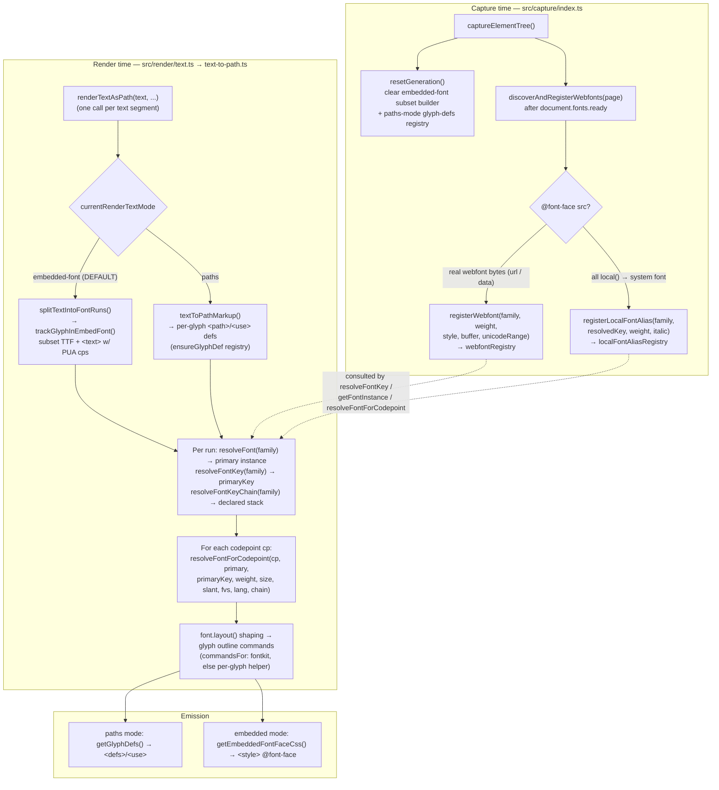
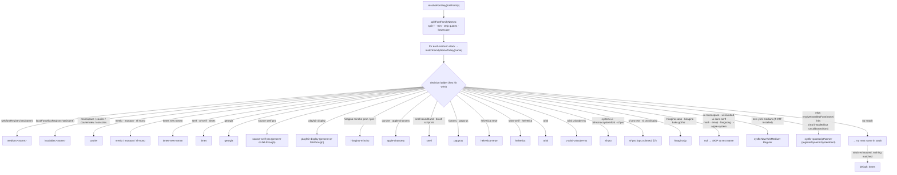
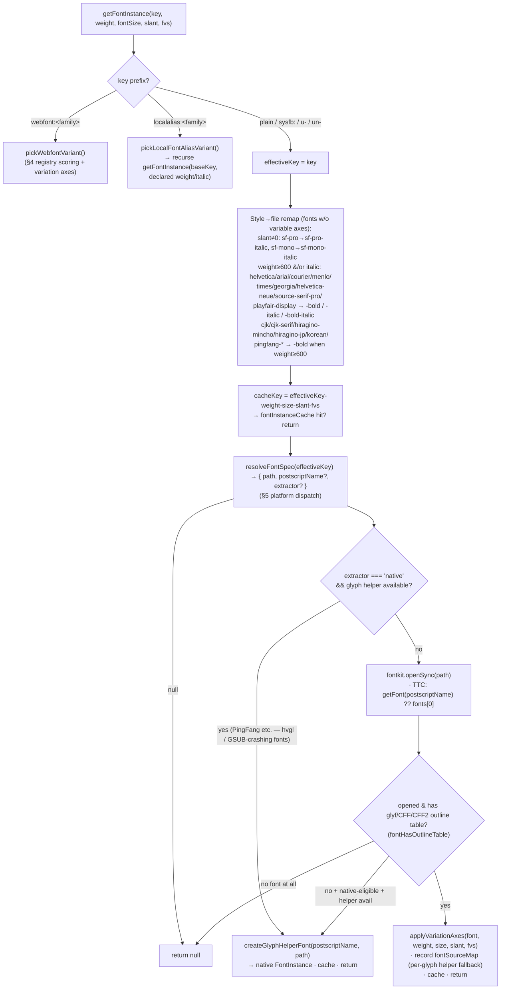
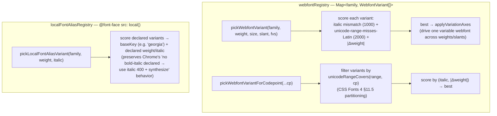
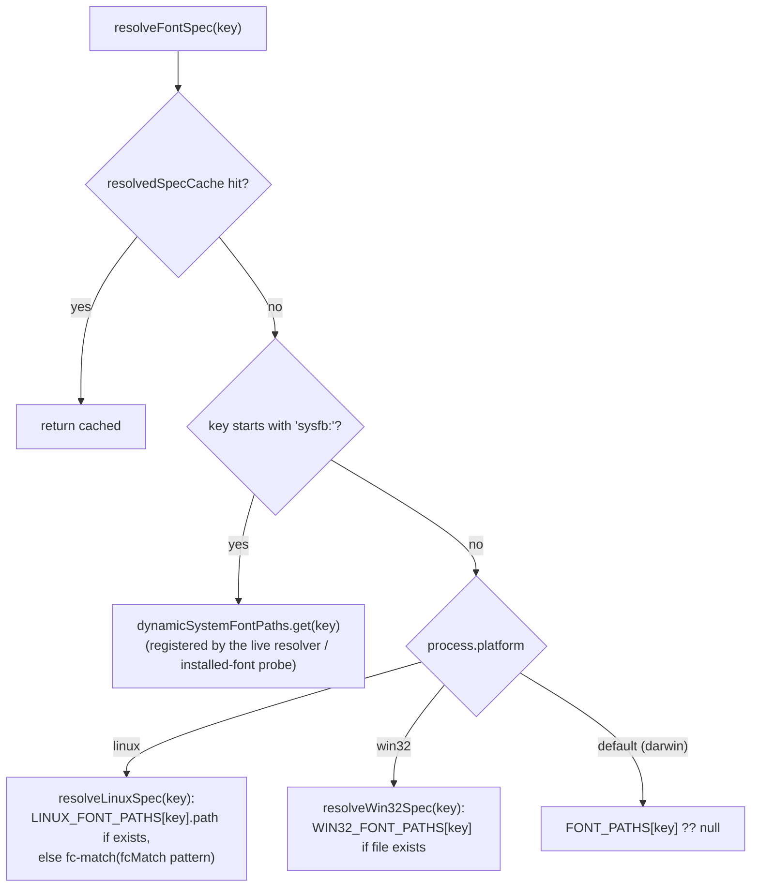
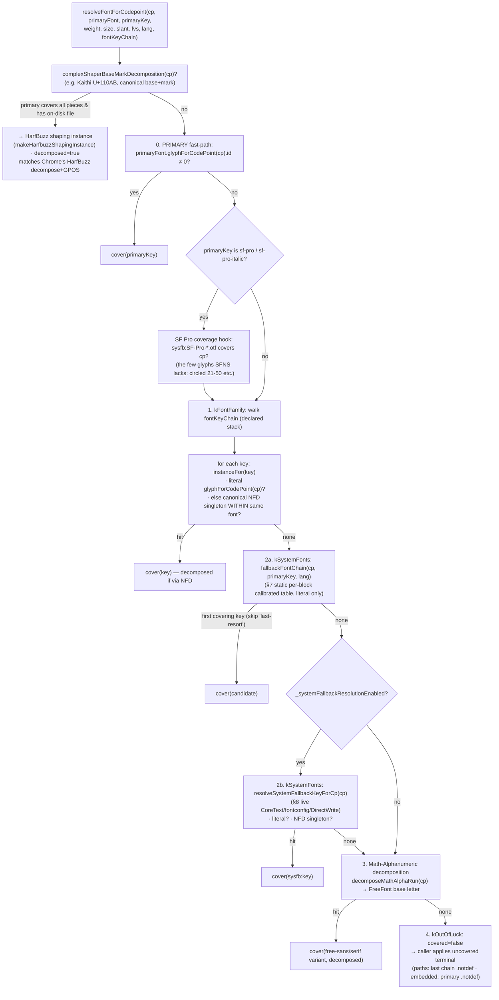
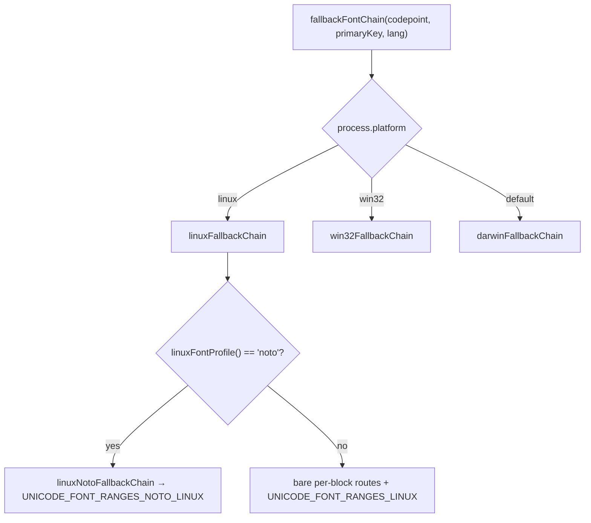
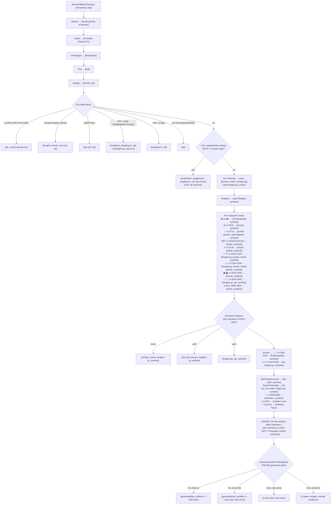
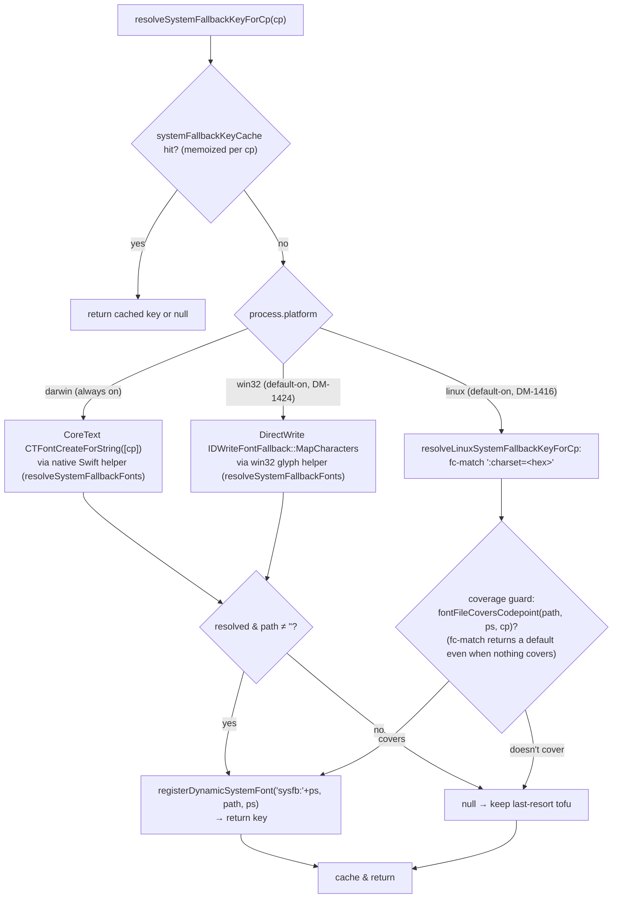
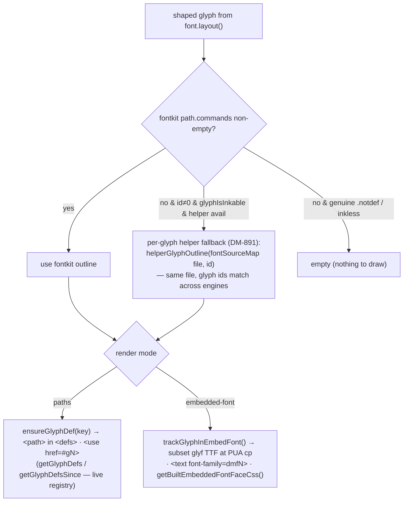

# Font resolution — complete flow diagram

This document is the **canonical end-to-end map of Domotion's font-resolution
system**: how a captured text run's CSS `font-family` (plus every codepoint in
it) is turned into a concrete on-disk font face + glyph outline, across macOS,
Linux, and Windows, including every branch, registry, cache, and per-block /
per-codepoint route.

> **Maintenance contract.** This diagram is a canonical reference — it must stay
> in lockstep with the code. Any change to font routing, the platform tables, the
> fallback chains, the family→key map, the per-codepoint resolver, the live
> system-fallback backends, or the render-text-mode branch **must update the
> matching diagram + prose here in the same commit**. The authoritative source is
> `src/render/font-resolution.ts` (routing tables + resolvers), `src/render/glyph-helper.ts`
> (native CoreText / FreeType / DirectWrite backends), `src/render/text-to-path.ts`
> (the shaping / run-splitting callers), `src/render/embedded-font-builder.ts`
> (embedded-mode subset builder), and `src/capture/index.ts`
> (`discoverAndRegisterWebfonts`). When code and diagram disagree, the code wins —
> fix the diagram. The `check-requirements-against-code` skill verifies this doc
> as part of its sweep.

Related requirement docs (this diagram synthesizes them; each is the narrative
source of truth for its slice):
- [03 — CSS font-family chain resolution](03-font-family-chain.md)
- [30 — webfont `unicode-range` partitioning](30-webfont-unicode-range.md)
- [40 — cross-platform font-path discovery](40-cross-platform-font-paths.md)
- [42 — cross-platform fallback-chain calibration](42-cross-platform-fallback-calibration.md)
- [51 — probe-then-fallback dispatch (fontkit ↔ native helper)](51-probe-then-fallback-dispatch.md)
- [52 — embedded-mode glyph fallback](52-embedded-mode-glyph-fallback.md)
- [80 — cross-platform live system-fallback resolver](80-cross-platform-system-fallback-resolver.md)

---

## Legend

- **Logical key** — an internal string (`helvetica`, `times`, `cjk`, `sf-arabic`,
  `pingfang-sc`, `u-noto-sans`, …) that names a *role*, not a file. The platform
  layer maps a key → an actual font file. `webfont:<family>`, `localalias:<family>`,
  `sysfb:<postscriptName>`, `u-…` (darwin generated), and `un-…` (Linux Noto
  generated) are namespaced key families.
- **FontInstance** — the uniform interface (`src/render/font-resolution.ts`) both
  backing engines expose: fontkit `Font` OR a native glyph-helper instance. Carries
  `layout()`, `glyphForCodePoint()`, metrics.
- **Primary** — the font the run's own `font-family` resolves to (first matched
  name in the stack). **Fallback** — what covers a codepoint the primary lacks.

---

## 1. Top-level pipeline (capture → render → glyph emission)

**Source of truth:** `discoverAndRegisterWebfonts` + `resetGeneration` in
`src/capture/index.ts`; `renderTextAsPath` / `textToPathMarkup` /
`splitTextIntoFontRuns` in `src/render/text-to-path.ts`; the mode switch
(`currentRenderTextMode` / `withRenderTextMode`) in `src/render/font-resolution.ts`.

### Render-text mode (paths vs embedded-font)

| Mode | Default? | Output | Fidelity | Generation-scoped state |
|---|---|---|---|---|
| `embedded-font` | **yes** (DM-839) | `<text>` against a `@font-face` subset **glyf** TTF (svg2ttf; NOT CFF — DM-1666), addressed by private-use codepoints (consumer browser does zero shaping) | consumer browser rasterizes (its own hinting/AA) — smaller/faster, not byte-identical across browsers | `embeddedFonts` map + `embedded-font-builder` (`clearEmbeddedFonts`) |
| `paths` | no | `<use href="#gN">` into per-glyph `<path>` defs | per-pixel-faithful to Chromium; used for visual-regression diffing | `glyphDefs` registry (`clearGlyphDefs`) |

Both share the SAME per-codepoint resolution (`resolveFontForCodepoint`); they
differ only in the **uncovered terminal** (paths pins the last chain entry's
stable `.notdef` advance so emoji raster overlays stay aligned; embedded renders
the primary font's `.notdef`). `resetGeneration()` clears both generation-scoped
caches together (DM-1338 / DM-1435). The webfont + local-alias registries are
**session-scoped** (survive across generations; cleared by `clearWebfonts`).

---

## 2. Family stack → primary key (`resolveFontKey` / `matchFamilyNameToKey`)

`resolveFontKey(fontFamily)` splits the computed CSS `font-family` string on
commas, lowercases + strips quotes (`splitFontFamilyNames`), and walks the names
in order, returning the FIRST that `matchFamilyNameToKey` resolves; if none match,
the last-resort default is **`times`** (Chrome's macOS "Standard Font" default).
`resolveFontKeyChain` returns the full ordered, de-duplicated list of matched keys
(used by the per-codepoint resolver to reach later-declared families).

> **This ladder is the macOS family stage — it is NOT `process.platform`-branched.**
> `matchFamilyNameToKey` unconditionally encodes Chrome-**on-macOS**'s family and
> generic resolution (each entry is probe-calibrated against Chrome-macOS). The
> logical keys it returns are macOS-face names; cross-platform behavior emerges
> only DOWNSTREAM, where §5's `resolveFontSpec` remaps the SAME key to a
> per-platform file (e.g. `helvetica` → Helvetica on macOS, Liberation Sans on the
> Linux CI image, `arial.ttf` on Windows). Two consequences worth knowing (see
> DM-1687):
>
> - **Generic keywords are pinned to macOS defaults.** `sans-serif`→`helvetica`,
>   `serif`→`times`, `monospace`→`courier` are fixed; only `cursive`/`fantasy`
>   defer to fontconfig (via the Linux table's `fcMatch`). So a host whose
>   generic-family config differs from the calibration target (e.g. a DejaVu-based
>   desktop Linux, where Chrome resolves `sans-serif`→DejaVu Sans) diverges —
>   tracked in **DM-1691**.
> - **The uncurated-named-font tail is macOS/Windows-only.** The final
>   `resolveInstalledFont(name)` step (which resolves an installed-but-uncalibrated
>   family to a `sysfb:` key) uses the native helper, which returns null on Linux —
>   so on Linux an uncurated named family falls through to the `times` default
>   instead of resolving via fontconfig like Chrome would. Tracked in **DM-1690**.
>
> `docs/03-font-family-chain.md` frames the same mappings as "matching Chrome on
> macOS"; doc [40](40-cross-platform-font-paths.md) L62 notes the keys are
> "macOS-centric".

**Why generics resolve where they do (macOS calibration — Blink `font_cache_mac.mm`):**

| CSS generic / keyword | Key | Actual macOS font |
|---|---|---|
| `sans-serif`, `Helvetica` | `helvetica` | Helvetica.ttc (NOT SF Pro) |
| `serif`, `ui-serif`, `Times`, UA default | `times` | Times.ttc (Apple Times, NOT Times New Roman) |
| `monospace`, `Courier`, `Courier New`, `Consolas` | `courier` | Courier.ttc (NOT SF Mono/Menlo) |
| `cursive` | `apple-chancery` | Apple Chancery (NOT Snell Roundhand) |
| `fantasy` | `papyrus` | Papyrus |
| `system-ui`, `BlinkMacSystemFont`, `SF Pro` | `sf-pro` | SFNS.ttf |
| `ui-monospace`, `ui-rounded`, `math`, `emoji`, `fangsong`, `-apple-system` | `null` | **skipped** (Chrome doesn't pin these; falls through the stack, ultimately to `times`) |

**Source of truth:** `matchFamilyNameToKey` / `resolveFontKey` /
`resolveFontKeyChain` / `splitFontFamilyNames` in `src/render/font-resolution.ts`.
Doc [03](03-font-family-chain.md).

---

## 3. Key → FontInstance (`getFontInstance`)

Given a logical key + `(weight, fontSize, slant, variationSettings)`,
`getFontInstance` returns a cached, weight/slant-correct, variation-driven
`FontInstance`, or `null` (caller walks to the next candidate).

**Probe-then-fallback dispatch (doc [51](51-probe-then-fallback-dispatch.md)):**
fontkit is primary; the **native glyph helper** (macOS CoreText / Linux FreeType /
Windows DirectWrite, dispatched by `process.platform` in `src/render/glyph-helper.ts`)
is the fallback for a *helper-eligible* font (`extractor: "native"`) that fontkit
can't open OR opens with no outline table (PingFang's outlines live in Apple's
private `hvgl` table). A finer **per-glyph** tier (`commandsFor` → `helperGlyphOutline`,
DM-891, doc [52](52-embedded-mode-glyph-fallback.md)) supplies a single glyph's
outline from the SAME file when fontkit opened the font but returned an empty path
for one inkable glyph.

**Source of truth:** `getFontInstance` / `resolveFontSpec` / `applyVariationAxes` /
`fontHasOutlineTable` / `commandsFor` in `src/render/font-resolution.ts`;
`src/render/glyph-helper.ts`.

---

## 4. Registries: webfonts + local() aliases

- **Webfonts** (`registerWebfont`) retain the decompressed TTF/OTF buffer so
  embedded mode can `@font-face` it as a `data:` URI. Google-Fonts-style
  partitioning (same `(family, weight)` across N `@font-face` rules, each a
  distinct `unicode-range`) is honored per-codepoint by
  `pickWebfontVariantForCodepoint` (DM-517 / DM-557); `pickWebfontVariant` biases
  toward the Latin partition when it can't route per-codepoint. Doc
  [30](30-webfont-unicode-range.md).
- **Local aliases** (`registerLocalFontAlias`) map an author `@font-face` family
  whose `src` is all `local()` to a known system key, tracking each declared
  `(weight, italic)` variant (DM-360 / DM-303 / DM-1597).

**Source of truth:** `registerWebfont` / `pickWebfontVariant` /
`pickWebfontVariantForCodepoint` / `unicodeRangeCovers` / `registerLocalFontAlias` /
`pickLocalFontAliasVariant` in `src/render/font-resolution.ts`.

---

## 5. Key → font file: platform path dispatch (`resolveFontSpec`)

Three platform tables map the SAME logical keys to different files (doc
[40](40-cross-platform-font-paths.md)). A key absent from the platform table (or
whose file isn't on disk, e.g. `source-serif-pro`, `playfair-display`) resolves to
`null`, and the caller falls through — matching Chrome's behavior on a host
lacking that font.

### macOS `FONT_PATHS` (excerpt — the calibrated key→file map)

| Key(s) | File | Notes |
|---|---|---|
| `sf-pro` / `sf-pro-italic` | SFNS.ttf / SFNSItalic.ttf | system-ui; italic is a sibling file, not a `slnt` axis |
| `sf-mono(-italic)` | SFNSMono(Italic).ttf | |
| `helvetica*` | Helvetica.ttc | `sans-serif` generic |
| `helvetica-neue*` | HelveticaNeue.ttc | distinct face from Helvetica (DM-1189) |
| `arial*` | Supplemental/Arial*.ttf | |
| `times*` | Times.ttc | `serif` generic + UA default |
| `times-new-roman*` | Supplemental/Times New Roman*.ttf | explicit name only |
| `georgia*` | Supplemental/Georgia*.ttf | |
| `courier*` | Courier.ttc | `monospace` generic |
| `menlo*` / `monaco` | Menlo.ttc / Monaco.ttf | |
| `cjk(-bold)` | Hiragino Sans GB.ttc (W3/W6) | sans CJK fallback |
| `cjk-serif(-bold)` | Supplemental/Songti.ttc (STSongti-SC-Light/Bold) | serif-primary CJK |
| `pingfang-{sc,tc,hk,mo}(-bold)` | PingFang.ttc | Han ideographs; **`extractor: native`** (hvgl) |
| `hiragino-jp(-bold)` | ヒラギノ角ゴシック (HiraKakuProN W3/W6) | JP kana + wide symbols |
| `hiragino-mincho(-bold)` | ヒラギノ明朝 ProN | JP serif, explicit-name only |
| `korean(-bold)` | AppleSDGothicNeo.ttc | Hangul |
| `thai` | ThonburiUI.ttc | |
| `devanagari` | Kohinoor.ttc | |
| `sf-arabic` | GeezaPro.ttc | Arabic (Geeza Pro, not SF Arabic) |
| `sf-hebrew` | SFHebrew.ttf | |
| `symbols` | Apple Symbols.ttf | math operators / misc technical |
| `zapf-dingbats` | ZapfDingbats.ttf | Dingbats block |
| `stix-math` | Supplemental/STIXTwoMath.otf | Math Alphanumeric |
| `lucida-grande` | LucidaGrande.ttc | specific arrows / shapes |
| `snell` / `apple-chancery` / `papyrus` | Supplemental/… | cursive / fantasy |
| `last-resort` | LastResort.otf (macOS) / bundled LastResortHE (else) | per-block tofu frame |
| `u-…` (319 block routes) | `unicode-font-routing.darwin.generated.ts` | DM-983 CDP sweep |

### Linux (`LINUX_FONT_PATHS`, bare CI image) & Windows (`WIN32_FONT_PATHS`)

| Key | Linux (Playwright noble image) | Windows |
|---|---|---|
| `helvetica`/`arial`/`sf-pro` | Liberation Sans | Arial / (sf-pro→Segoe UI) |
| `times` | Liberation Serif | Times New Roman |
| `courier`/`menlo`/`monaco`/`sf-mono` | WenQuanYi Zen Hei Mono | Courier New / Consolas |
| `cjk` | WenQuanYi Zen Hei | Microsoft YaHei |
| `cjk-serif` | (Noto profile / generated) | SimSun |
| `hiragino-jp` | IPAGothic (generated) | Yu Gothic |
| `korean` | WenQuanYi (generated) | Malgun Gothic |
| `sf-arabic` | FreeSerif | Segoe UI |
| `sf-hebrew` | (Liberation Sans covers) | Segoe UI |
| `devanagari` | FreeSans | Nirmala UI |
| `thai` | Loma | Tahoma / Leelawadee UI |
| `symbols`/`zapf-dingbats` | FreeSans / FreeSerif | Segoe UI Symbol |
| `stix-math` | FreeSans / FreeSerif | Cambria Math |
| `u-…`/`un-…` generated | `unicode-font-routing.{linux,noto-linux}.generated.ts` | `unicode-font-routing.win32.generated.ts` |

**Linux profile detection** (`linuxFontProfile`): `fc-match "sans-serif:charset=4e00"`
→ if the path matches `/noto/i`, use the **Noto** calibrated table
(`linuxNotoFallbackChain` + `UNICODE_FONT_RANGES_NOTO_LINUX`); else the **bare**
CI-image chain. Overridable via `DOMOTION_LINUX_FONT_PROFILE=noto|bare`.

**Source of truth:** `resolveFontSpec` / `resolveLinuxSpec` / `resolveWin32Spec` /
`fcMatch` / `linuxFontProfile` / `FONT_PATHS` / `LINUX_FONT_PATHS` /
`WIN32_FONT_PATHS` in `src/render/font-resolution.ts`; the four
`unicode-font-routing.*.generated.ts` tables.

---

## 6. Per-codepoint resolution (`resolveFontForCodepoint`) — Blink FontFallbackIterator mirror

This is the heart of the system: for one codepoint `cp` in a run whose primary is
`primaryFont`/`primaryFontKey` and whose declared stack is `fontKeyChain`, decide
the exact font + glyph to paint. The order mirrors Blink's `FontFallbackIterator`.

Notes:
- `instanceFor(key)` materializes a chain key to an instance —
  webfont-partition-aware (`pickWebfontVariantForCodepoint`), and only the
  **primary** carries the author's `font-variation-settings`.
- Step 1 confines NFD decomposition to the DECLARED cascade (so it never
  over-renders into deep fallback faces Chrome can't reach — the DM-1080 hazard;
  Arial Unicode MS covers +85 CJK-compat cells via in-font decomposition).
- `codepointResolvesToNotdef(cp, …)` is the read-only predicate that runs the same
  chain (primary → webfont partition → `fallbackFontChain` → live resolver) to ask
  "does anything cover `cp`?" without emitting.

**Source of truth:** `resolveFontForCodepoint` / `codepointResolvesToNotdef` /
`sfProCoverageOtfKey` / `decomposeMathAlphaRun` in `src/render/font-resolution.ts`.
Doc [80](80-cross-platform-system-fallback-resolver.md).

---

## 7. Static per-block fallback chain (`fallbackFontChain` → platform chains)

Each platform chain is a **parallel router over the SAME Unicode block boundaries**
(shared predicates `isHebrewBlock` / `isArabicBlock` / `isDevanagariBlock` /
`isThaiBlock` / `isHangulBlock` / `isCjkBmpBlock` / `isBoxDrawingBlock` /
`isDingbatsBlock` / `isMathAlphanumericBlock` / `isSuperSubscriptBlock` /
`isLetterlikeBlock` / `isMathOperatorsBlock` / `isPictographResidueBlock`); only
the per-block KEY differs by platform (CoreText vs fontconfig vs DirectWrite).
Every chain ends by consulting its generated per-block table (binary-searched
`UNICODE_FONT_RANGES*`), then a platform terminal.

### 7a. `darwinFallbackChain` — block dispatch order (first match returns)

Precedence matters: hand-tuned per-codepoint routes (carrying width/shape
calibration) come BEFORE broad block ranges, which come before the generated
table. `serifPrimary` = primaryKey ∈ {`times`, `times-new-roman`, `georgia`};
`monoPrimary` = {`courier`, `menlo`, `monaco`, `sf-mono`}.

`pingfangKeyForLang(lang)` maps BCP-47 tags to regional PingFang: `zh-TW`/`zh-Hant`→`pingfang-tc`,
`zh-HK`→`pingfang-hk`, `zh-MO`→`pingfang-mo`, `ja*`→`hiragino-jp`, `zh`/`zh-CN`/`zh-Hans`→null (SC default).

### 7b. `linuxFallbackChain` (bare CI image) — key routes

Hebrew→`[helvetica]` · Arabic→`[sf-arabic]`(FreeSerif) · Devanagari→`[devanagari]`(FreeSans) ·
Thai→`[thai]`(Loma) · Hangul→`[cjk]`(WenQuanYi) · Box Drawing→mono `[primary, cjk]` / else `[helvetica, cjk]` ·
Dingbats→`[free-sans, free-serif]` · Chess→`[free-serif, free-sans]` · ↗↙→`[cjk, helvetica]` ·
Arrows→`[helvetica, free-sans]` · Geometric→`[helvetica, cjk]` · Misc Symbols→`[helvetica, hiragino-jp, free-sans]` ·
Math Alpha→`[free-sans, free-serif]` · Letterlike/Math Ops→`[free-sans, helvetica]` · CJK BMP→`[cjk]` ·
Pictograph residue→`[free-sans]` · else generated `UNICODE_FONT_RANGES_LINUX` → `[]`.

### 7c. `win32FallbackChain` — key routes

Hebrew→`[sf-hebrew]`(Segoe UI) · Arabic→`[sf-arabic]`(Segoe UI) · Devanagari→`[devanagari]`(Nirmala UI) ·
Thai→`[tahoma, thai]` · Hangul→`[korean, cjk]`(Malgun Gothic) · Math Alpha→`[stix-math, helvetica]`(Cambria Math) ·
CJK BMP→serif `[cjk-serif, cjk]`(SimSun) / ja `[hiragino-jp, cjk]`(Yu Gothic) / else `[cjk]`(YaHei) ·
Box Drawing→mono `[primary, sf-mono]`(Consolas) / else `[helvetica, symbols]`(Arial) · Dingbats→`[symbols]` ·
Geometric/Misc/Arrows→`[helvetica, symbols]`(Arial covers common) · Super/Subscripts→`[helvetica]` ·
Letterlike/Math Ops→`[helvetica, stix-math]` · Pictograph residue→`[symbols]` ·
else generated `UNICODE_FONT_RANGES_WIN32` → `[]`.

**Source of truth:** `fallbackFontChain` / `darwinFallbackChain` /
`linuxFallbackChain` / `linuxNotoFallbackChain` / `win32FallbackChain` /
`pingfangKeyForLang` / the `is*Block` predicates / `binarySearchRange` in
`src/render/font-resolution.ts`. Doc [42](42-cross-platform-fallback-calibration.md).

---

## 8. Live per-codepoint system-fallback resolver (`resolveSystemFallbackKeyForCp`)

The static tables are necessarily incomplete; a missed codepoint would drop to
`last-resort` tofu even when the host has a covering font. The live resolver asks
the platform's own font-substitution engine what the browser would pick, registers
that face as a dynamic `sysfb:<name>` key, and hands it back to the chain walker.

Gated by `_systemFallbackResolutionEnabled` (macOS always on; Linux/Windows
default-on, force off with `DOMOTION_SYSTEM_FALLBACK=0`). Toggle safely with
`withSystemFallbackResolution(on, fn)` (save/restore) rather than a bare
`setSystemFallbackResolution`. The Windows/macOS backends share the same native
"fallback" protocol (`resolveSystemFallbackFonts` in `src/render/glyph-helper.ts`)
and register with the **native** extractor; the Linux backend registers with the
**fontkit** extractor. All three verify the picked face actually covers `cp` (the
native helpers via a `HasCharacter` guard reporting `found:false`; Linux via
`fontFileCoversCodepoint`) so a non-covering pick correctly tofus, matching Chrome.

**Source of truth:** `resolveSystemFallbackKeyForCp` /
`resolveLinuxSystemFallbackKeyForCp` / `fontFileCoversCodepoint` /
`registerDynamicSystemFont` / `withSystemFallbackResolution` in
`src/render/font-resolution.ts`; `resolveSystemFallbackFonts` /
`resolveInstalledFont` / `createGlyphHelperFont` / `isGlyphHelperAvailable` in
`src/render/glyph-helper.ts`. Doc [80](80-cross-platform-system-fallback-resolver.md).

---

## 9. Glyph outline extraction & emission (`commandsFor`)

Once a `(font, glyph)` is chosen, the outline is extracted and emitted per render
mode.

**Source of truth:** `commandsFor` / `helperGlyphOutline` / `glyphIsInkable` /
`ensureGlyphDef` / `getGlyphDefs` in `src/render/font-resolution.ts`;
`trackGlyphInEmbedFont` / `getBuiltEmbeddedFontFaceCss` in
`src/render/embedded-font-builder.ts`. Docs [51](51-probe-then-fallback-dispatch.md),
[52](52-embedded-mode-glyph-fallback.md).

**Font flavor (DM-1666):** the subset font is TrueType `glyf`, written by
svg2ttf from an SVG-font description of the tracked glyphs (cubic beziers →
quadratics via cubic2quad). It is deliberately NOT CFF: Chrome rasterizes
overlapping same-winding contours in an opentype.js-built CFF subset with
even-odd fill, which holes any glyph whose source outline draws overlapping
contours (SF Pro's bold "A" = leg + crossbar + leg). `glyf` fills nonzero, so
the overlaps union correctly.

---

## Caches & lifecycle (summary)

| Cache / registry | Scope | Cleared by |
|---|---|---|
| `fontInstanceCache` (key-weight-size-slant-fvs → instance) | process | never (immutable system fonts) |
| `resolvedSpecCache` (key → FontPath) | process | never |
| `systemFallbackKeyCache` (cp → sysfb key\|null) | process | never |
| `dynamicSystemFontPaths` (sysfb: → FontPath) | process | never (grows as resolver fires) |
| `helperFontCache` / `helperOutlineCache` | process | `__clearGlyphFallbackCaches` (test) |
| `webfontRegistry` / `localFontAliasRegistry` | session (per capture) | `clearWebfonts` |
| `glyphDefs` (paths mode) | generation | `clearGlyphDefs` / `resetGeneration` |
| `embeddedFonts` + subset builder | generation | `clearEmbeddedFonts` / `resetGeneration` |

---

## Cross-platform calibration status (as of this writing)

| Platform | Path discovery | Fallback-chain calibration | Live resolver |
|---|---|---|---|
| macOS (CoreText) | ✅ `FONT_PATHS` | ✅ pixel-exact (`regionCount === 0`) | ✅ always on |
| Linux (fontconfig) | ✅ `LINUX_FONT_PATHS` + `fc-match` | ✅ within ≤1% native-hinting floor (bare + Noto profiles) | ✅ default-on (DM-1416) |
| Windows (DirectWrite) | ✅ `WIN32_FONT_PATHS` | ✅ within ≤4% native-hinting floor | ✅ default-on (DM-1424) |

The residual per-platform gap is unhinted-outline-vs-native-raster hinting, not
missing routing. See doc [42](42-cross-platform-fallback-calibration.md) and the
"Platform support" section of `CLAUDE.md`.
