# Font resolution — complete flow diagram

This document is the **canonical end-to-end map of Domotion's font-resolution
system**: how a captured text run's CSS `font-family` (plus every codepoint in
it) is turned into a concrete on-disk font face + glyph outline, across macOS,
Linux, and Windows, including every branch, registry, cache, and per-block /
per-codepoint route.

> **Maintenance contract.** This diagram is a canonical reference — it must stay
> in lockstep with the code. Any change to font routing, the platform tables, the
> fallback chains, the family→key map, the per-codepoint resolver, the live
> system-fallback backends, or the render-text-mode branch **must update the
> matching diagram + prose here in the same commit**. The authoritative source is
> `src/render/font-resolution.ts` (routing tables + resolvers),
> `src/render/win-font-fallback.ts` (Blink's hardcoded Windows stage, transcribed),
> `src/render/glyph-helper.ts`
> (native CoreText / FreeType / DirectWrite backends), `src/render/text-to-path.ts`
> (the shaping / run-splitting callers), `src/render/embedded-font-builder.ts`
> (embedded-mode subset builder), and `src/capture/index.ts`
> (`discoverAndRegisterWebfonts`). When code and diagram disagree, the code wins —
> fix the diagram. The `check-requirements-against-code` skill verifies this doc
> as part of its sweep.

Related requirement docs (this diagram synthesizes them; each is the narrative
source of truth for its slice):
- [03 — CSS font-family chain resolution](03-font-family-chain.md)
- [30 — webfont `unicode-range` partitioning](30-webfont-unicode-range.md)
- [40 — cross-platform font-path discovery](40-cross-platform-font-paths.md)
- [42 — cross-platform fallback-chain calibration](42-cross-platform-fallback-calibration.md)
- [51 — probe-then-fallback dispatch (fontkit ↔ native helper)](51-probe-then-fallback-dispatch.md)
- [52 — embedded-mode glyph fallback](52-embedded-mode-glyph-fallback.md)
- [80 — cross-platform live system-fallback resolver](80-cross-platform-system-fallback-resolver.md)

---

## Legend

- **Logical key** — an internal string (`helvetica`, `times`, `cjk`, `sf-arabic`,
  `pingfang-sc`, `u-noto-sans`, …) that names a *role*, not a file. The platform
  layer maps a key → an actual font file. `webfont:<family>`, `localalias:<family>`,
  `sysfb:<postscriptName>`, `u-…` (darwin generated), and `un-…` (Linux Noto
  generated) are namespaced key families.
- **FontInstance** — the uniform interface (`src/render/font-resolution.ts`) both
  backing engines expose: fontkit `Font` OR a native glyph-helper instance. Carries
  `layout()`, `glyphForCodePoint()`, metrics.
- **Primary** — the font the run's own `font-family` resolves to (first matched
  name in the stack). **Fallback** — what covers a codepoint the primary lacks.

---

## 1. Top-level pipeline (capture → render → glyph emission)

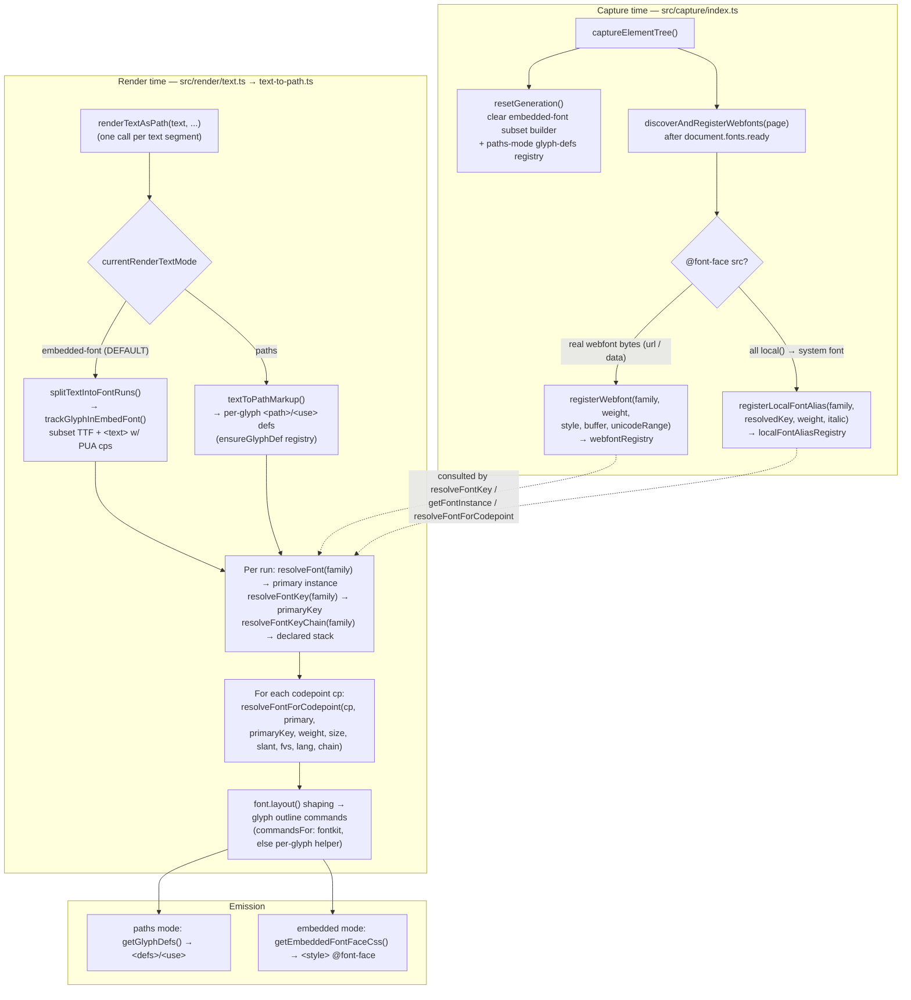
```mermaid
flowchart TD
  subgraph CAP["Capture time — src/capture/index.ts"]
    A0["captureElementTree()"] --> A1["resetGeneration()<br/>clear embedded-font subset builder<br/>+ paths-mode glyph-defs registry"]
    A0 --> A2["discoverAndRegisterWebfonts(page)<br/>after document.fonts.ready"]
    A2 --> A3{"@font-face src?"}
    A3 -->|"real webfont bytes (url / data)"| A4["registerWebfont(family, weight,<br/>style, buffer, unicodeRange)<br/>→ webfontRegistry"]
    A3 -->|"all local() → system font"| A5["registerLocalFontAlias(family,<br/>resolvedKey, weight, italic)<br/>→ localFontAliasRegistry"]
  end

  subgraph REN["Render time — src/render/text.ts → text-to-path.ts"]
    B0["renderTextAsPath(text, ...)<br/>(one call per text segment)"] --> B1{"currentRenderTextMode"}
    B1 -->|"embedded-font (DEFAULT)"| B2["splitTextIntoFontRuns()<br/>→ trackGlyphInEmbedFont()<br/>subset TTF + &lt;text&gt; w/ PUA cps"]
    B1 -->|"paths"| B3["textToPathMarkup()<br/>→ per-glyph &lt;path&gt;/&lt;use&gt; defs<br/>(ensureGlyphDef registry)"]
    B2 --> C0
    B3 --> C0
    C0["Per run: resolveFont(family) → primary instance<br/>resolveFontKey(family) → primaryKey<br/>resolveFontKeyChain(family) → declared stack"]
    C0 --> C1["For each codepoint cp:<br/>resolveFontForCodepoint(cp, primary,<br/>primaryKey, weight, size, slant, fvs, lang, chain)"]
    C1 --> C2["font.layout() shaping →<br/>glyph outline commands<br/>(commandsFor: fontkit, else per-glyph helper)"]
  end

  subgraph OUT["Emission"]
    C2 --> D1["paths mode: getGlyphDefs() → &lt;defs&gt;/&lt;use&gt;"]
    C2 --> D2["embedded mode: getEmbeddedFontFaceCss() → &lt;style&gt; @font-face"]
  end

  A4 -.->|"consulted by resolveFontKey /<br/>getFontInstance / resolveFontForCodepoint"| C0
  A5 -.-> C0
```

**Source of truth:** `discoverAndRegisterWebfonts` + `resetGeneration` in
`src/capture/index.ts`; `renderTextAsPath` / `textToPathMarkup` /
`splitTextIntoFontRuns` in `src/render/text-to-path.ts`; the mode switch
(`currentRenderTextMode` / `withRenderTextMode`) in `src/render/font-resolution.ts`.

### Render-text mode (paths vs embedded-font)

| Mode | Default? | Output | Fidelity | Generation-scoped state |
|---|---|---|---|---|
| `embedded-font` | **yes** (DM-839) | `<text>` against a `@font-face` subset **glyf** TTF (svg2ttf; NOT CFF — DM-1666), addressed by private-use codepoints (consumer browser does zero shaping) | consumer browser rasterizes (its own hinting/AA) — smaller/faster, not byte-identical across browsers | `embeddedFonts` map + `embedded-font-builder` (`clearEmbeddedFonts`) |
| `paths` | no | `<use href="#gN">` into per-glyph `<path>` defs | per-pixel-faithful to Chromium; used for visual-regression diffing | `glyphDefs` registry (`clearGlyphDefs`) |

Both share the SAME per-codepoint resolution (`resolveFontForCodepoint`); they
differ only in the **uncovered terminal** (paths pins the last chain entry's
stable `.notdef` advance so emoji raster overlays stay aligned; embedded renders
the primary font's `.notdef`). `resetGeneration()` clears both generation-scoped
caches together (DM-1338 / DM-1435). The webfont + local-alias registries are
**session-scoped** (survive across generations; cleared by `clearWebfonts`).

---

## 2. Family stack → primary key (`resolveFontKey` / `matchFamilyNameToKey`)

`resolveFontKey(fontFamily)` splits the computed CSS `font-family` string on
commas, lowercases + strips quotes (`splitFontFamilyNames`), and walks the names
in order, returning the FIRST that `matchFamilyNameToKey` resolves; if none match,
the last-resort default is **`times`** (Chrome's macOS "Standard Font" default).
`resolveFontKeyChain` returns the full ordered, de-duplicated list of matched keys
(used by the per-codepoint resolver to reach later-declared families).

> **This ladder is the macOS family stage — it is NOT `process.platform`-branched.**
> `matchFamilyNameToKey` unconditionally encodes Chrome-**on-macOS**'s family and
> generic resolution (each entry is probe-calibrated against Chrome-macOS). The
> logical keys it returns are macOS-face names; cross-platform behavior emerges
> only DOWNSTREAM, where §5's `resolveFontSpec` remaps the SAME key to a
> per-platform file (e.g. `helvetica` → Helvetica on macOS, Liberation Sans on the
> Linux CI image, `arial.ttf` on Windows). Two consequences worth knowing (see
> DM-1687):
>
> - **Generic keywords are pinned to macOS defaults.** `sans-serif`→`helvetica`,
>   `serif`→`times`, `monospace`→`courier` are fixed; only `cursive`/`fantasy`
>   defer to fontconfig (via the Linux table's `fcMatch`). So a host whose
>   generic-family config differs from the calibration target (e.g. a DejaVu-based
>   desktop Linux, where Chrome resolves `sans-serif`→DejaVu Sans) diverges —
>   tracked in **DM-1691**.
> - **The uncurated-named-font tail is macOS/Windows-only.** The final
>   `resolveInstalledFont(name)` step (which resolves an installed-but-uncalibrated
>   family to a `sysfb:` key) uses the native helper, which returns null on Linux —
>   so on Linux an uncurated named family falls through to the `times` default
>   instead of resolving via fontconfig like Chrome would. Tracked in **DM-1690**.
>   (On Windows the `family` query is implemented since DM-1721 — an exact
>   `FindFamilyName` lookup against the system collection, carrying the matched
>   face's resolved axis values for variable instances, e.g. "Segoe UI Variable
>   Text" → `SEGUIVAR.TTF` at `opsz` 10.5.)
>
> `docs/03-font-family-chain.md` frames the same mappings as "matching Chrome on
> macOS"; doc [40](40-cross-platform-font-paths.md) L62 notes the keys are
> "macOS-centric".

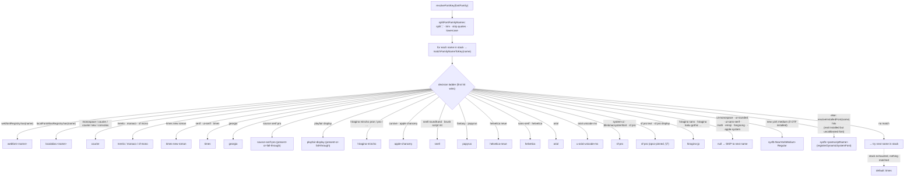
```mermaid
flowchart TD
  S0["resolveFontKey(fontFamily)"] --> S1["splitFontFamilyNames:<br/>split ',' · trim · strip quotes · lowercase"]
  S1 --> L["for each name in stack →<br/>matchFamilyNameToKey(name)"]
  L --> M{"decision ladder (first hit wins)"}

  M -->|"webfontRegistry.has(name)"| R1["webfont:&lt;name&gt;"]
  M -->|"localFontAliasRegistry.has(name)"| R2["localalias:&lt;name&gt;"]
  M -->|"monospace / courier / courier new / consolas"| R3["courier"]
  M -->|"menlo · monaco · sf mono"| R4["menlo / monaco / sf-mono"]
  M -->|"times new roman"| R5["times-new-roman"]
  M -->|"serif · ui-serif · times"| R6["times"]
  M -->|"georgia"| R7["georgia"]
  M -->|"source serif pro"| R8["source-serif-pro (present-or-fall-through)"]
  M -->|"playfair display"| R9["playfair-display (present-or-fall-through)"]
  M -->|"hiragino mincho pron / pro / …"| R10["hiragino-mincho"]
  M -->|"cursive · apple chancery"| R11["apple-chancery"]
  M -->|"snell roundhand · brush script mt"| R12["snell"]
  M -->|"fantasy · papyrus"| R13["papyrus"]
  M -->|"helvetica neue"| R14["helvetica-neue"]
  M -->|"sans-serif · helvetica"| R15["helvetica"]
  M -->|"arial"| R16["arial"]
  M -->|"arial unicode ms"| R17["u-arial-unicode-ms"]
  M -->|"system-ui · blinkmacsystemfont · sf pro"| R18["sf-pro"]
  M -->|"sf pro text · sf pro display"| R19["sf-pro (opsz-pinned, §7)"]
  M -->|"hiragino sans · hiragino kaku gothic …"| R20["hiragino-jp"]
  M -->|"ui-monospace · ui-rounded · ui-sans-serif ·<br/>math · emoji · fangsong · -apple-system"| RN["null → SKIP to next name"]
  M -->|"new york medium (if OTF installed)"| R21["sysfb:NewYorkMedium-Regular"]
  M -->|"else: resolveInstalledFont(name) hits<br/>(real installed but uncalibrated font)"| R22["sysfb:&lt;postscriptName&gt;<br/>(registerDynamicSystemFont)"]
  M -->|"no match"| RNext["→ try next name in stack"]

  RNext -.->|"stack exhausted, nothing matched"| DEF["default: times"]
```

**Why generics resolve where they do (macOS calibration — Blink `font_cache_mac.mm`):**

| CSS generic / keyword | Key | Actual macOS font |
|---|---|---|
| `sans-serif`, `Helvetica` | `helvetica` | Helvetica.ttc (NOT SF Pro) |
| `serif`, `ui-serif`, `Times`, UA default | `times` | Times.ttc (Apple Times, NOT Times New Roman) |
| `monospace`, `Courier`, `Courier New`, `Consolas` | `courier` | Courier.ttc (NOT SF Mono/Menlo) |
| `cursive` | `apple-chancery` | Apple Chancery (NOT Snell Roundhand) |
| `fantasy` | `papyrus` | Papyrus |
| `system-ui`, `BlinkMacSystemFont`, `SF Pro` | `sf-pro` | SFNS.ttf |
| `ui-monospace`, `ui-rounded`, `math`, `emoji`, `fangsong`, `-apple-system` | `null` | **skipped** (Chrome doesn't pin these; falls through the stack, ultimately to `times`) |

**Source of truth:** `matchFamilyNameToKey` / `resolveFontKey` /
`resolveFontKeyChain` / `splitFontFamilyNames` in `src/render/font-resolution.ts`.
Doc [03](03-font-family-chain.md).

---

## 3. Key → FontInstance (`getFontInstance`)

Given a logical key + `(weight, fontSize, slant, variationSettings)`,
`getFontInstance` returns a cached, weight/slant-correct, variation-driven
`FontInstance`, or `null` (caller walks to the next candidate).

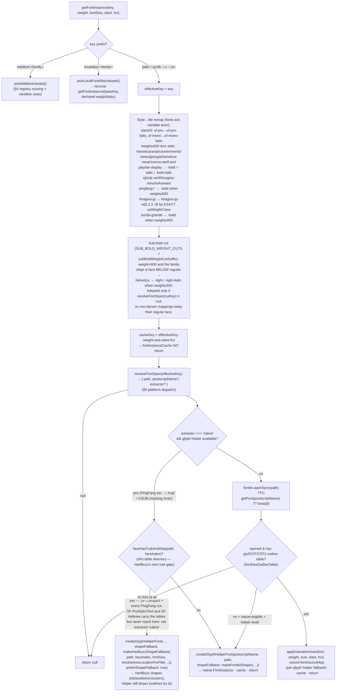
```mermaid
flowchart TD
  G0["getFontInstance(key, weight, fontSize, slant, fvs)"] --> G1{"key prefix?"}
  G1 -->|"webfont:&lt;family&gt;"| GW["pickWebfontVariant()<br/>(§4 registry scoring + variation axes)"]
  G1 -->|"localalias:&lt;family&gt;"| GL["pickLocalFontAliasVariant()<br/>→ recurse getFontInstance(baseKey,<br/>declared weight/italic)"]
  G1 -->|"plain / sysfb: / u- / un-"| G2["effectiveKey = key"]

  G2 --> G3["Style→file remap (fonts w/o variable axes):<br/>slant≠0: sf-pro→sf-pro-italic, sf-mono→sf-mono-italic<br/>weight≥600 &/or italic: helvetica/arial/courier/menlo/<br/>times/georgia/helvetica-neue/source-serif-pro/<br/>playfair-display → -bold / -italic / -bold-italic<br/>cjk/cjk-serif/hiragino-mincho/korean/<br/>pingfang-* → -bold when weight≥600<br/>hiragino-jp → hiragino-jp-w{0,1,3..9} by EXACT usWeightClass<br/>lucida-grande → -bold when weight≥450"]
  G3 --> G3b["Sub-bold cut (SUB_BOLD_WEIGHT_CUTS +<br/>subBoldWeightCutSuffix): weight&lt;600 and the family<br/>ships a face BELOW regular →<br/>helvetica → -light / -light-italic when weight≤300.<br/>Adopted only if resolveFontSpec(cutKey) ≠ null,<br/>so non-darwin mappings keep their regular face."]
  G3b --> G4["cacheKey = effectiveKey-weight-size-slant-fvs<br/>→ fontInstanceCache hit? return"]
  G4 --> G5["resolveFontSpec(effectiveKey) → { path, postscriptName?, extractor? }<br/>(§5 platform dispatch)"]
  G5 -->|"null"| GNull["return null"]
  G5 --> G6{"extractor === 'native'<br/>&& glyph helper available?"}
  G6 -->|"yes (PingFang etc. — hvgl / GSUB-crashing fonts)"| G6t{"faceHasTrakAndStat(path, faceIndex)?<br/>(sfnt table directory — HarfBuzz's own trak gate)"}
  G6t -->|"yes — SF Compact + every PingFang cut.<br/>SF Pro/Italic/Text and SF Hebrew carry the tables<br/>but never reach here: not extractor:'native'"| G7t["createGlyphHelperFont(…, shapeFallback: makeHarfbuzzShapeFallback(<br/>path, faceIndex, fontSize, resolveAxisLocationForFile(…)),<br/>preferShapeFallback: true)<br/>→ HarfBuzz shapes (ids/positions/clusters),<br/>helper still draws (outlines by id)"]
  G6t -->|"no"| G7["createGlyphHelperFont(postscriptName, path,<br/>shapeFallback: makeFontkitShaper(…))<br/>→ native FontInstance · cache · return"]
  G6 -->|"no"| G8["fontkit.openSync(path)<br/>· TTC: getFont(postscriptName) ?? fonts[0]"]
  G8 --> G9{"opened & has glyf/CFF/CFF2 outline table?<br/>(fontHasOutlineTable)"}
  G9 -->|"no + native-eligible + helper avail"| G7
  G9 -->|"no font at all"| GNull
  G9 -->|"yes"| G10["applyVariationAxes(font, weight, size, slant, fvs)<br/>· record fontSourceMap (per-glyph helper fallback)<br/>· cache · return"]
```

**Probe-then-fallback dispatch (doc [51](51-probe-then-fallback-dispatch.md)):**
fontkit is primary; the **native glyph helper** (macOS CoreText / Linux FreeType /
Windows DirectWrite, dispatched by `process.platform` in `src/render/glyph-helper.ts`)
is the fallback for a *helper-eligible* font (`extractor: "native"`) that fontkit
can't open OR opens with no outline table (PingFang's outlines live in Apple's
private `hvgl` table). A finer **per-glyph** tier (`commandsFor` → `helperGlyphOutline`,
DM-891, doc [52](52-embedded-mode-glyph-fallback.md)) supplies a single glyph's
outline from the SAME file when fontkit opened the font but returned an empty path
for one inkable glyph.

**Outline offset — where CoreText says the glyph goes vs where it draws it.**
`createGlyphHelperFont` measures one per-face vertical correction on macOS and
applies it to every outline it returns (`measureOutlineOffsetY` →
`glyphCommands`, `src/render/glyph-helper.ts`). CoreText exposes two answers for
the same glyph: `CTFontCreatePathForGlyph` (the outline) and
`CTFontGetBoundingRectsForGlyphs` (the box it occupies). Chrome paints at the
bounding rect, so where the two disagree the raw outline lands in the wrong
place. Apple Color Emoji is the one macOS face that disagrees — CoreText places
every one of its glyphs 100 units (0.125 em at its 800 upem) below the outline
it hands back, matching Chrome's painted output exactly; ten ordinary faces
report 0 across 600 glyphs each.

The catch is that CoreText only reveals this through the **system-registered**
font: opening the very same file by URL — which is how the helper normally opens
faces — reports an offset of 0. So the probe issues a second handle on the face
by PostScript **name** (no path) inside the existing `meta` round trip and reads
the disagreement there. The offset is a property of the face, so it is measured
once per font, never per glyph, and adopted only when the sampled glyphs agree
AND the offset is at least 1% of the em — a face whose curve extrema sit off its
control points otherwise reports sub-unit noise (PingFang SC scatters 0 to −1
unit at 1000 upem) that must not be mistaken for a real offset. Faces opened
with an explicit variation location skip the probe.

The visible symptom was a lone U+20E3 COMBINING ENCLOSING KEYCAP: one of the few
Apple Color Emoji glyphs that is a real outline rather than an sbix bitmap, so it
takes the glyph-path pipeline rather than the raster-overlay one, and painted its
box ~4 px high at font-size 32.

**Weight → face routing.** A static family has no `wght` axis to drive, so the
requested CSS weight has to pick a FILE (or a TTC member). Three rules, applied
in order, all of them calibrated by asking Chromium which face it painted —
`CSS.getPlatformFontsForNode` over the full 100…900 range in 10-point steps —
rather than by running the CSS font-matching algorithm, which the platform
matcher does not reproduce:

| Family key | Measured Chrome behavior |
| --- | --- |
| `helvetica` | 100-300 → `Helvetica-Light`, 310-590 → `Helvetica`, 600-900 → `Helvetica-Bold`; oblique column parallel |
| `lucida-grande` | 100-440 → `LucidaGrande`, 450-900 → `LucidaGrande-Bold` |
| `arial` / `times` / `georgia` / `courier` / `menlo` / … | regular below 600, bold at 600+ (no other cut installed) |

1. the `weight ≥ 600` bold split plus the italic sibling (the long-standing
   rule, still the default for every regular/bold-only family);
2. `SUB_BOLD_WEIGHT_CUTS` / `subBoldWeightCutSuffix` for a family that ships a
   face **below** regular — today `helvetica`, whose `Helvetica.ttc` carries a
   Light cut at `OS/2.usWeightClass` 300 that the regular/bold pair hid. This
   one matters broadly: Chrome on macOS resolves the `sans-serif` generic to
   Helvetica, so `font-weight: 100/200/300` on default body text was painted a
   full cut too heavy;
3. the per-family bold thresholds that are not 600 — `lucida-grande` (the macOS
   fallback for arrows, Hebrew and check marks) crosses over at 450, so a `↑` or
   `✓` inside a bold heading is painted from the bold face.

Every suffixed key is adopted **only when `resolveFontSpec` resolves it on the
host platform**, which is what keeps the table platform-agnostic: the Linux
(Liberation Sans) and Windows (Arial) mappings for `helvetica` / `lucida-grande`
have no light or bold sibling key, so they fall back to the regular face —
which is what Chrome picks there too.

**Faux-italic signal.** `FontInstance.isRoutedItalicCut` records that the slant
request was satisfied by routing to a real italic/oblique sibling. It exists
because `post.italicAngle` is not trustworthy on its own — `Helvetica-LightOblique`
and `HelveticaNeue-BoldItalic` both report 0 despite outlines that lean the same
~12° as their correctly-tagged siblings, and the embedded-mode faux-italic gate
in `renderTextAsPath` sheared those a second time. The routing decision wins over
the angle.

**Source of truth:** `getFontInstance` / `resolveFontSpec` / `applyVariationAxes` /
`subBoldWeightCutSuffix` / `fontHasOutlineTable` / `commandsFor` in
`src/render/font-resolution.ts`; `src/render/glyph-helper.ts`.

---

## 4. Registries: webfonts + local() aliases

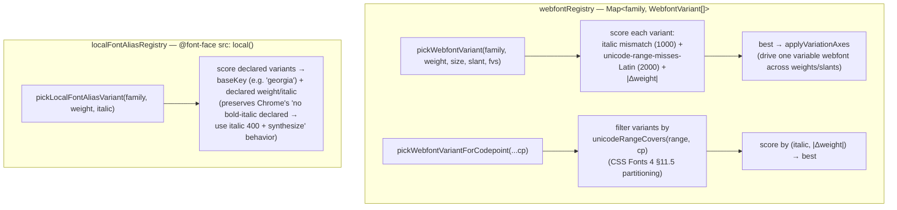
```mermaid
flowchart TD
  subgraph WF["webfontRegistry — Map&lt;family, WebfontVariant[]&gt;"]
    W0["pickWebfontVariant(family, weight, size, slant, fvs)"] --> W1["score each variant:<br/>italic mismatch (1000) +<br/>unicode-range-misses-Latin (2000) +<br/>|Δweight|"]
    W1 --> W2["best → applyVariationAxes<br/>(drive one variable webfont across weights/slants)"]
    P0["pickWebfontVariantForCodepoint(...cp)"] --> P1["filter variants by<br/>unicodeRangeCovers(range, cp)<br/>(CSS Fonts 4 §11.5 partitioning)"]
    P1 --> P2["score by (italic, |Δweight|) → best"]
  end
  subgraph LA["localFontAliasRegistry — @font-face src: local()"]
    LA0["pickLocalFontAliasVariant(family, weight, italic)"] --> LA1["score declared variants →<br/>baseKey (e.g. 'georgia') + declared weight/italic<br/>(preserves Chrome's 'no bold-italic declared →<br/>use italic 400 + synthesize' behavior)"]
  end
```

- **Webfonts** (`registerWebfont`) retain the decompressed TTF/OTF buffer so
  embedded mode can `@font-face` it as a `data:` URI. Google-Fonts-style
  partitioning (same `(family, weight)` across N `@font-face` rules, each a
  distinct `unicode-range`) is honored per-codepoint by
  `pickWebfontVariantForCodepoint` (DM-517 / DM-557); `pickWebfontVariant` biases
  toward the Latin partition when it can't route per-codepoint. Doc
  [30](30-webfont-unicode-range.md).
- **Local aliases** (`registerLocalFontAlias`) map an author `@font-face` family
  whose `src` is all `local()` to a known system key, tracking each declared
  `(weight, italic)` variant (DM-360 / DM-303 / DM-1597).

**Source of truth:** `registerWebfont` / `pickWebfontVariant` /
`pickWebfontVariantForCodepoint` / `unicodeRangeCovers` / `registerLocalFontAlias` /
`pickLocalFontAliasVariant` in `src/render/font-resolution.ts`.

---

## 5. Key → font file: platform path dispatch (`resolveFontSpec`)

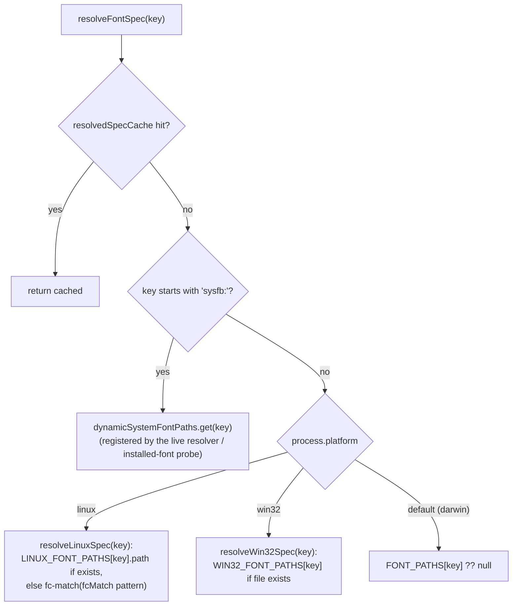
```mermaid
flowchart TD
  RS0["resolveFontSpec(key)"] --> RS1{"resolvedSpecCache hit?"}
  RS1 -->|"yes"| RSC["return cached"]
  RS1 -->|"no"| RS2{"key starts with 'sysfb:'?"}
  RS2 -->|"yes"| RS3["dynamicSystemFontPaths.get(key)<br/>(registered by the live resolver / installed-font probe)"]
  RS2 -->|"no"| RS4{"process.platform"}
  RS4 -->|"linux"| RSL["resolveLinuxSpec(key):<br/>LINUX_FONT_PATHS[key].path if exists,<br/>else fc-match(fcMatch pattern)"]
  RS4 -->|"win32"| RSW["resolveWin32Spec(key):<br/>WIN32_FONT_PATHS[key] if file exists"]
  RS4 -->|"default (darwin)"| RSD["FONT_PATHS[key] ?? null"]
```

Three platform tables map the SAME logical keys to different files (doc
[40](40-cross-platform-font-paths.md)). A key absent from the platform table (or
whose file isn't on disk, e.g. `source-serif-pro`, `playfair-display`) resolves to
`null`, and the caller falls through — matching Chrome's behavior on a host
lacking that font.

### macOS `FONT_PATHS` (excerpt — the calibrated key→file map)

**An entry on a `.ttc` must name its member.** A spec with no `postscriptName`
does not mean "this file's face" — it means "whatever opening the file by path
gives you", and on a collection that is member 0, i.e. the vendor's ordering
rather than anything a routing table meant. `NotoSansMyanmar.ttc` has 18 members
and member 0 is **Black**, so every Myanmar run painted at weight 900 whatever
the CSS asked for, while Chrome (asked over CDP) answers
`NotoSansMyanmar-Regular` at weight 400 — U+1000 advance 1124 against Black's
1121. `src/render/font-path-postscript-names.test.ts` sweeps the table and fails
on any key that resolves to a multi-member collection without a name.

Entries under the `u-` namespace come from the generated per-block table, which
says not to edit it by hand; names for those are overridden in `FONT_PATHS`
**after** the spread, which is the durable place until the generator learns to
emit one.

**Single-face VARIABLE files are a separate, still-open question.** For those,
opening by path also gets different metrics than the face HarfBuzz indexes — SF
Arabic 3870 units by path against 4122 by name, SF Pro's `Hamburgefonstiv`
13580.667 against 14711, with identical glyph ids throughout, so it is metrics
rather than face identity, and by-name equals HarfBuzz exactly. Naming them
nonetheless regressed a unicode fixture 30× on CI, reproducibly and against a
control ref run twice, by a mechanism not yet found — it is inert in every local
measurement, so the divergence is specific to the runner's font inventory. They
are deliberately left unnamed until that is explained.

| Key(s) | File | Notes |
|---|---|---|
| `sf-pro` / `sf-pro-italic` | SFNS.ttf / SFNSItalic.ttf | system-ui; italic is a sibling file, not a `slnt` axis |
| `sf-mono(-italic)` | SFNSMono(Italic).ttf | |
| `helvetica*` | Helvetica.ttc | `sans-serif` generic |
| `helvetica-neue*` | HelveticaNeue.ttc | distinct face from Helvetica (DM-1189) |
| `arial*` | Supplemental/Arial*.ttf | |
| `times*` | Times.ttc | `serif` generic + UA default |
| `times-new-roman*` | Supplemental/Times New Roman*.ttf | explicit name only |
| `georgia*` | Supplemental/Georgia*.ttf | |
| `courier*` | Courier.ttc | `monospace` generic |
| `menlo*` / `monaco` | Menlo.ttc / Monaco.ttf | |
| `cjk(-bold)` | Hiragino Sans GB.ttc (W3/W6) | sans CJK fallback |
| `cjk-serif(-bold)` | Supplemental/Songti.ttc (STSongti-SC-Light/Bold) | serif-primary CJK |
| `pingfang-{sc,tc,hk,mo}(-bold)` | PingFang.ttc | Han ideographs; **`extractor: native`** (hvgl) |
| `hiragino-jp` + `hiragino-jp-w0…w9` | ヒラギノ角ゴシック W0–W9 (**HiraginoSans-W\***) | JP kana + wide symbols. Chrome picks the cut whose `OS/2.usWeightClass` matches the CSS weight exactly — measured 100→W0 200→W1 300→W3 400→W4 500→W5 600→W6 700→W7 800→W8 900→W9 (W2 is usWeightClass 250, unreachable from CSS). The base key is **W4**. Previously pinned to `HiraKakuProN-W3`, which is a different FAMILY (Hiragino Kaku Gothic ProN) that merely shares the W3 `.ttc` container — wrong at all nine weights, and wrong in family besides. DM-1854. |
| `hiragino-mincho(-bold)` | ヒラギノ明朝 ProN | JP serif, explicit-name only |
| `korean(-bold)` | AppleSDGothicNeo.ttc | Hangul |
| `thai` | ThonburiUI.ttc | |
| `devanagari` | Kohinoor.ttc | |
| `sf-arabic` | GeezaPro.ttc | Arabic (Geeza Pro, not SF Arabic) |
| `sf-hebrew` | SFHebrew.ttf | |
| `symbols` | Apple Symbols.ttf | math operators / misc technical |
| `zapf-dingbats` | ZapfDingbats.ttf | Dingbats block |
| `stix-math` | Supplemental/STIXTwoMath.otf | Math Alphanumeric |
| `lucida-grande` | LucidaGrande.ttc | specific arrows / shapes |
| `snell` / `apple-chancery` / `papyrus` | Supplemental/… | cursive / fantasy |
| `last-resort` | LastResort.otf (macOS) / bundled LastResortHE (else) | per-block tofu frame |
| `u-…` (319 block routes) | `unicode-font-routing.darwin.generated.ts` | DM-983 CDP sweep — **availability-gated, see below** |

#### Generated block routes are gated on the family being installed (DM-1844)

The `u-…` table records which family Chrome's CoreText fallback picked **per Unicode block, as sampled on one Mac**. It is therefore a snapshot of that machine's font inventory, and several of its families are *not* stock — `SF Pro Text` and `Noto Sans` are separate Apple / Google downloads, and the Cyrillic route (among 18 others) names `SF Pro Text`.

So each entry now carries the `family` it was sampled from, and `fallbackFontChain` uses a route only when `resolveInstalledFont(family)` succeeds here (`generatedRouteUsable`). On a machine without that family Chrome cannot pick it either, and a route to a face Chrome will never choose defeats the table's whole purpose.

**A file-existence check is not sufficient** and was the trap: the Cyrillic route's `/System/Library/Fonts/SFNS.ttf` exists on every macOS. What varies is whether the *family* is installed — which is what decides Chrome's pick. Same rule the family→key map already applies to `"SF Pro Text"`.

When a route is rejected, the **live resolver** supplies the replacement and is placed at the chain HEAD. Merely dropping the route would be worse than the original bug: the static tail ends in `last-resort`, whose LastResort.otf has a block-frame glyph for *every* codepoint, so it would win and paint tofu — and `u-noto-sans` sitting in that tail is itself a non-stock download that gets skipped when absent. If the OS has no answer either, the generated route is kept: a face Chrome might not pick still beats guaranteed tofu.

Measured with `tools/chrome-font-agreement.ts` (FONTAGREE), which asks Chrome via CDP `CSS.getPlatformFontsForNode` and our resolver the same per-codepoint question on the same machine. On the GitHub macOS runner this went **6/10 → 10/10**: U+04FA–U+04FC now resolve to `sysfb:.NewYork-Regular`, matching the `.New York` Chrome paints there, and U+1D00 to Lucida Grande, instead of the route's SFNS. On a developer Mac — which *has* the sampled fonts — nothing changes and it stays 10/10. `src/render/generated-route-family.test.ts` pins the family provenance the gate depends on.

Ten codepoints is a diagnostic, not a proof. The exhaustive form of the same comparison is **`tools/font-conformance.ts`** (`npm run fonts:conformance`, [doc 107](./107-font-conformance-oracle.md)): every assigned Unicode codepoint × every font stack the fixture corpus uses, asked of both Chrome and this diagram's resolver, with a JSON report and a non-zero exit on any disagreement. Anything in this diagram that is a sampled approximation rather than a transcription of Blink's own logic shows up there as a mismatch count.

### Linux (`LINUX_FONT_PATHS`, bare CI image) & Windows (`WIN32_FONT_PATHS`)

| Key | Linux (Playwright noble image) | Windows |
|---|---|---|
| `helvetica`/`arial`/`sf-pro` | Liberation Sans | Arial / (sf-pro→Segoe UI) |
| `times` | Liberation Serif | Times New Roman |
| `courier`/`menlo`/`monaco`/`sf-mono` | WenQuanYi Zen Hei Mono | Courier New / Consolas |
| `cjk` | WenQuanYi Zen Hei | Microsoft YaHei |
| `cjk-serif` | (Noto profile / generated) | SimSun |
| `hiragino-jp` | IPAGothic (generated) | Yu Gothic |
| `korean` | WenQuanYi (generated) | Malgun Gothic |
| `sf-arabic` | FreeSerif | Segoe UI |
| `sf-hebrew` | (Liberation Sans covers) | Segoe UI |
| `devanagari` | FreeSans | Nirmala UI |
| `thai` | Loma | Tahoma / Leelawadee UI |
| `symbols`/`zapf-dingbats` | FreeSans / FreeSerif | Segoe UI Symbol |
| `stix-math` | FreeSans / FreeSerif | Cambria Math |
| `u-…`/`un-…` generated | `unicode-font-routing.{linux,noto-linux}.generated.ts` | `unicode-font-routing.win32.generated.ts` |

**Linux profile detection** (`linuxFontProfile`): `fc-match "sans-serif:charset=4e00"`
→ if the path matches `/noto/i`, use the **Noto** calibrated table
(`linuxNotoFallbackChain` + `UNICODE_FONT_RANGES_NOTO_LINUX`); else the **bare**
CI-image chain. Overridable via `DOMOTION_LINUX_FONT_PROFILE=noto|bare`.

**Source of truth:** `resolveFontSpec` / `resolveLinuxSpec` / `resolveWin32Spec` /
`fcMatch` / `linuxFontProfile` / `FONT_PATHS` / `LINUX_FONT_PATHS` /
`WIN32_FONT_PATHS` in `src/render/font-resolution.ts`; the four
`unicode-font-routing.*.generated.ts` tables.

---

## 6. Per-codepoint resolution (`resolveFontForCodepoint`) — Blink FontFallbackIterator mirror

This is the heart of the system: for one codepoint `cp` in a run whose primary is
`primaryFont`/`primaryFontKey` and whose declared stack is `fontKeyChain`, decide
the exact font + glyph to paint. The order mirrors Blink's `FontFallbackIterator`.

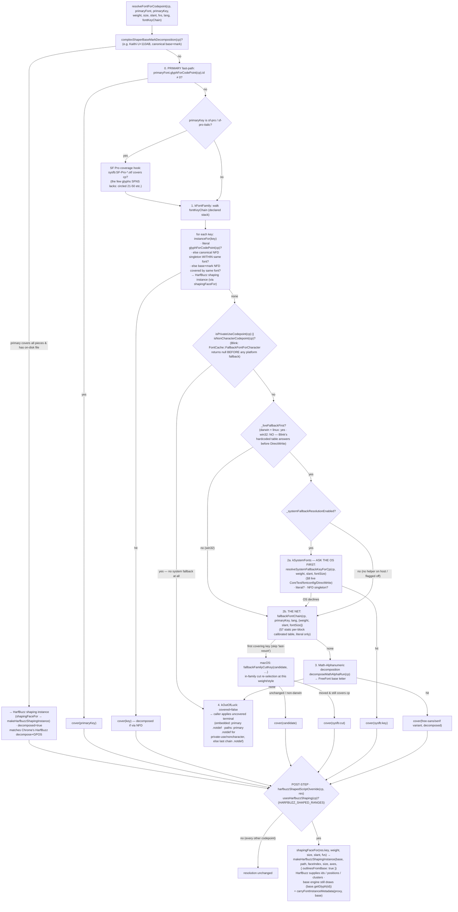
```mermaid
flowchart TD
  F0["resolveFontForCodepoint(cp, primaryFont, primaryKey,<br/>weight, size, slant, fvs, lang, fontKeyChain)"] --> FC["complexShaperBaseMarkDecomposition(cp)?<br/>(e.g. Kaithi U+110AB, canonical base+mark)"]
  FC -->|"primary covers all pieces & has on-disk file"| FCH["→ HarfBuzz shaping instance<br/>(shapingFaceFor → makeHarfbuzzShapingInstance) · decomposed=true<br/>matches Chrome's HarfBuzz decompose+GPOS"]
  FC -->|"no"| F1["0. PRIMARY fast-path:<br/>primaryFont.glyphForCodePoint(cp).id ≠ 0?"]
  F1 -->|"yes"| F1H["cover(primaryKey)"]
  F1 -->|"no"| FSF{"primaryKey is sf-pro / sf-pro-italic?"}
  FSF -->|"yes"| FSF1["SF Pro coverage hook:<br/>sysfb:SF-Pro-*.otf covers cp?<br/>(the few glyphs SFNS lacks: circled 21-50 etc.)"]
  FSF1 --> F2
  FSF -->|"no"| F2["1. kFontFamily: walk fontKeyChain (declared stack)"]
  F2 --> F2A["for each key: instanceFor(key)<br/>· literal glyphForCodePoint(cp)?<br/>· else canonical NFD singleton WITHIN same font?<br/>· else base+mark NFD covered by same font?<br/>→ HarfBuzz shaping instance (via shapingFaceFor)"]
  F2A -->|"hit"| F2H["cover(key) — decomposed if via NFD"]
  F2A -->|"none"| FPUA{"isPrivateUseCodepoint(cp) ||<br/>isNonCharacterCodepoint(cp)?<br/>(Blink: FontCache::FallbackFontForCharacter<br/>returns null BEFORE any platform fallback)"}
  FPUA -->|"yes — no system fallback at all"| F6
  FPUA -->|"no"| FW{"_liveFallbackFirst?<br/>(darwin + linux: yes · win32: NO — Blink's<br/>hardcoded table answers before DirectWrite)"}
  FW -->|"no (win32)"| F3
  FW -->|"yes"| F4{"_systemFallbackResolutionEnabled?"}
  F4 -->|"yes"| F4A["2a. kSystemFonts — ASK THE OS FIRST:<br/>resolveSystemFallbackKeyForCp(cp, weight, slant, fontSize)<br/>(§8 live CoreText/fontconfig/DirectWrite)<br/>· literal? · NFD singleton?"]
  F4A -->|"hit"| F4H["cover(sysfb:key)"]
  F4A -->|"OS declines"| F3
  F4 -->|"no (no helper on host / flagged off)"| F3["2b. THE NET: fallbackFontChain(cp, primaryKey, lang, {weight, slant, fontSize})<br/>(§7 static per-block calibrated table, literal only)"]
  F3 -->|"first covering key (skip 'last-resort')"| F3C["macOS: fallbackFamilyCutKey(candidate, …)<br/>in-family cut re-selection at this weight/style"]
  F3C -->|"moved & still covers cp"| F3HC["cover(sysfb:cut)"]
  F3C -->|"unchanged / non-darwin"| F3H["cover(candidate)"]
  F3 -->|"none"| F5["3. Math-Alphanumeric decomposition<br/>decomposeMathAlphaRun(cp) → FreeFont base letter"]
  F5 -->|"hit"| F5H["cover(free-sans/serif variant, decomposed)"]
  F5 -->|"none"| F6["4. kOutOfLuck: covered=false<br/>→ caller applies uncovered terminal<br/>(embedded: primary .notdef · paths: primary .notdef for<br/>private-use/noncharacter, else last chain .notdef)"]
  FCH & F1H & F2H & F3H & F3HC & F4H & F5H --> FHB{"POST-STEP · harfbuzzShapedScriptOverride(cp, res)<br/>usesHarfbuzzShaping(cp)? (HARFBUZZ_SHAPED_RANGES)"}
  FHB -->|"no (every other codepoint)"| FHB0["resolution unchanged"]
  FHB -->|"yes"| FHB1["shapingFaceFor(res.key, weight, size, slant, fvs) →<br/>makeHarfbuzzShapingInstance(base, path, faceIndex, size, axes,<br/>{ outlinesFromBase: true })<br/>HarfBuzz supplies ids / positions / clusters ·<br/>base engine still draws (base.getGlyph(id))<br/>+ carryFontInstanceMetadata(proxy, base)"]
```

Notes:
- `instanceFor(key)` materializes a chain key to an instance —
  webfont-partition-aware (`pickWebfontVariantForCodepoint`), and only the
  **primary** carries the author's `font-variation-settings`.
- **The post-step routes SHAPING to HarfBuzz without moving the OUTLINES.**
  `resolveFontForCodepoint` is a thin wrapper: it calls the resolution walk
  above and then hands the result to `harfbuzzShapedScriptOverride`, which — for
  the scripts listed in `HARFBUZZ_SHAPED_RANGES` (`unicode-classification.ts`) —
  replaces the resolved instance with a `makeHarfbuzzShapingInstance` proxy in
  `outlinesFromBase` mode. HarfBuzz then supplies glyph ids, positions and
  clusters (it is the engine Chrome runs), and each glyph's outline still comes
  from `base.getGlyph(id)`, which is well-defined because it is the same file
  and therefore the same gid space.

  The list is grown **one script at a time**, each with its own full macOS
  unicode sweep, because a script's blast radius is every face that covers it.
  Today it holds **Thai** (U+0E00–U+0E7F). The reason a script is on it is a
  measurement, not an assumption: `npm run fonts:shaper-ab` compares HarfBuzz
  against the macOS CoreText helper over every resolvable face and reports 366
  disagreements spread across **all ten** dedicated-shaper scripts, so the claim
  the exclusion used to rest on — "macOS CoreText already matches Chrome for
  them" — is false everywhere it was applied. Two of Thai's 32 are `glyph-ids`:
  HarfBuzz substitutes the Windows-PUA shift-left forms U+F704 / U+F714 for an
  above vowel plus tone mark over an ascender consonant, per the state machine
  and mapping table in `external/harfbuzz/src/hb-ot-shaper-thai.cc` (rev
  `4de187d`: `SL_mappings` :124-137, `thai_pua_shape` :156-159,
  `thai_above_start_state` :172-179, `thai_above_state_machine` :188-189). On
  Arial Unicode MS those are the plain outline shifted 220 units left — 0.107 em,
  ≈1.7 px at 16 px.

  **Holding the outlines fixed is the whole mechanism.** An earlier attempt
  routed the entire `layout()` through HarfBuzz and made the Thai fixture worse
  (worst tile 0.0940 → 0.1214, reproducible to six decimal places) even though
  on the face that fixture actually paints with, the two engines shape
  byte-for-byte identically — the cost was the outline engine changing hands,
  against which the macOS pixel calibration was measured.

  Two consequences worth stating because they are easy to get backwards:
  - The script stays in `DEDICATED_SHAPER_RANGES`. That predicate is also what
    tells `text-to-path.ts` a run needs RUN-based shaping rather than
    per-character; dropping a rerouted script out of it would turn contextual
    shaping off entirely.
  - The two HarfBuzz-**outline** hooks (`complexShaperBaseMarkDecomposition`
    above, and `resolveDottedCircleHbRun`) stay excluded for rerouted scripts
    too. A rerouted run is already HarfBuzz-shaped, so all they could add is the
    outline swap that regressed the fixture.

  The proxy exposes a fixed property set, so `carryFontInstanceMetadata` copies
  the facts the embedded-font path reads off a resolved instance
  (`naturalWeight` / `faceIsBoldTrait` for synthetic bold, `resolvedItalicAngle`
  / `isRoutedItalicCut` for synthetic oblique, `postscriptName`) plus its
  `fontSourceMap` entry — without which two optical instances of one face
  collapse into a single embedded TTF.
- **Why the OS is asked first (step 2a before 2b).** Blink has exactly ONE stage
  here and it is the OS. `FontFallbackIterator::Next`
  (`font_fallback_iterator.cc:120-157`, Chromium rev `7d859f27`) runs
  `kFontGroupFonts` / `kSegmentedFace` → (`kFallbackPriorityFonts`, one-shot,
  emoji only) → **`kSystemFonts` = `UniqueSystemFontForHintList`** →
  `kFirstCandidateForNotdefGlyph` → `kOutOfLuck`. There is no static
  per-Unicode-block stage anywhere in that walk, and `UniqueSystemFontForHintList`
  goes straight to the platform fallback. Our `fallbackFontChain` therefore sits
  exactly where Blink asks the OS, so ordering it first meant answering before
  Chrome's question was ever asked — the structural divergence
  [doc 106](106-blink-font-parity-inventory.md) §4 names. Putting the OS first
  collapsed every wrong `→ PingFangHK-Regular` route to zero — we had been
  painting the Hong Kong regional variant on ext-B where Chrome paints SC.

  On the conformance oracle's CJK slice this ordering **alone** moves 113,963
  mismatches / 27 routes → **113,407 / 16**. The larger figure this doc
  previously reported for it (29,025 / 4, agree-exact 86.9%) is the combined
  result with the `system-ui` cascade base armed, which was still off by default
  when that was written — see the 2×2 in §8a. Neither flag is scoreable alone,
  and 84,382 of the 84,938 rows require both.
- **Private-use and noncharacter codepoints skip system fallback entirely.**
  Blink's `FontCache::FallbackFontForCharacter`
  (`platform/fonts/font_cache.cc:229-244`, rev `7d859f27`) returns null before it
  reaches `PlatformFallbackFontForCharacter` at all:

  ```cpp
  if (Character::IsPrivateUse(lookup_char) ||
      Character::IsNonCharacter(lookup_char))
    return nullptr;
  ```

  `IsPrivateUse` is general category `Co`; `IsNonCharacter` is ICU's
  `U_IS_UNICODE_NONCHAR` — U+FDD0..U+FDEF plus the last two codepoints of every
  plane (`character.cc:290-296`). Upstream pins it with
  `FontCacheTest.NoFallbackForPrivateUseArea`, and Blink's own comment gives the
  reason for the noncharacter half: some are encoding-detection sentinels that
  really do appear on the web, and running fallback for U+FFFE cost a memory
  regression (crbug.com/862352).

  The gate covers **both** 2a and 2b, because both stand in for `kSystemFonts` —
  so the walk falls straight through to `kOutOfLuck` and the run keeps painting
  from its primary. Two live defects came from not having it: macOS CoreText
  answers `SFCompact-Regular` for U+100000 (Apple keeps SF Symbols in plane 16),
  so a private-use codepoint painted a real SF glyph; and the chain tail answered
  LastResort for the rest, whose glyph is a rounded box with a `?` measuring
  2253/2048 em against Helvetica's 1298 `.notdef` — wide enough to overhang the
  next character, since the advance came from the capture and was Chrome's.
  The declared-family stages are deliberately NOT gated: macOS Helvetica has a
  real U+F8FF (the Apple logo), and an author's icon webfont covers its own PUA
  range, both of which Chrome paints from the family that carries them.
- **Step 2b is still load-bearing.** The static chain is the net for what the OS
  declines: a host with no glyph helper, a platform whose live resolver is
  flagged off, or a codepoint the platform engine has no answer for — each of
  which would otherwise drop straight to tofu. It is a fall-through, not a
  competitor. `DOMOTION_LIVE_FALLBACK_FIRST=0` restores the old chain-first order
  for an A/B.
- **Windows keeps 2b before 2a, and that is not an oversight.** `kSystemFonts`
  bottoms out in `FontCache::PlatformFallbackFontForCharacter`, which is a
  different procedure on each platform — so "ask the OS first" is Blink's order
  on only two of the three. macOS goes straight to `CTFontCreateForString`, and
  Linux straight to fontconfig (`linux/font_cache_linux.cc:89-97` — no table
  stage precedes it). Windows calls
  `GetFallbackFamilyNameFromHardcodedChoices` **first** and reaches
  `GetDWriteFallbackFamily` only as the fall-through on a miss
  (`win/font_cache_skia_win.cc:285-295`, rev `7d859f27`). Since §7c transcribes
  that hardcoded table into `win32FallbackChain`, running the static chain ahead
  of the live resolver is precisely what reproduces Chrome on Windows; flipping
  the order there would put `MapCharacters` in front of the table and invert the
  thing the transcription exists to match. The principle is not "no tables" — it
  is transcribed-from-Chromium rather than sampled-from-a-machine.
- Step 2b names a **family**, not a face. Each `FONT_PATHS` entry can hold only
  one PostScript name, and the `-bold` siblings beside it are a two-slot
  approximation of a ladder Chrome actually runs: Songti SC answers Light at
  100-300, Regular at 400, Bold at 500-700 and Black at 800-900 for the same
  character; Apple SD Gothic Neo runs all nine steps; and every crossover sits on
  an xx50 boundary, because Blink buckets the CSS weight with `(weight - 50) /
  100` integer division before handing CoreText a weight trait — Chrome moves
  Lucida Grande and Songti SC at 450, not 500. (The hand-tuned
  `lucida-grande` heuristic had that boundary right for that one family; the
  mechanism has it right for all of them.) `fallbackFamilyCutKey`
  replaces that approximation with the mechanism (§8a): it hands the candidate's
  own face to the system-fallback resolver as the cascade base, so
  `CTFontCreateForString` answers with that same face — the caller has already
  checked it covers `cp` — and only the in-family re-selection moves. macOS only;
  Linux and Windows keep the base key, their engines' weight handling being
  calibrated separately. Memoized in `fallbackFamilyCutCache`.
- Step 1 confines NFD decomposition to the DECLARED cascade (so it never
  over-renders into deep fallback faces Chrome can't reach — the DM-1080 hazard;
  Arial Unicode MS covers +85 CJK-compat cells via in-font decomposition).
- Step 1's third check (**all platforms**) mirrors HarfBuzz's normalizer
  (`hb-ot-shape-normalize.cc`): a codepoint with a canonical **base+mark** NFD
  (`nfdBaseMarkDecomposition` — e.g. U+21AE ↮ → U+2194 ↔ + U+0338 combining long
  solidus) whose pieces a declared family covers is routed through a real-HarfBuzz
  shaping instance of THAT family, exactly as Chrome shapes it — Chrome-on-Linux
  paints the negated arrows (↮ ⇎ ↚ ↛) as two Liberation Sans glyphs (base arrow +
  naively-placed zero-advance slash; no GPOS anchors on arrow bases) and never
  reaches the fontconfig per-char fallback, whose FreeSans PRECOMPOSED ↮
  (slash centered) is a visibly different glyph.

  It is **not** platform-gated: HarfBuzz normalization is engine behavior, and
  what holds a codepoint back is the every-piece-covered guard, not the platform.
  On macOS that guard is what keeps the negated arrows on their composed route —
  Helvetica lacks the U+2194 base piece (misc arrows route to Hiragino), so
  Chrome-on-macOS can't decompose them either and paints Apple Symbols' composed
  glyph, which the darwin chain already matches. The guard **does** fire on a
  **stock macOS** install for accented Latin / Cyrillic: with the non-stock
  "SF Pro Text" absent the unicode fixtures' stacks fall to Arial Unicode MS,
  which has no precomposed Ѐ Ѝ ѐ ѝ Ӭ ӭ (U+0400, U+040D, U+0450, U+045D, U+04EC,
  U+04ED) or Ǹ Ș Ț Ȟ Ȧ Ǫ Ȯ Ȱ Ȳ (U+0218–U+0233) yet covers every NFD piece.
  Chrome decomposes there — CDP `getPlatformFontsForNode` reports "Arial Unicode
  MS" with glyphCount 2 (3 for the two-mark U+0230/U+0231). Rejecting the font on
  missing composed coverage previously walked the resolver on to Helvetica's
  precomposed glyph, whose accent sits at a visibly different height; a developer
  Mac cannot reproduce that, because SF Pro Text covers those codepoints and the
  walk never reaches Arial Unicode MS. Windows resolves these via its calibrated
  chain (Segoe UI Symbol).
- `codepointResolvesToNotdef(cp, …)` is the read-only predicate that consults the
  same sources (primary → webfont partition → `fallbackFontChain` → live resolver)
  to ask "does anything cover `cp`?" without emitting. It deliberately does NOT
  track step 2a/2b's ordering, and does not need to: it returns on the first
  source that covers `cp` and otherwise consults them all, so its boolean is
  order-invariant. Only `resolveFontForCodepoint` has to pick a WINNER, and only
  the winner's identity depends on the order.

**Source of truth:** `resolveFontForCodepoint` / `codepointResolvesToNotdef` /
`sfProCoverageOtfKey` / `decomposeMathAlphaRun` in `src/render/font-resolution.ts`.
Doc [80](80-cross-platform-system-fallback-resolver.md).

---

## 7. Static per-block fallback chain (`fallbackFontChain` → platform chains)

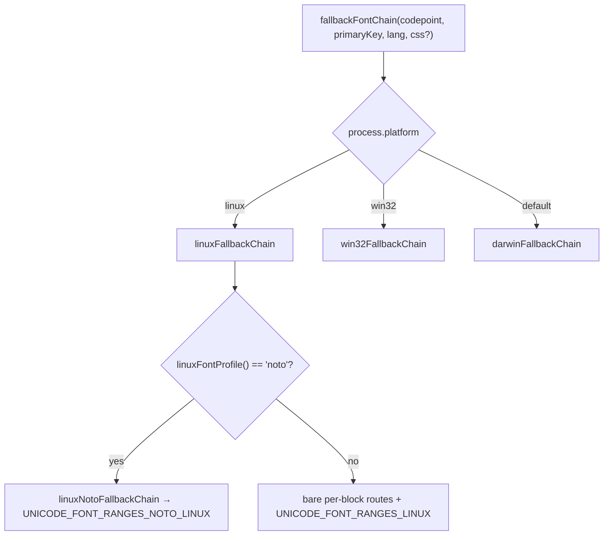
```mermaid
flowchart TD
  FB0["fallbackFontChain(codepoint, primaryKey, lang, css?)"] --> FB1{"process.platform"}
  FB1 -->|"linux"| FBL["linuxFallbackChain"]
  FB1 -->|"win32"| FBW["win32FallbackChain"]
  FB1 -->|"default"| FBD["darwinFallbackChain"]
  FBL --> FBLN{"linuxFontProfile() == 'noto'?"}
  FBLN -->|"yes"| FBLNoto["linuxNotoFallbackChain → UNICODE_FONT_RANGES_NOTO_LINUX"]
  FBLN -->|"no"| FBLBare["bare per-block routes + UNICODE_FONT_RANGES_LINUX"]
```

The **darwin and linux** chains are parallel routers over the SAME Unicode block
boundaries (shared predicates `isHebrewBlock` / `isArabicBlock` /
`isDevanagariBlock` / `isThaiBlock` / `isHangulBlock` / `isCjkBmpBlock` /
`isBoxDrawingBlock` / `isDingbatsBlock` / `isMathAlphanumericBlock` /
`isSuperSubscriptBlock` / `isLetterlikeBlock` / `isMathOperatorsBlock` /
`isPictographResidueBlock`); only the per-block KEY differs (CoreText vs
fontconfig). Each ends by consulting its generated per-block table
(binary-searched `UNICODE_FONT_RANGES*`), then a platform terminal.

**`win32FallbackChain` is not one of those routers.** It is a transcription of
Blink's own Windows fallback stage, which keys on the ICU **Script** property plus
its own list of `UBlockCode`s — a different partition, deliberately, because that
is the partition Chrome-on-Windows uses. See §7c.

### 7a. `darwinFallbackChain` — block dispatch order (first match returns)

Precedence matters: hand-tuned per-codepoint routes (carrying width/shape
calibration) come BEFORE broad block ranges, which come before the generated
table. `serifPrimary` = primaryKey ∈ {`times`, `times-new-roman`, `georgia`};
`monoPrimary` = {`courier`, `menlo`, `monaco`, `sf-mono`}.

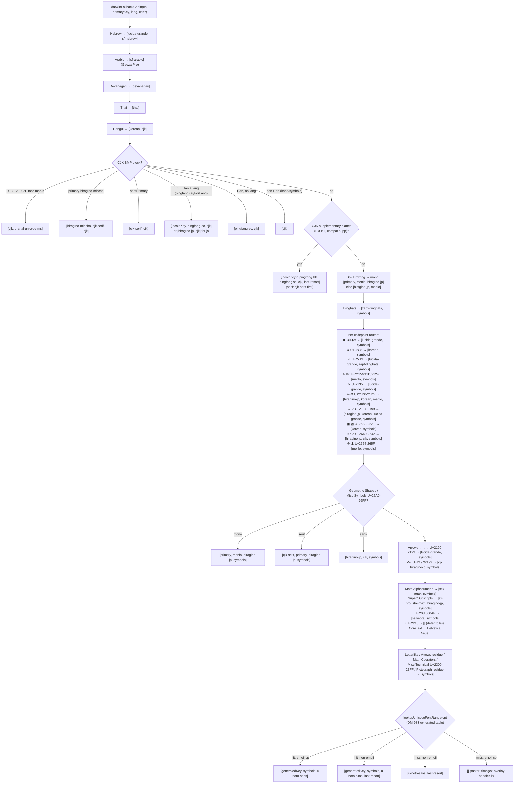
```mermaid
flowchart TD
  D0["darwinFallbackChain(cp, primaryKey, lang, css?)"] --> DH["Hebrew → [lucida-grande, sf-hebrew]"]
  DH --> DA["Arabic → [sf-arabic] (Geeza Pro)"]
  DA --> DDev["Devanagari → [devanagari]"]
  DDev --> DT["Thai → [thai]"]
  DT --> DHang["Hangul → [korean, cjk]"]
  DHang --> DCJK{"CJK BMP block?"}
  DCJK -->|"U+302A-302F tone marks"| DCJK1["[cjk, u-arial-unicode-ms]"]
  DCJK -->|"primary hiragino-mincho"| DCJK2["[hiragino-mincho, cjk-serif, cjk]"]
  DCJK -->|"serifPrimary"| DCJK3["[cjk-serif, cjk]"]
  DCJK -->|"Han + lang (pingfangKeyForLang)"| DCJK4["[localeKey, pingfang-sc, cjk]<br/>or [hiragino-jp, cjk] for ja"]
  DCJK -->|"Han, no lang"| DCJK5["[pingfang-sc, cjk]"]
  DCJK -->|"non-Han (kana/symbols)"| DCJK6["[cjk]"]
  DCJK -->|"no"| DSMP{"CJK supplementary planes<br/>(Ext B-I, compat supp)?"}
  DSMP -->|"yes"| DSMP1["[localeKey?, pingfang-hk, pingfang-sc, cjk, last-resort]<br/>(serif: cjk-serif first)"]
  DSMP -->|"no"| DBOX["Box Drawing → mono: [primary, menlo, hiragino-jp]<br/>else [hiragino-jp, menlo]"]
  DBOX --> DDing["Dingbats → [zapf-dingbats, symbols]"]
  DDing --> DPC["Per-codepoint routes:<br/>■□●○◆◇ → [lucida-grande, symbols]<br/>◈ U+25C8 → [korean, symbols]<br/>✓ U+2713 → [lucida-grande, zapf-dingbats, symbols]<br/>ℕℝℤ U+2115/211D/2124 → [menlo, symbols]<br/>ℵ U+2135 → [lucida-grande, symbols]<br/>⇐-⇕ U+21D0-21D5 → [hiragino-jp, korean, menlo, symbols]<br/>↔-↙ U+2194-2199 → [hiragino-jp, korean, lucida-grande, symbols]<br/>▣-▩ U+25A3-25A9 → [korean, symbols]<br/>♀♁♂ U+2640-2642 → [hiragino-jp, cjk, symbols]<br/>♔-♟ U+2654-265F → [menlo, symbols]"]
  DPC --> DGEO{"Geometric Shapes /<br/>Misc Symbols U+25A0-26FF?"}
  DGEO -->|"mono"| DGEO1["[primary, menlo, hiragino-jp, symbols]"]
  DGEO -->|"serif"| DGEO2["[cjk-serif, primary, hiragino-jp, symbols]"]
  DGEO -->|"sans"| DGEO3["[hiragino-jp, cjk, symbols]"]
  DGEO --> DARR["Arrows ←→↑↓ U+2190-2193 → [lucida-grande, symbols]<br/>↗↙ U+2197/2199 → [cjk, hiragino-jp, symbols]"]
  DARR --> DMATH["Math Alphanumeric → [stix-math, symbols]<br/>Super/Subscripts → [sf-pro, stix-math, hiragino-jp, symbols]<br/>‾ ¯ U+203E/00AF → [helvetica, symbols]<br/>∕ U+2215 → [] (defer to live CoreText → Helvetica Neue)"]
  DMATH --> DSYM["Letterlike / Arrows residue / Math Operators /<br/>Misc Technical U+2300-23FF / Pictograph residue → [symbols]"]
  DSYM --> DGEN{"lookupUnicodeFontRange(cp)<br/>(DM-983 generated table)"}
  DGEN -->|"hit, emoji cp"| DGEN1["[generatedKey, symbols, u-noto-sans]"]
  DGEN -->|"hit, non-emoji"| DGEN2["[generatedKey, symbols, u-noto-sans, last-resort]"]
  DGEN -->|"miss, non-emoji"| DGEN3["[u-noto-sans, last-resort]"]
  DGEN -->|"miss, emoji cp"| DGEN4["[] (raster &lt;image&gt; overlay handles it)"]
```

`pingfangKeyForLang(lang)` maps BCP-47 tags to regional PingFang: `zh-TW`/`zh-Hant`→`pingfang-tc`,
`zh-HK`→`pingfang-hk`, `zh-MO`→`pingfang-mo`, `ja*`→`hiragino-jp`, `zh`/`zh-CN`/`zh-Hans`→null (SC default).

### 7b. `linuxFallbackChain` (bare CI image) — key routes

Hebrew→`[helvetica]` · Arabic→`[sf-arabic]`(FreeSerif) · Devanagari→`[devanagari]`(FreeSans) ·
Thai→`[thai]`(Loma) · Hangul→`[cjk]`(WenQuanYi) · Box Drawing→mono `[primary, cjk]` / else `[helvetica, cjk]` ·
Dingbats→`[free-sans, free-serif]` · Chess→`[free-serif, free-sans]` · ↗↙→`[cjk, helvetica]` ·
Arrows→`[helvetica, free-sans]` · Geometric→`[helvetica, cjk]` · Misc Symbols→`[helvetica, hiragino-jp, free-sans]` ·
Math Alpha→`[free-sans, free-serif]` · Letterlike/Math Ops→`[free-sans, helvetica]` · CJK BMP→`[cjk]` ·
Pictograph residue→`[free-sans]` · else generated `UNICODE_FONT_RANGES_LINUX` → `[]`.

### 7c. `win32FallbackChain` — Blink's hardcoded Windows stage, transcribed

On Windows, `FontCache::PlatformFallbackFontForCharacter` asks a **hardcoded
table first** and only falls through to DirectWrite when that table produces
nothing usable (`platform/fonts/win/font_cache_skia_win.cc:286-296`, Chromium rev
`7d859f27`). An implementation built only on
`IDWriteFontFallback::MapCharacters` therefore answers Chrome's *second* question,
and on a machine with a complete font set Chrome never asks it — whole scripts can
diverge with no font-set explanation available.

`src/render/win-font-fallback.ts` carries the transcription, with a per-symbol
citation for every piece; `win32FallbackChain` is a thin adapter over it. The
stage order that produces, matching Blink's:

1. **`blinkWinHardcodedFamilies`** — `GetFallbackFamilyNameFromHardcodedChoices`.
2. **the live DirectWrite resolver** (§8), run by the walker after this chain —
   Blink's `GetDWriteFallbackFamily` fall-through.
3. **the generated per-block net** (`UNICODE_FONT_RANGES_WIN32`), deferred behind
   (2) by `win32DeferOrStatic` so a frozen sample of DirectWrite's answers cannot
   pre-empt DirectWrite itself.

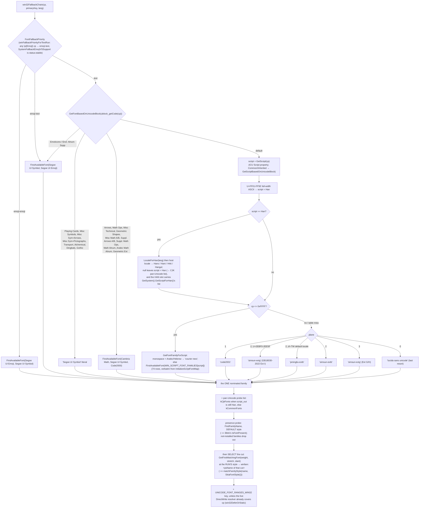
```mermaid
flowchart TD
  W0["win32FallbackChain(cp, primaryKey, lang)"] --> WP{"FontFallbackPriority<br/>(winFallbackPriorityForTextRun: any \p{Emoji} cp → emoji-text,<br/>SystemFallbackEmojiVSSupport is status:stable)"}
  WP -->|"emoji-emoji"| WCE["FirstAvailableFont(Segoe UI Emoji, Segoe UI Symbol)"]
  WP -->|"emoji-text"| WME["FirstAvailableFont(Segoe UI Symbol, Segoe UI Emoji)"]
  WP -->|"text"| WB{"GetFontBasedOnUnicodeBlock(ublock_getCode(cp))"}
  WB -->|"Emoticons / Encl. Alnum Supp"| WME
  WB -->|"Playing Cards, Misc Symbols, Misc Sym+Arrows,<br/>Misc Sym+Pictographs, Transport, Alchemical,<br/>Dingbats, Gothic"| WSYM["'Segoe UI Symbol' literal"]
  WB -->|"Arrows, Math Ops, Misc Technical, Geometric Shapes,<br/>Misc Math A/B, Suppl. Arrows A/B, Suppl. Math Ops,<br/>Math Alnum, Arabic Math Alnum, Geometric Ext"| WMATH["FirstAvailableFont(Cambria Math, Segoe UI Symbol, Code2000)"]
  WB -->|"default"| WS["script = GetScript(cp)<br/>(ICU Script property; Common/Inherited → GetScriptBasedOnUnicodeBlock)"]
  WS --> WFW["U+FF01-FF5E full-width ASCII → script = Han"]
  WFW --> WHAN{"script == Han?"}
  WHAN -->|"yes"| WHANL["LocaleForHan(lang) then host locale → Hans / Hant / Hrkt / Hangul;<br/>null leaves script = Han (→ CJK pan-Unicode list),<br/>and the HAN slot carries GetSystem().GetScriptForHan()'s list"]
  WHAN -->|"no"| WBMP
  WHANL --> WBMP{"cp &lt;= 0xFFFF?"}
  WBMP -->|"yes"| WTAB["GetFontFamilyForScript:<br/>monospace + Arabic/Hebrew → 'courier new';<br/>else FirstAvailableFont(WIN_SCRIPT_FONT_FAMILIES[script])<br/>(74 rows, verbatim from InitializeScriptFontMap)"]
  WBMP -->|"no / table miss"| WPL{"plane"}
  WPL -->|"1"| WP1["'code2001'"]
  WPL -->|"2, U+2EBF0-2EE5F"| WP2E["'simsun-extg' (GB18030-2022 Ext I)"]
  WPL -->|"2, zh-TW default locale"| WP2T["'pmingliu-extb'"]
  WPL -->|"2"| WP2S["'simsun-extb'"]
  WPL -->|"3"| WP3["'simsun-extg' (Ext G/H)"]
  WPL -->|"0"| WLR["'lucida sans unicode' (last resort)"]
  WTAB --> WONE["the ONE nominated family"]
  WCE --> WONE
  WME --> WONE
  WSYM --> WONE
  WMATH --> WONE
  WP1 --> WONE
  WP2E --> WONE
  WP2T --> WONE
  WP2S --> WONE
  WP3 --> WONE
  WLR --> WONE
  WONE --> WPAN["+ pan-Unicode probe list:<br/>kCjkFonts when script_out is still Han, else kCommonFonts"]
  WPAN --> WKEY["presence probe: FindFamilyName, DEFAULT style<br/>( == Blink's IsFontPresent);<br/>not-installed families drop out"]
  WKEY --> WCUT["then SELECT the cut: GetFirstMatchingFont(weight, stretch, slant)<br/>at the RUN'S style → winfam:&lt;psName of that cut&gt;<br/>( == matchFamilyStyle(name, SkiaFontStyle()))"]
  WCUT --> WNET["+ UNICODE_FONT_RANGES_WIN32 key, unless the live<br/>DirectWrite resolver already covers cp (win32DeferOrStatic)"]
```

Two properties of the adapter that are load-bearing rather than incidental:

- **The script table contributes at most ONE family.** Blink takes the first
  *installed* entry, then checks `FontContainsCharacter`, and on a coverage miss
  goes to the **pan-Unicode probe list** — not to the script list's second slot.
  Emitting one key preserves that control flow, because the walker's own
  `glyphIdForCp` check is `FontContainsCharacter`.
- **`IsFontPresent` is asked, never tabulated.** Blink's `IsFontPresent` is
  `SkFontMgr::matchFamilyStyle(name, SkFontStyle())`, which on Windows reduces to
  an exact `IDWriteFontCollection::FindFamilyName`
  (`third_party/skia/src/ports/SkFontMgr_win_dw.cpp:381-385` → `:1057-1067`) —
  exactly the win32 helper's `family` query. A baked-in `C:\Windows\Fonts`
  filename table would reintroduce the defect that made the sampled darwin
  routing wrong: one machine's inventory frozen into source. Where the helper is
  unavailable (non-Windows, or a Windows host with no built binary) every family
  reads as absent, the Blink stage contributes nothing, and the generated net
  carries the whole answer — the same behavior as before this stage existed.
- **Presence and cut selection are two DIFFERENT calls with the same API, and the
  argument is the difference** (DM-1878). `IsFontPresent` passes the **default**
  `SkFontStyle()` — a bold run does not change whether a family is installed
  (`win/font_fallback_win.cc:54-59`). Instantiating the nominated family passes the
  **run's** style: `GetFontPlatformData(font_description, create_by_family)` →
  `matchFamilyStyle(name, font_description.SkiaFontStyle())`
  (`win/font_cache_skia_win.cc:170-176`, `fonts/skia/font_cache_skia.cc:293-295`),
  which on Windows is `GetFirstMatchingFont(weight, stretch, slant)`.

  We used to make only the first call and use its answer for both, so **every
  weight-700 Windows stack resolved the regular cut** — 222,874 of the first
  Windows conformance baseline's 259,152 mismatches were same-family-wrong-cut.
  Unlike macOS there is no second in-family re-selection step to recover it
  (§8a): DirectWrite decides inside the lookup, so the style has to be in the
  call. The cut now travels in the key (`winfam:SegoeUI-Bold` vs `winfam:SegoeUI`),
  so one family serves many weights without sibling table entries — and the style
  joins the memo key, or whichever weight asked first would be served to all.

  Verified on a Win11 host against the routes the oracle reported Chrome picking:

  | asked | resolved |
  |---|---|
  | Segoe UI, no style | `SegoeUI` / `SEGOEUI.TTF` (unchanged) |
  | Segoe UI @300 / @600 / @700 / @900 | `-Light` / `-Semibold` / `-Bold` / `Black` |
  | Segoe UI @400 italic / @700 italic | `-Italic` / `-BoldItalic` |
  | Microsoft YaHei / Malgun Gothic / Nirmala UI / Ebrima / Gadugi @700 | each family's real `-Bold` |

  That ladder is also why a two-slot `-bold` sibling entry could not have been
  made correct: Segoe UI ships six upright weights plus five italics, so a
  regular/bold pair is wrong at 300, 350, 600 and 900 — the same defect measured
  on macOS, where `hiragino-jp` pinned to one face was wrong at seven of nine
  weights before its W0–W9 ladder landed.

**What this replaced:** a per-block table calibrated by probing painted advance
widths and `CSS.getPlatformFontsForNode` on one Windows 11 host. It scored well on
the blocks it had been probed against, and that was the defect — a curve fit to
sampled outputs standing in for a stage of Blink that simply was not implemented.
Two divergences it baked in, now gone by construction: Hebrew went to Segoe UI
where Blink nominates **David** first, and Thai went to Tahoma-then-Leelawadee-UI
as a pair where Blink nominates exactly one family and then probes pan-Unicode.

**Known residual:** `FontDescription::GenericFamily()` reaches the transcription
only as "is the primary key `courier`", because the logical-key model does not
carry the CSS generic separately (the same information loss `system-ui` has —
see §7's `stackPrimaryIsSystemUi` note). It can only differ for Arabic or Hebrew
text in a run that names `"Courier New"` explicitly, where Blink would see
`kStandardFamily` and we see the monospace generic.

**Source of truth:** `fallbackFontChain` / `darwinFallbackChain` /
`linuxFallbackChain` / `linuxNotoFallbackChain` / `win32FallbackChain` /
`win32FamilyKey` / `win32DeferOrStatic` / `pingfangKeyForLang` / the `is*Block`
predicates / `binarySearchRange` in `src/render/font-resolution.ts`, and the whole
of `src/render/win-font-fallback.ts`. Doc
[42](42-cross-platform-fallback-calibration.md).

---

## 8. Live per-codepoint system-fallback resolver (`resolveSystemFallbackKeyForCp`)

The static tables are necessarily incomplete; a missed codepoint would drop to
`last-resort` tofu even when the host has a covering font. The live resolver asks
the platform's own font-substitution engine what the browser would pick, registers
that face as a dynamic `sysfb:<name>` key, and hands it back to the chain walker.

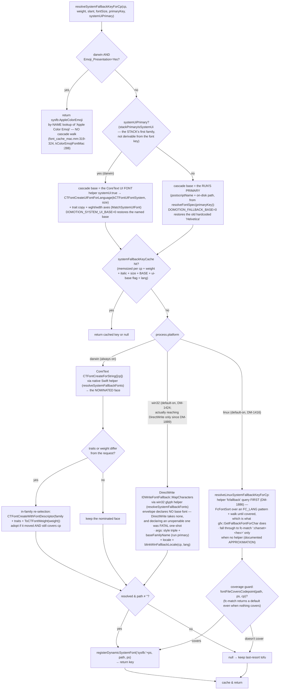
```mermaid
flowchart TD
  SR0["resolveSystemFallbackKeyForCp(cp, weight, slant, fontSize, primaryKey, systemUiPrimary)"] --> SREM{"darwin AND<br/>Emoji_Presentation=Yes?"}
  SREM -->|"yes"| SREMF["return sysfb:AppleColorEmoji<br/>by-NAME lookup of 'Apple Color Emoji' — NO cascade walk<br/>(font_cache_mac.mm:319-324, kColorEmojiFontMac :288)"]
  SREM -->|"no"| SRUI{"systemUiPrimary?<br/>(stackPrimaryIsSystemUi — the STACK's first family,<br/>not derivable from the font key)"}
  SRUI -->|"yes (darwin)"| SRUIB["cascade base = the CoreText UI FONT<br/>helper systemUi:true → CTFontCreateUIFontForLanguage(kCTFontUIFontSystem, size)<br/>+ trait copy + wght/wdth axes (MatchSystemUIFont)<br/>DOMOTION_SYSTEM_UI_BASE=0 restores the named base"]
  SRUI -->|"no"| SRB["cascade base = the RUN'S PRIMARY<br/>(postscriptName + on-disk path, from resolveFontSpec(primaryKey))<br/>DOMOTION_FALLBACK_BASE=0 restores the old hardcoded 'Helvetica'"]
  SRUIB --> SR1
  SRB --> SR1{"systemFallbackKeyCache hit?<br/>(memoized per cp + weight + italic + size + BASE + ui-base flag + lang)"}
  SR1 -->|"yes"| SRC["return cached key or null"]
  SR1 -->|"no"| SR2{"process.platform"}
  SR2 -->|"darwin (always on)"| SRD0["CoreText CTFontCreateForString([cp])<br/>via native Swift helper (resolveSystemFallbackFonts)<br/>→ the NOMINATED face"]
  SRD0 --> SRD{"traits or weight differ<br/>from the request?"}
  SRD -->|"yes"| SRD1["in-family re-selection:<br/>CTFontCreateWithFontDescriptor(family + traits + ToCTFontWeight(weight))<br/>adopt if it moved AND still covers cp"]
  SRD -->|"no"| SRDN["keep the nominated face"]
  SR2 -->|"linux (default-on, DM-1416)"| SRL["resolveLinuxSystemFallbackKeyForCp:<br/>helper 'fcfallback' query FIRST (DM-1886) —<br/>FcFontSort over an FC_LANG pattern + walk until covered,<br/>which is what gfx::GetFallbackFontForChar does<br/>· fall through to fc-match ':charset=&lt;hex&gt;' only<br/>when no helper (documented APPROXIMATION)"]
  SR2 -->|"win32 (default-on, DM-1424;<br/>actually reaching DirectWrite only since DM-1889)"| SRW["DirectWrite IDWriteFontFallback::MapCharacters<br/>via win32 glyph helper (resolveSystemFallbackFonts)<br/>envelope declares NO base font — DirectWrite takes none,<br/>and declaring an unopenable one was FATAL one-shot<br/>· args: style triple + baseFamilyName (run primary)<br/>+ locale = blinkWinFallbackLocale(cp, lang)"]
  SRD1 --> SRG{"resolved & path ≠ ''?"}
  SRDN --> SRG
  SRL --> SRLG{"coverage guard:<br/>fontFileCoversCodepoint(path, ps, cp)?<br/>(fc-match returns a default even when nothing covers)"}
  SRW --> SRG
  SRG -->|"yes"| SRR["registerDynamicSystemFont('sysfb:'+ps, path, ps)<br/>→ return key"]
  SRG -->|"no"| SRNull["null → keep last-resort tofu"]
  SRLG -->|"covers"| SRR
  SRLG -->|"doesn't cover"| SRNull
  SRR --> SRcache["cache & return"]
  SRNull --> SRcache
```

### 8·0. How the question reaches the OS: the helper transport

Every branch above is a round-trip to a native helper binary, and the *carrier*
differs per platform in a way that has twice turned out to be load-bearing rather
than incidental.

| Platform | Transport | Per-call cost |
| --- | --- | --- |
| macOS | persistent `--serve` over spawned stdio | ~0.4 ms |
| Linux | persistent `--serve` over spawned stdio | ~0.4 ms |
| Windows | persistent `--serve-pipe` over a **named pipe** (DM-1889) | ~0.5 ms (was ~42 ms, one process per call) |

The channel is synchronous — `writeSync`/`readSync` against a real file
descriptor — because the whole resolution path is synchronous. On Windows, Node
reports a spawned child's stdio pipes as fd `-1`, so that channel could not be
driven there and every call fell back to spawning the binary afresh. The
conclusion drawn at the time was that Windows cannot have a persistent channel.
The narrower truth is that it cannot have one *over spawned stdio*: `fs.openSync`
on a named-pipe path does yield a real fd. So the helper also serves over a named
pipe it creates, with the parent connecting as client — same protocol, same font
cache, byte-identical responses, ~83x cheaper per call as measured on a Windows 11
host.

**The envelope is not uniform across platforms, and must not be made so.**
macOS and Linux declare a base font; Windows declares none. That is not an
optimisation but a correctness requirement in both directions: `CTFontCreateForString`
resolves *from* a base face, so dropping it changes every macOS answer; DirectWrite
takes no base at all, and declaring an unopenable one is fatal in one-shot mode —
which is precisely how the Windows resolver came to answer "no fallback font" for
every codepoint while appearing healthy. Pinned by
`src/render/win32-fallback-envelope.test.ts`; the full account is in doc 80's
DM-1889 correction.

### 8a. macOS: the fallback answer is weight-dependent

Asking CoreText which font renders a character is only the first half of what
Blink does. `CTFontCreateForString` nominates one member of a family — Songti SC
Light for Han from a serif primary, Euphemia UCAS Regular for Canadian Aboriginal
— no matter what weight the CSS asked for. Blink then re-selects **within that
family** at the requested symbolic traits and weight, building a descriptor from
the family name plus `kCTFontSymbolicTrait` / `kCTFontWeightTrait` and resolving
it with `CTFontCreateWithFontDescriptor`; it adopts the result only when the
face actually moved and still covers the character. So the same character in the
same stack resolves to Songti SC Regular at weight 400 and Songti SC Black at
900.

Transcribed from `GetAlternateFontPlatformData` and
`CreateCopyWithTraitsAndWeightFromFont` in
`third_party/blink/renderer/platform/fonts/mac/font_cache_mac.mm:74-109` and
`:200-280`, with the CSS-weight→CoreText-weight table from `ToCTFontWeight` in
`mac/font_matcher_mac.mm:871-887` (Chromium checkout `7d859f27`, 2026-06-27).
The helper runs the re-selection itself, so the arguments and the API call are
Blink's, not an approximation of them. Skipping it pinned every fallback family
to whichever cut CoreText nominated: at weight 700 that is the wrong face for
8,121 of a 27,790-codepoint stride (29%).

Three consequences worth holding onto:

- **The cascade base is the RUN'S OWN PRIMARY** (DM-1852), because that is what
  Blink passes: `GetSubstituteFont` hands `CTFontCreateForString` the font the run
  is currently painting in (`mac/font_cache_mac.mm:128-150`), and CoreText's
  answer depends on it. We previously passed a hardcoded `"Helvetica"` — the right
  API asked a different question. Measured before it became the default: 294
  face-selection decisions fixed and 0 broken on the conformance oracle, with
  **zero** pixels moved across the full 818-fixture macOS unicode sweep (both arms
  dispatched from one ref, env verified per shard). `DOMOTION_FALLBACK_BASE=0`
  restores the old base for an A/B.
- **The CSS description is part of the cache key**, not just the codepoint —
  `systemFallbackKeyCache` and the helper's own memo both carry weight, italic,
  size **and the base**. A codepoint-only key served whichever weight (or base)
  asked first to every later caller.
- **A cascade base must be opened from its FILE, never looked up by name alone,
  whenever it may be one of Apple's hidden `.`-prefixed faces.** CoreText refuses
  those names and answers with Times New Roman *without erroring*, so a name-only
  base silently walks Times' cascade — which is how `.ThonburiUI-Regular` briefly
  reported the unrelated public Thonburi family as its own bold cut. The
  `basePath` field on the request carries the file; the helper now errors on a
  named-but-unopenable `fontRef` instead of quietly substituting Helvetica.
- **An emoji-presentation codepoint never reaches the cascade at all** (DM-1884).
  `PlatformFallbackFontForCharacter` short-circuits at its very top
  (`mac/font_cache_mac.mm:319-324`): if the run's fallback priority is emoji
  presentation, Blink returns `GetFontData(font_description, "Apple Color Emoji")`
  — a by-NAME family lookup (`kColorEmojiFontMac`, `:288`) — before
  `font_data_to_substitute` is even read. So for emoji the cascade base is
  irrelevant by construction.

  We had no such stage, and its absence was **invisible while the base was a
  named face**, because that face's cascade reaches plain `AppleColorEmoji`
  anyway. It surfaced the moment the UI-font base was armed: the UI font's own
  cascade list reaches the hidden `.AppleColorEmojiUI` variant instead — which
  Blink's comment at `:156-159` predicts in so many words ("might also return
  '.Apple Color Emoji UI' when starting from system-ui"). Measured as 3,558 rows
  on the conformance oracle, entirely within the three `system-ui` stacks.

  Deliberately **not** fixed by aliasing `.AppleColorEmojiUI` back to
  `AppleColorEmoji`: that scores well while leaving the stage missing, so any
  other face the UI cascade reaches first would still be wrong.

  The gate is the Unicode property `Emoji_Presentation`, which is what Blink's
  `kEmojiEmoji` priority derives from (`IsEmojiPresentationEmoji` = `kEmojiEmoji |
  kEmojiEmojiWithVS`, `font_fallback_priority.h:45-48`). Derived, not curated —
  `isEmojiCodepoint`'s hand-listed ranges miss ⌚ U+231A / ⌛ U+231B / ⏩ U+23E9 /
  ⏪ U+23EA because nobody sampled Miscellaneous Technical, which is exactly the
  block the defect showed up in.
- **A `system-ui` run's base is the UI FONT, and it is not nameable** (DM-1859).
  `system-ui` never enters the normal family matcher: `mac/font_cache_mac.mm:409-412`
  routes it to `MatchSystemUIFont`, which builds the font with
  `CTFontCreateUIFontForLanguage(kCTFontUIFontSystem, size, nullptr)`, applies
  bold/italic as symbolic traits, and — above weight 400 or width 100 — applies
  `wght`/`wdth` variation axes clamped to the face's own ranges
  (`mac/font_matcher_mac.mm:540-588`). Fallback then walks from *that* font, and
  Blink's own comment names the consequence
  (`mac/font_cache_mac.mm:156-159`): the system API "might also return '.Apple
  Color Emoji UI' when starting from system-ui". That is why Chrome paints Apple's
  hidden `.PingFangUITextSC-*` / `.PingFangUIDisplaySC-*` optical cuts for CJK on a
  `system-ui` page where a named base yields plain `PingFangSC-*`.

  Two things make this a **call, not a table**. Opening `SFNS.ttf` by path is not
  equivalent — measured under four different PostScript names, it answers U+6F22
  with `PingFangSC-Regular` at every size and weight, because the plain file
  carries the default cascade while the UI font carries its own cascade list.
  And CoreText's answer is not guessable: at 13px only weights 400 and 700 stay in
  the **Text** cut (every other weight jumps to **Display**), and adding
  `font-style: italic` at 13px moves Text → Display because PingFang has no
  italic. Verified 18/18 exact against Chrome (CDP `getPlatformFontsForNode`,
  9 weights × 2 sizes). A sampled table that happened to capture those rules would
  be freezing one OS version's behavior into source.

  The signal travels **beside** the font key, not derived from it:
  `stackPrimaryIsSystemUi(fontFamily)` reads the stack's first family, because
  `system-ui`, `BlinkMacSystemFont` and an explicitly-named `"SF Pro Text"` all
  collapse onto the single `sf-pro` key while Blink sends the first two to
  `MatchSystemUIFont` and the third to `MatchFontFamily`
  (`mac/font_cache_mac.mm:409-417`). Splitting the key was rejected: `sf-pro`'s
  Latin metrics are load-bearing (SF Pro's advances measure ~3% wider than
  Helvetica's) and a second key would have to reproduce every entry across three
  platform tables plus the italic sibling to stay metric-identical.

  **This flag and `DOMOTION_LIVE_FALLBACK_FIRST` are only scoreable together**
  (see §7). With the static per-block chain answering first, the OS is never asked,
  so the base it would have been asked with cannot matter. Conformance oracle, CJK
  slice (226,472 comparisons), one revision, one instrument:

  |            | chain-first      | OS-first (default) |
  | ---------- | ---------------- | ------------------ |
  | base OFF   | 113,963 / 27 rts | 113,407 / 16 rts   |
  | base ON    | 113,908 / 23 rts | **29,025 / 4 rts** |

  Against the all-off cell: this base alone is −55 rows, the ordering alone is
  −556, both together are **−84,938 (−75%)**. Only 611 of that is explained by
  the two flags separately; the remaining **84,327 rows exist only when both are
  on**. All three `.PingFangUI*` routes go to zero (the `system-ui` stack: 84,567
  mismatches → 185).
- **This is NOT the same matcher as the declared-family path.** Chrome resolves
  `font-family: "Euphemia UCAS"; font-weight: 500` to the regular face but a
  *fallback* to the same family at weight 500 to `EuphemiaUCAS-Bold`; declared
  `"Songti SC"` at 500 is Regular where the fallback is Bold. The declared path
  runs CSS font matching (which `SUB_BOLD_WEIGHT_CUTS` and `HIRAGINO_CUTS`
  mirror); this path runs CoreText's nearest-weight descriptor match. Merging
  the two would be wrong at several weights in both directions.

Windows had the same shape of gap and now closes it, though by a different
mechanism. There is no second in-family re-selection step on Windows — DirectWrite
picks the cut inside `MapCharacters` — so the style has to be *in the call*. It
now is: `resolveSystemFallbackKeyForCp` passes the run's weight and slant, and the
win32 helper converts them with `dwriteWeightFromCss` / `dwriteSlantFromCss` /
`dwriteStretchFromCss`, which transcribe `FontDescription::SkiaFontStyle()`
(`fonts/font_description.cc:477-521` plus the nine width boundaries in
`fonts/font_selection_types.h:221-245`) and Skia's `DWriteStyle`
(`third_party/skia/src/utils/win/SkDWrite.h:83-97`). Previously the call was
hardcoded `NORMAL/NORMAL/NORMAL` while Blink passes
`font_description.SkiaFontStyle()`, so a bold run resolved the regular cut and it
was reported as Chrome's pick. Absent style fields keep the old defaults, so an
older helper binary and an older Node side each degrade to the previous behavior
rather than mismatching.

The call's two remaining arguments are now the run's as well, and both had been
constants:

- **`baseFamilyName`** — Blink passes the run's primary family
  (`GetDWriteFallbackFamily`: `font_description.Family().FamilyName()`), which is
  what lets that family's own font linking participate. `resolveSystemFallbackKeyForCp`
  now derives it from the file the primary key resolves to (`system-ui` from the
  OS, since it has no literal name).
- **`locale`** — Blink resolves a fallback locale *per codepoint*
  (`FallbackLocaleForCharacter(...)->LocaleForSkFontMgr()`,
  `win/font_cache_skia_win.cc:228-240`) and pushes it into
  `matchFamilyStyleCharacter`'s one-element bcp47 vector; Skia hands it to
  `MapCharacters` as the analysis source's locale name. The helper reported a
  hardcoded `en-us`, so every query was asked in English regardless of the page —
  the Han-unification trap, where a unified ideograph resolves to a different
  face under `ja` than under `zh-Hans` and the wrong one reads as a
  font-inventory problem.

  `blinkWinFallbackLocale` (`src/render/win-font-fallback.ts`) transcribes
  `FallbackLocaleForCharacter` + `LocaleForSkFontMgr` and is pinned against
  Blink's own `locale_test_data` table (`platform/text/layout_locale_test.cc:60-131`)
  row for row. It is **not** the raw CSS `lang`: the reduction keeps the script
  and drops the region (`zh-CN` → `zh-Hans`). Measured on a Win11 VM for U+6F22
  with only the tag varying — `ja` → Yu Gothic UI, `ko` → Malgun Gothic,
  `zh-Hans`/`zh-CN` → Microsoft YaHei UI, `zh-Hant`/`zh-TW` → Microsoft JhengHei
  UI, and bare **`zh` → Yu Gothic UI**, i.e. truncating to the primary subtag
  lands on a Japanese face and is indistinguishable from not passing the argument
  (exactly what Skia's own comment at `SkFontMgr_win_dw.cpp:641-643` warns about).
  This is the OPPOSITE reduction from the Linux path's, where fontconfig speaks
  language-REGION and ignores `Hans`.

  The locale joins the helper's per-codepoint memo key (`fallbackCacheKey`), since
  the answer is a function of it. See doc
  [80](80-cross-platform-system-fallback-resolver.md) for the full measurement
  table and the one argument still not transcribed (Skia's
  `IDWriteNumberSubstitution`, built from the same tag).

Gated by `_systemFallbackResolutionEnabled` (macOS always on; Linux/Windows
default-on, force off with `DOMOTION_SYSTEM_FALLBACK=0`). Toggle safely with
`withSystemFallbackResolution(on, fn)` (save/restore) rather than a bare
`setSystemFallbackResolution`. The Windows/macOS backends share the same native
"fallback" protocol (`resolveSystemFallbackFonts` in `src/render/glyph-helper.ts`)
and register with the **native** extractor; the Linux backend registers with the
**fontkit** extractor. All three verify the picked face actually covers `cp` (the
native helpers via a `HasCharacter` guard reporting `found:false`; Linux via
`fontFileCoversCodepoint`) so a non-covering pick correctly tofus, matching Chrome.

**Source of truth:** `resolveSystemFallbackKeyForCp` /
`resolveLinuxSystemFallbackKeyForCp` / `fontFileCoversCodepoint` /
`registerDynamicSystemFont` / `withSystemFallbackResolution` in
`src/render/font-resolution.ts`; `resolveSystemFallbackFonts` /
`resolveInstalledFont` / `createGlyphHelperFont` / `isGlyphHelperAvailable` in
`src/render/glyph-helper.ts`. Doc [80](80-cross-platform-system-fallback-resolver.md).

---

## 9. Glyph outline extraction & emission (`commandsFor`)

Once a `(font, glyph)` is chosen, the outline is extracted and emitted per render
mode.

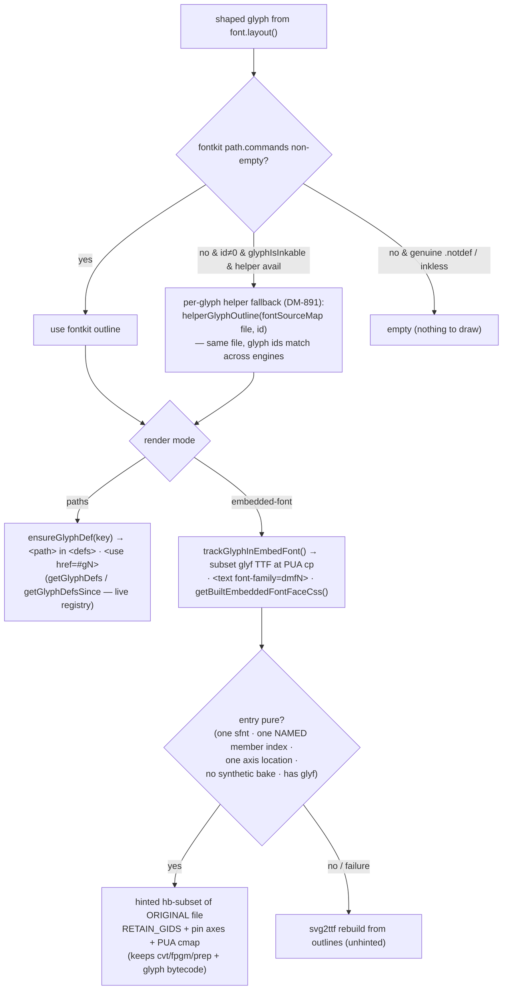
```mermaid
flowchart TD
  E0["shaped glyph from font.layout()"] --> E1{"fontkit path.commands non-empty?"}
  E1 -->|"yes"| E2["use fontkit outline"]
  E1 -->|"no & id≠0 & glyphIsInkable & helper avail"| E3["per-glyph helper fallback (DM-891):<br/>helperGlyphOutline(fontSourceMap file, id)<br/>— same file, glyph ids match across engines"]
  E1 -->|"no & genuine .notdef / inkless"| E4["empty (nothing to draw)"]
  E2 --> E5{"render mode"}
  E3 --> E5
  E5 -->|"paths"| E6["ensureGlyphDef(key) → &lt;path&gt; in &lt;defs&gt; · &lt;use href=#gN&gt;<br/>(getGlyphDefs / getGlyphDefsSince — live registry)"]
  E5 -->|"embedded-font"| E7["trackGlyphInEmbedFont() → subset glyf TTF at PUA cp<br/>· &lt;text font-family=dmfN&gt; · getBuiltEmbeddedFontFaceCss()"]
  E7 --> E8{"entry pure?<br/>(one sfnt · one NAMED member index ·<br/>one axis location ·<br/>no synthetic bake · has glyf)"}
  E8 -->|"yes"| E9["hinted hb-subset of ORIGINAL file<br/>RETAIN_GIDS + pin axes + PUA cmap<br/>(keeps cvt/fpgm/prep + glyph bytecode)"]
  E8 -->|"no / failure"| E10["svg2ttf rebuild from outlines (unhinted)"]
```

**Source of truth:** `commandsFor` / `helperGlyphOutline` / `glyphIsInkable` /
`ensureGlyphDef` / `getGlyphDefs` in `src/render/font-resolution.ts`;
`trackGlyphInEmbedFont` / `getBuiltEmbeddedFontFaceCss` in
`src/render/embedded-font-builder.ts`. Docs [51](51-probe-then-fallback-dispatch.md),
[52](52-embedded-mode-glyph-fallback.md).

**Font flavor (DM-1666):** the subset font is TrueType `glyf`. It is
deliberately NOT CFF: Chrome rasterizes overlapping same-winding contours in an
opentype.js-built CFF subset with even-odd fill, which holes any glyph whose
source outline draws overlapping contours (SF Pro's bold "A" = leg + crossbar +
leg). `glyf` fills nonzero, so the overlaps union correctly.

**Two glyf builders (DM-1714/DM-1716, doc [99](99-hinted-embedded-subset.md)):**
`buildGlyfFontForEntry` picks per entry:

1. **Hinted hb-subset** (preferred): when every glyph in the entry came from ONE
   openable sfnt at ONE axis location with NO synthetic bake, the ORIGINAL file
   is subset via harfbuzz's hb-subset (`src/render/hb-subset.ts`) with
   `RETAIN_GIDS` — keeping `cvt`/`fpgm`/`prep` + per-glyph instruction bytecode
   — and a format-12 PUA→gid cmap is injected. A variable source is **fully
   instanced** at the run's resolved axis location (`FontSourceInfo.variationAxes`
   from `getFontSourceInfo`; pin-all-defaults + per-tag pins, dropping
   `fvar`/`gvar` so the consumer can't re-vary axes we resolved) — hinting
   survives hb's instancer. This closes the embedded-mode share of the
   Windows/Linux hinting floor (doc 42). On Windows the location adopts the
   matcher's RESOLVED axis values when the helper reported them
   (`FontPath.resolvedAxes` → `resolveAxisLocationForFile`; DM-1721 — named
   optical subfamilies pin `opsz` at a fixed value at every font size, so a
   fontSize-derived `opsz` would embed the wrong instance), and the helper
   font itself is opened at the same location via the font spec's
   `variations` (DirectWrite yields the default `fvar` instance otherwise).

   **macOS resolves a DIFFERENT axis set, via `resolveDarwinAxisLocation`.**
   This path was previously win32-only, on the assumption that CoreText applies
   optical sizing itself for named faces. It does not: a handle opened by
   name/path reports no variation and no `kCTFontOpticalSizeAttribute` at any
   size, and paints the face at its default `opsz`. Chrome does not rely on
   CoreText for it either — it overrides it, cloning the typeface at `opsz` =
   the CSS **specified** size, clamped into the axis range
   (`mac/font_platform_data_mac.mm:169-185` + `:74-79`, Chromium `7d859f27`;
   clamped again independently by Skia at
   `src/ports/SkTypeface_mac_ct.cpp:1147`, Skia `ebf5052`). The macOS resolver
   therefore sets **`opsz` plus any explicit `font-variation-settings` axis, and
   deliberately NOT `wght`** — on macOS the weight is already baked in by the
   CoreText trait/weight re-selection that runs first
   (`font_cache_mac.mm:242-267`, mirrored in the glyph helper), whereas on
   Windows DirectWrite has not applied it and the CSS weight must be pinned.
   Both resolvers return no location when nothing moves off the file's
   defaults, so an unvaried face is never needlessly cloned or split into a
   duplicate embedded subset.
2. **svg2ttf rebuild** (fallback): an SVG-font description of the tracked
   outlines (cubic → quadratic via cubic2quad), unhinted. Used for synthetic
   faux-bold/italic bakes, per-glyph helper outlines, CFF/CFF2 faces (the
   bundled wasm silently drops `CFF ` — an outline-less subset fails Chrome's
   OTS) and outline-less sources (PingFang `hvgl`) — both guarded by
   `sfntHasSubsettableOutlines` — plus webfont buffers, mixed entries, an
   **unnameable member index** (`FontSourceInfo.faceIndex === null`, below), or
   any hb-subset failure.

### Which member of a container, and how honestly it is reported

`FontSourceInfo` (`getFontSourceInfo`) answers "where did these outlines come
from" for the embedded-subset path. Two of its fields are only meaningful if the
requested face can actually be located inside the file, so
`resolveFaceInfoForFile` resolves the requested PostScript name in three tiers
and reports which one applied:

| Tier | Condition | `faceIndex` | `nameMatched` | Axis pin |
|---|---|---|---|---|
| Direct member | the name is a physical sfnt member | that member's index | `true` | CSS-derived (`resolveAxisLocationForFile`) |
| **fvar named instance** | the name is a named instance of a member | the **owning member's** index | `true` | the **instance's own coordinates**, except `opsz` |
| Unresolvable | neither | **`null`** | `false` | none (`null`) |

The named-instance tier is not an edge case — it is how most Apple system faces
are addressed. `PingFangSC-Regular` is instance 0 of member 20
(`PingFangSC-Medium`) at `WDTH 500 / wght 400 / HGHT 500`, and
`.ThonburiUI-Bold` is instance 2 of member 0 at `wght 700`. CoreText enumerates
those instances as descriptors and loads them by name, so a member-name search
alone misses them. Resolving them matters twice over:

- **The index becomes usable.** `PingFangSC-Regular` and `PingFangHK-Regular`
  resolve to members 20 and 22; a member-name search reports 0 for both, which
  reads as "SC and HK resolved to the same face" and is what `hb_face_create`
  would then subset.
- **The axis pin becomes exact.** The instance's coordinates *are* the face, so
  they replace a location re-derived from CSS weight, which only coincides when
  the CSS weight happens to equal the cut's own. `opsz` is deliberately excluded:
  CoreText applies automatic optical sizing on top of a named instance, and the
  `opsz = fontSize` pin is what the macOS sweeps validate pixel-exact. Author
  `font-variation-settings` still override on top (CSS cascade order), and on
  Windows the matcher's own `resolvedAxes` continue to win.

When neither tier matches, `faceIndex` is **`null`** rather than `0`, and
`nameMatched` is `false`. Callers must check before using it as an index —
treating `null` as `0` reads member zero, a face nobody asked for. The
hinted-subset path therefore disqualifies such an entry and drops to svg2ttf,
which emits the outlines the extractor actually produced. `variationAxes` is
`null` in that state too, rather than describing member zero's axes.

**The HarfBuzz shaping route is the second consumer of this index.** Every call
that wraps a font in `makeHarfbuzzShapingInstance` — the complex-shaper
base+mark decomposition and the in-font NFD tier — goes through
`shapingFaceFor(fontKey)`, which pairs the
spec's path with `resolveFaceInfoForFile(...).faceIndex` and hands both to
`hb_face_create`. It used to pass the path alone and open index 0, which on a
macOS collection meant a bold or UI cut was shaped by the regular one: same
glyph count, different ids and advances, nothing reporting an error. A `null`
index makes the shaper decline the run rather than fall back to member zero, so
the caller keeps its CoreText / fontkit shaping — a different shaper, but the
right font. The index is then bounds-checked against the file's own face count
before the face is created, which is what Blink does with the index Skia hands
it (`HbFaceFromSkTypeface`, `harfbuzz_face_from_typeface.cc:38-42`).

### HarfBuzz is vendored, built with Chromium's configuration

The `harfbuzzjs` published on npm is built `-DHB_TINY`, and `hb-config.hh`
chains that to no AAT support at all: `HB_TINY` → `HB_MINI` (`:44-46`) →
`HB_NO_AAT` (`:95-96`) → `HB_NO_AAT_SHAPE` (`:132-134`), the guard around
`apply_morx` in the shaping plan (`hb-ot-shape.cc:90`, `:98-100`).

That matters more on macOS than it sounds, because Apple ships system faces with
`morx` and **no `GSUB` whatsoever** — GeezaPro (the Arabic face), Helvetica,
Al Nile and Baghdad. HarfBuzz decides by the face, not the script:
`_hb_apply_morx` (`hb-ot-shape.cc:60-65`) uses `morx` whenever the face has it
and the run is horizontal, *ignoring `GSUB` even when present*. So on GeezaPro
the `HB_TINY` build returned the unjoined isolated forms — 647/1415/1292/902/900
font units against real HarfBuzz's 647/656/1359/700/971, well-formed output that
is simply a different word.

`vendor/harfbuzzjs/` is therefore harfbuzzjs v1.4.0 with `dist/harfbuzz.js` and
`dist/harfbuzz.wasm` rebuilt from source using the HarfBuzz configuration
**Chromium ships**, transcribed from `third_party/harfbuzz/BUILD.gn:462-518`
(Chromium rev `7d859f27`). Chromium's own `README.chromium` for HarfBuzz states
the reason directly: it no longer builds `hb-coretext` *"as we rely on
HarfBuzz' built-in AAT shaping"*. Both projects pin the same HarfBuzz release
(14.2.1), so the configuration was the only variable, and with it matched the
build reproduces `hb-shape` exactly on both an AAT-only face (GeezaPro
`647 656 1359 700 971`) and a `GSUB` face (Arial Unicode `559 498 1323 893 985`).

`HB_TINY` had also removed HarfBuzz's two font blocklists, its legacy cmap
subtables, and — via `HB_NO_OT_SHAPE_FALLBACK`, which Chromium does **not**
set — the OT shaper's Arabic/Hebrew/Thai fallback paths and vowel-constraint
handling. Those are all restored by matching Chromium.

`vendor/harfbuzzjs/README.md` carries the provenance table, the reproduction
recipe, and the two divergences that remain (Unicode properties come from
HarfBuzz's built-in UCD rather than ICU; the Rust backend is absent, which is
not a divergence for shipping Chrome since Blink pins the `"ot"` shaper unless
an off-by-default runtime flag is set). `vendor/harfbuzzjs/build/config-override.h`
is the configuration itself, annotated define by define.

Consequence for the diagram: `getHbEntry` no longer inspects `morx`. Every face
it can identify and bounds-check is shaped by HarfBuzz.

### Shaping passes the run's size, because AAT tracking depends on it

`harfbuzzShapeRun` takes the run's CSS pixel size and sets it on the font before
shaping. That is not a metrics convenience — HarfBuzz reads the AAT `trak`
tracking amount from the font's nominal point size, and applies `trak` whenever
the face carries both `trak` and `STAT` (`hb-ot-shape.cc:216-220`). Blink sets
it on every run and says why in as many words
(`platform/fonts/shaping/harfbuzz_face.cc:641-647`, rev `7d859f27`):

> Setting ptem here is critical for HarfBuzz to know where to lookup spacing
> offset in the AAT trak table […] the meaning of HarfBuzz' `hb_font_set_ptem`
> API was changed to expect the equivalent of CSS pixels here.

Leaving it unset is not a neutral default; it applies **no** tracking, which is
a different answer from Chrome's on any face carrying the pair. Swept over the
229 faces in the macOS routing table, 13 do: SF Pro and SF Pro Italic, SF
Compact, SF Hebrew, SF Pro Text, and every PingFang cut. Helvetica and Times do
**not**; their collection members carry `morx` and `kern` and neither table.
Measured on PingFang, first advance of `fi fl ffi` in font units:

| ptem | advance |
| --- | --- |
| unset | 398 |
| 16 | 397 |
| 32 | 386 |
| 1000 | 381 |

The font object is cached per (file, face index) and shared across runs of every
size, so the size is set on **every** shape call rather than at open time — a
`ptem` left over from a previous run would track this one at the wrong size.

`hb_font_set_ptem` is not exported by published harfbuzzjs; `vendor/harfbuzzjs/`
adds it to the symbol list and exposes a `Font.setPtem()` binding. See that
directory's README.

**So a tracked face is shaped by HarfBuzz, and drawn by the platform helper.**
The CoreText helper opens each face at `size = unitsPerEm`, so it applies the
tracking for a 1000 pt render — the 381 row above — at every size. That is not
an engine disagreement: the two engines agree exactly given the same `ptem`. It
is the size the helper opens at, and no argument to the helper changes it.

**Both paths carry it, by two different mechanisms.** A face reaches
`createGlyphHelperFont` only if the platform table marks it
`extractor: "native"` — nine of the thirteen do (the eight PingFang cuts and SF
Compact). The other four (SF Pro, SF Pro Italic, SF Pro Text, SF Hebrew) are
ordinary `glyf` files, so fontkit opens them and they never see the helper's
seam. Those four are `system-ui`, i.e. most macOS body text, and fontkit
implements no AAT tracking at all, so they get the same treatment through
`installHarfbuzzShaping` at the end of `getFontInstance`: HarfBuzz's `layout` is
installed on the built instance, and fontkit keeps drawing by glyph id.

Installed in place rather than proxied, and that is not a style choice. A
`getFontInstance` result carries `naturalWeight`, `hasWeightAxis`,
`faceIsBoldTrait`, `resolvedItalicAngle`, `hasSlantAxis`, `isRoutedItalicCut`
and `postscriptName`, all read later by the renderer and the embedded-font path,
and the object is itself the key of `fontSourceMap`. A proxy exposing a fixed
property set would drop every one of them silently and break identity lookup
besides. Replacing one method also keeps the identity that
`renderTextAsPath`'s `useFontOverride !== curFontOverride` run-grouping depends
on.

Measured on SF Pro, total advance of `Hamburgefonstiv` in font units at 12 / 16 /
32 px: **15976 at 16 px against 15101 at 32 px**, where before it was flat except
for the optical-size step. `DOMOTION_TRAK_HB_SHAPING=0` bounds both paths.

`getFontInstance` therefore asks `faceHasTrakAndStat(path, faceIndex)` — a
direct read of the sfnt table directory, since the answer decides whether a
58 MB face gets opened by HarfBuzz at all — and for a face carrying the pair
injects `makeHarfbuzzShapeFallback(...)` as the helper's `shapeFallback`, with
`preferShapeFallback: true` so it is consulted **ahead of** the platform's own
`shape` query rather than only where that query fails (the Windows case that
seam was built for).

That seam carries glyph ids, positions and clusters and deliberately **no
outlines**, so shaping moves and outline production does not. The split is
Chrome's own — Blink shapes with HarfBuzz and rasterizes from the platform
typeface through Skia — and it is load-bearing rather than tidy: routing the
whole `layout()` through a HarfBuzz proxy instead shaped byte-identically on the
face in question and still moved a Thai fixture's worst tile from 0.0940 to
0.1214, because it silently moved outline production too and the CoreText
outlines are what the macOS pixel-exact calibration was measured against.

The axis location handed to HarfBuzz here is the **shaping-side** derivation
(`resolveAxisLocationForFile`, including any fvar named-instance coordinates),
not the `resolveDarwinAxisLocation` the helper is opened with, and the two
legitimately differ: the helper opens the face by PostScript name, so CoreText
resolves a named instance itself and `wght` must not be re-applied on top;
HarfBuzz opens it by face index and gets the file's default instance, so every
axis has to be named explicitly — otherwise a request for PingFang Regular
shapes with the Medium master it is an instance of.

### A contrary direction reverses the characters before shaping

`unicode-bidi: bidi-override` is the one place a run's direction is
authoritative *against* its own script, and it does not reach the shaper as a
direction at all. Blink implements the property by injecting U+202D LRO /
U+202E RLO plus a trailing U+202C PDF and running the ordinary bidi algorithm
(`core/layout/inline/inline_items_builder.cc:1501-1505`). HarfBuzz then refuses
to shape contrary to the script: `hb_ensure_native_direction`
(`hb-ot-shape.cc:588`) reverses the buffer's clusters and flips the direction so
the shaper always runs natively, and `hb_ot_shape_internal` reverses back at the
end (`:1184`).

The consequence is the load-bearing part: reversing **before** shaping means the
contextual forms are computed on the reversed character sequence. Under
`bidi-override; direction: ltr` Chrome therefore paints Arabic with its ends
**unjoined** — the word's first letter no longer has anything to its right.
Verified equivalent on GeezaPro: `hb-shape --direction=ltr` over the source and
`--direction=rtl` over the reversed source return byte-identical glyphs and
advances, differing only in cluster numbering.

`renderTextAsPath` therefore reverses the segment's code points and shapes in
the script's own direction, rather than passing a contrary direction down. That
also removes the reason such a run needed a different shaper: the platform
helper infers direction from content and cannot be told otherwise, but on the
reversed string its inference lands on exactly the direction wanted. The
reversal is gated on
an override being present: outside one, `seg.rtl` is not authoritative (a
fallback run carries no level array, so a plain mixed-script line reports
`rtl: false` for an Arabic segment) and reversing on that signal mirrors the
word.

Note the two index spaces are different and must not be crossed: the macOS
helper's `CTFontManagerCreateFontDescriptorsFromURL` enumeration is CoreText's
**named-instance-expanded** list (SFIndia.ttc reports 81 descriptors for 9
physical members; PingFangUI.ttc reports 268 for 32), so a position in it is not
a TTC member index. That is why the helper reports no face index at all — the
physical index comes from fontkit on the Node side, and is the only one valid for
`hb_face_create` / `FT_New_Face`.

### The extractor reports how it resolved a face

The macOS helper's `openFont` (`tools/macos-glyph-extractor/…/main.swift`) returns
`nameMatched` plus a `resolution` on the `meta` query, one of
`nameMatchedInFile` · `firstFaceNoNameRequested` · `byNameVerified` ·
`byNameUnverified` · `systemUI`. Only `byNameUnverified` is not guaranteed to be
the requested face: it is the name-only route with no file to fall back on, where
CoreText substitutes a default for a name it cannot resolve — notably it refuses
Apple's dot-prefixed system names and returns `TimesNewRomanPSMT`
(measured for `.SFDevanagari-Regular`, `.ThonburiUI-Regular`, `.SFBangla-Regular`).

A named request that the given file cannot answer is reported **unavailable**
rather than substituted with the file's first face. That substitution used to be
silent, and it is a different face entirely: member zero of `SFIndia.ttc` is
`.SFBangla-Ultralight`, so a missed `.SFDevanagari-Regular` would have painted
Bangla outlines at ultralight for Devanagari text. Blink makes the same choice —
`MatchUniqueFont` compares CoreText's answer against the request and returns
`nullptr` when they differ, "it's not the exact match that is required"
(`third_party/blink/renderer/platform/fonts/mac/font_matcher_mac.mm:451-481`,
Chromium `7d859f27`). The failure is graceful: the font ref is simply absent from
the response, so queries naming it report `fontRef missing or unknown` and the
Node side routes to fontkit.

`createGlyphHelperFont` uses this when deciding whether to trust the second,
by-name handle it opens to measure `outlineOffsetY` (the Apple Color Emoji
baseline correction CoreText only reports through the system-registered font):
the probe is applied only when that handle is confirmed to be the requested face,
so a face-wide baseline correction can never be read off a substituted font.

**Synthetic (faux) bold bake (DM-1693):** when the resolved face has no variant
at the requested weight, Chrome emboldens the outline algorithmically (Skia
`SkFont.setEmbolden`); the embedded `@font-face` — tagged with the requested
weight — would otherwise paint the thin natural outline with no synthesis. So
`renderTextAsEmbedded` bakes the same dilation into the outline via
`emboldenPathCommands` (`src/render/embolden-outline.ts`, a faithful float port
of FreeType's `FT_Outline_EmboldenXY`) before `trackGlyphInEmbedFont`. The bake
fires when `requestedWeight − FontInstance.naturalWeight > 200` and no variable
`wght` axis carries the weight (`FontInstance.hasWeightAxis`), both populated in
`getFontInstance`. Most visible on Linux, where `system-ui`/CJK resolve to
single-weight faces (WenQuanYi Zen Hei = 500). **Gated OFF for
`-webkit-text-stroke` runs:** Chrome emboldens in device space (post-hinting), we
bake in design space — coverage matches, but a ~1px edge residual that a
high-contrast stroke would trace is left for stroked heavy text (see doc 52).

**Synthetic (faux) oblique bake (DM-1695):** the italic mirror. When italic is
requested but the resolved face is upright (no italic sibling was routed to, no
`slnt` axis carried the slant), Chrome shears the glyph (Skia
`SkFont.setSkewX(-1/4)`); the embedded `@font-face` — tagged `font-style: italic`
— would otherwise paint the upright outline. So `renderTextAsEmbedded` bakes the
same shear (`x += 0.25·y`, y-up, pivoting at the baseline) via `shearPathCommands`
(`embolden-outline.ts`). The bake fires when italic is requested and
`FontInstance.resolvedItalicAngle` is ~0 (an upright face) and no `slnt` axis
carried the slant (`FontInstance.hasSlantAxis`) and the slant was not satisfied
by routing to the family's own italic cut (`FontInstance.isRoutedItalicCut` —
needed because `Helvetica-LightOblique` and `HelveticaNeue-BoldItalic` report
`post.italicAngle` 0 despite genuinely slanted outlines, and the angle test
alone sheared them a second time), all populated in `getFontInstance`. A shear is a pure affine transform — it commutes with the
uniform font scaling, so unlike the embolden it reproduces Chrome's device-space
skew EXACTLY at every size and is applied to stroked runs too (no gate). Embolden
then shear when both apply (bold-italic on a no-bold-no-italic face).

---

## Caches & lifecycle (summary)

| Cache / registry | Scope | Cleared by |
|---|---|---|
| `fontInstanceCache` (key-weight-size-slant-fvs → instance) | process | `clearFontResolutionCaches` † |
| `resolvedSpecCache` (key → FontPath) | process | `clearFontResolutionCaches` † |
| `systemFallbackKeyCache` (cp + weight + italic + size → sysfb key\|null) | process | `clearFontResolutionCaches` † |
| `fallbackFamilyCutCache` (chain key + cp + weight + italic + size → sysfb cut\|null) | process | `clearFontResolutionCaches` † |
| `fileFaceInfoCache` / `_famAvailCache` | process | `clearFontResolutionCaches` † |
| `dynamicSystemFontPaths` (sysfb: → FontPath) | process | **never** — a registry, not a memo (grows as resolver fires) |
| `helperFontCache` / `helperOutlineCache` | process | `clearFontResolutionCaches` † · `__clearGlyphFallbackCaches` (test) |
| `webfontRegistry` / `localFontAliasRegistry` | session (per capture) | `clearWebfonts` |
| `glyphDefs` (paths mode) | generation | `clearGlyphDefs` / `resetGeneration` |
| `embeddedFonts` + subset builder | generation | `clearEmbeddedFonts` / `resetGeneration` |

† **`clearFontResolutionCaches()` is for bounded-memory batch work, not for
rendering.** Normal generation never calls it: these memoize deterministic
lookups over immutable system fonts, so keeping them is free correctness-wise
and expensive to give up. It exists because a process that sweeps the *entire*
codepoint space accumulates without bound — fontkit memoizes a `Glyph` per
glyph id for the life of a `Font`, and `fontInstanceCache` keeps the `Font`
alive, so a full-universe run exhausted the heap partway through and reported
its prefix as the answer. Clearing is safe (every entry is a pure function of
its key; a cold lookup re-derives it) but costs the file / CoreText reads again.
`dynamicSystemFontPaths` is excluded on purpose — `resolveFontSpec` consults it,
so dropping it would make a previously-resolvable `sysfb:` key stop resolving,
and it is bounded by distinct fonts rather than by codepoints anyway. See
[doc 107 § Memory](107-font-conformance-oracle.md#memory-why-the-sweep-resets-its-own-caches).

The two **generation-scoped** registries are also transactional: they hand out
ids in order of first use (`dmfN` families + PUA codepoints in the subset
builder, `gN` def ids in the paths registry), so a speculative render —
composing a variant only to measure its real byte size, then discarding it —
would permanently shift the addressing of the real output that follows.
`snapshotGeneration()` captures both as an opaque marker and
`restoreGeneration(marker)` rolls every mutation since it back, including a
`clear` performed inside the speculative window; `snapshotEmbeddedFonts()` /
`restoreEmbeddedFonts()` are the subset-builder half alone. The
`fontInstanceCache` / `resolvedSpecCache` / helper caches are deliberately NOT
part of the transaction — they memoize deterministic lookups and never affect
output bytes. See doc
[99 § speculative composition](99-hinted-embedded-subset.md#speculative-composition-snapshot--restore).

---

## Cross-platform calibration status (as of this writing)

| Platform | Path discovery | Fallback-chain calibration | Live resolver |
|---|---|---|---|
| macOS (CoreText) | ✅ `FONT_PATHS` | ✅ pixel-exact (`regionCount === 0`) | ✅ always on |
| Linux (fontconfig) | ✅ `LINUX_FONT_PATHS` + `fc-match` | ✅ within ≤1% native-hinting floor (bare + Noto profiles) | ✅ default-on (DM-1416) |
| Windows (DirectWrite) | ✅ `WIN32_FONT_PATHS` | ✅ Blink's hardcoded stage transcribed (§7c), then DirectWrite | ✅ default-on, now style-aware |

The residual per-platform gap is unhinted-outline-vs-native-raster hinting, not
missing routing. See doc [42](42-cross-platform-fallback-calibration.md) and the
"Platform support" section of `CLAUDE.md`.

All three columns are now backed by an exhaustive per-codepoint agreement
measurement, not only by the visual fixture suites: the conformance oracle (doc
[107](107-font-conformance-oracle.md)) runs on macOS, Linux and Windows, each
with its own stack corpus, its own font inventory and its own committed baseline
under `tests/baselines/font-conformance-<os>.json`. The Windows stage in §7c is
correct **by construction** — it is Blink's algorithm, transcribed with
citations — and is now also *scored*.

Two things about those numbers that must not be rounded away. They are **not
comparable across platforms**: the three columns run different Blink code over
different font sets and even different ICU codepoint universes, so a macOS
number says nothing about Linux. And the gate on each is **regression-relative,
not absolute** — no platform measures zero, and the baseline records what "no
worse than last time" means for that platform's own environment.
