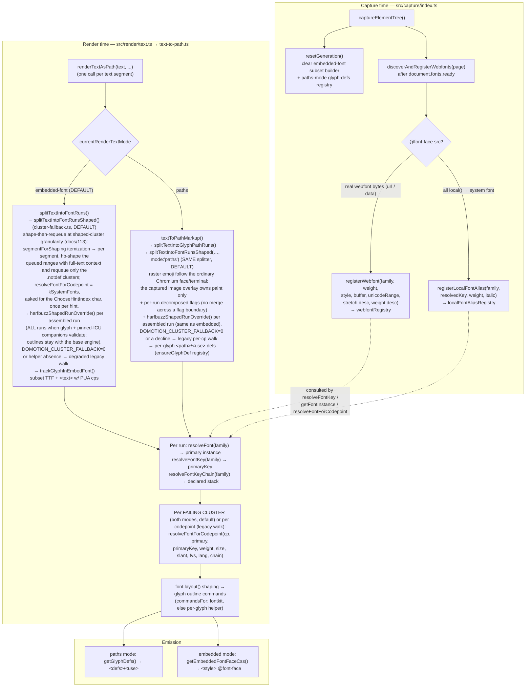
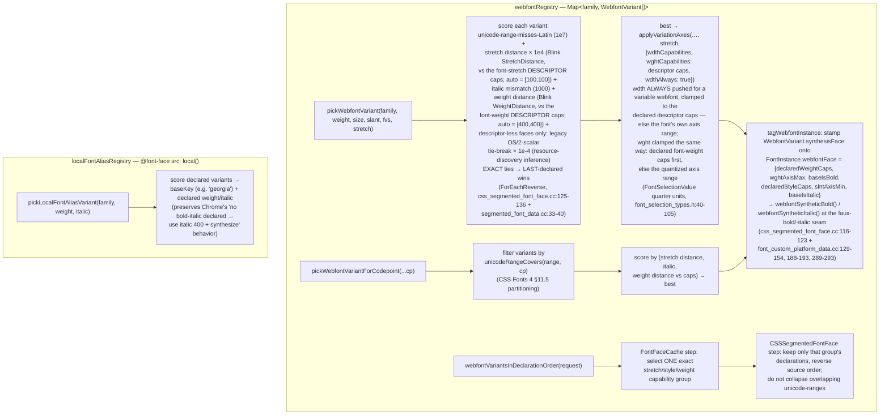
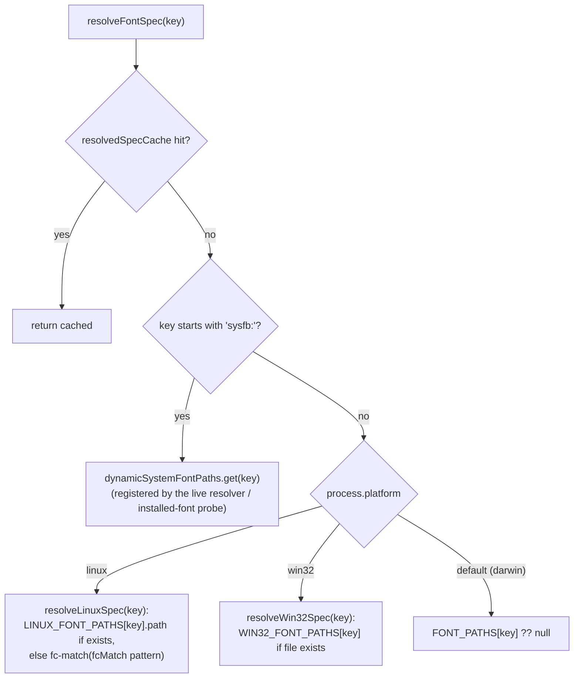
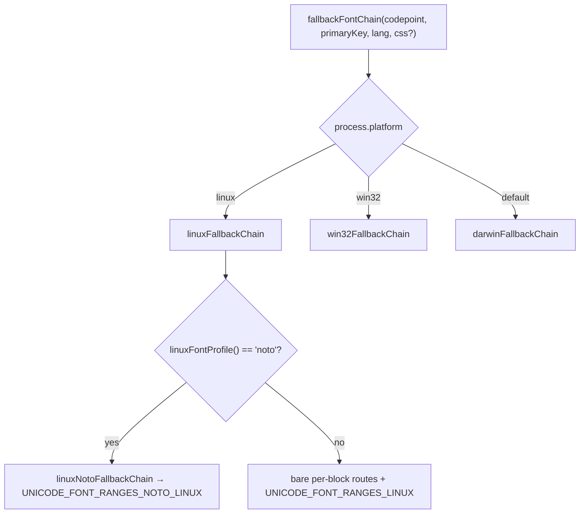
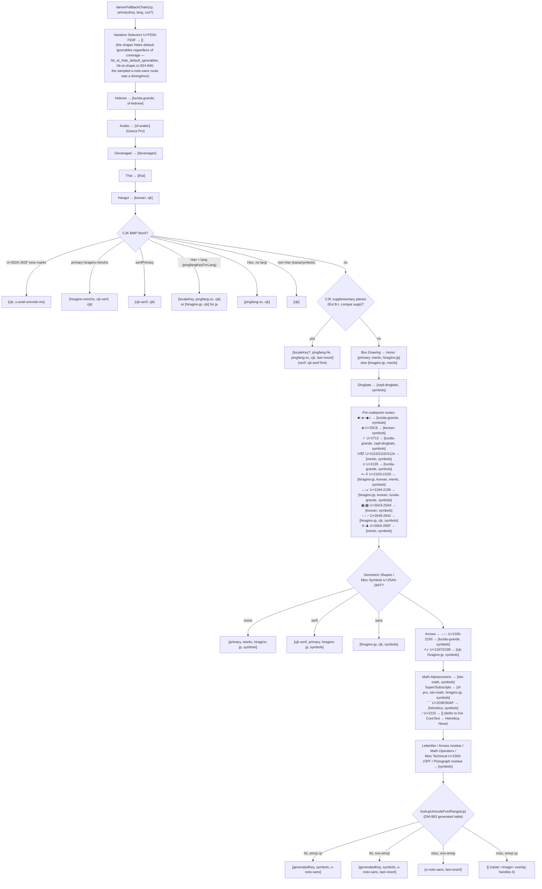
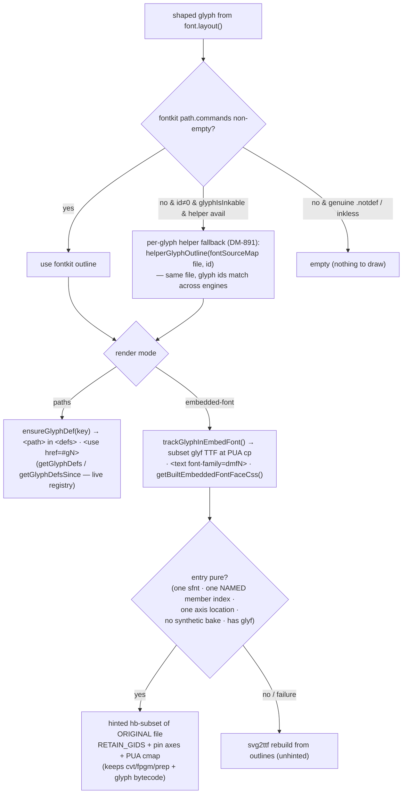

# Font resolution — complete flow diagram

This document is the **canonical end-to-end map of Domotion's font-resolution
system**: how a captured text run's CSS `font-family` (plus every codepoint in
it) is turned into a concrete on-disk font face + glyph outline, across macOS,
Linux, and Windows, including every branch, registry, cache, and per-block /
per-codepoint route.

> **Maintenance contract.** This diagram is a canonical reference — it must stay
> in lockstep with the code. Any change to font routing, the platform tables, the
> fallback chains, the family→key map, the per-codepoint resolver, the live
> system-fallback backends, or the render-text-mode branch **must update the
> matching diagram + prose here in the same commit**. The authoritative source is
> `src/render/font-resolution.ts` (routing tables + resolvers),
> `src/render/win-font-fallback.ts` (Blink's hardcoded Windows stage, transcribed),
> `src/render/glyph-helper.ts`
> (native CoreText / FreeType / DirectWrite backends), `src/render/text-to-path.ts`
> (the shaping / run-splitting callers), `src/render/embedded-font-builder.ts`
> (embedded-mode subset builder), and `src/capture/index.ts`
> (`discoverAndRegisterWebfonts`). When code and diagram disagree, the code wins —
> fix the diagram. The `check-requirements-against-code` skill verifies this doc
> as part of its sweep.

Related requirement docs (this diagram synthesizes them; each is the narrative
source of truth for its slice):
- [03 — CSS font-family chain resolution](03-font-family-chain.md)
- [30 — webfont `unicode-range` partitioning](30-webfont-unicode-range.md)
- [40 — cross-platform font-path discovery](40-cross-platform-font-paths.md)
- [42 — cross-platform fallback-chain calibration](42-cross-platform-fallback-calibration.md)
- [51 — probe-then-fallback dispatch (fontkit ↔ native helper)](51-probe-then-fallback-dispatch.md)
- [52 — embedded-mode glyph fallback](52-embedded-mode-glyph-fallback.md)
- [80 — cross-platform live system-fallback resolver](80-cross-platform-system-fallback-resolver.md)

---

## Legend

- **Logical key** — an internal string (`helvetica`, `times`, `cjk`, `sf-arabic`,
  `pingfang-sc`, `u-noto-sans`, …) that names a *role*, not a file. The platform
  layer maps a key → an actual font file. `webfont:<family>`, `localalias:<family>`,
  `sysfb:<postscriptName>`, `u-…` (darwin generated), and `un-…` (Linux Noto
  generated) are namespaced key families.
- **FontInstance** — the uniform interface (`src/render/font-resolution.ts`) both
  backing engines expose: fontkit `Font` OR a native glyph-helper instance. Carries
  `layout()`, `glyphForCodePoint()`, metrics.
- **Primary** — the font the run's own `font-family` resolves to (first matched
  name in the stack). **Fallback** — what covers a codepoint the primary lacks.

---

## 1. Top-level pipeline (capture → render → glyph emission)


```mermaid
flowchart TD
  subgraph CAP["Capture time — src/capture/index.ts"]
    A0["captureElementTree()"] --> A1["resetGeneration()<br/>clear embedded-font subset builder<br/>+ paths-mode glyph-defs registry"]
    A0 --> A2["discoverAndRegisterWebfonts(page)<br/>after document.fonts.ready"]
    A2 --> A3{"@font-face src?"}
    A3 -->|"real webfont bytes (url / data)"| A4["registerWebfont(family, weight,<br/>style, buffer, unicodeRange,<br/>stretch desc, weight desc)<br/>→ webfontRegistry"]
    A3 -->|"all local() → system font"| A5["registerLocalFontAlias(family,<br/>resolvedKey, weight, italic)<br/>→ localFontAliasRegistry"]
  end

  subgraph REN["Render time — src/render/text.ts → text-to-path.ts"]
    B0["renderTextAsPath(text, ...)<br/>(one call per text segment)"] --> B1{"currentRenderTextMode"}
    B1 -->|"embedded-font (DEFAULT)"| B2["splitTextIntoFontRuns()<br/>→ splitTextIntoFontRunsShaped() (cluster-fallback.ts, DEFAULT)<br/>shape-then-requeue at shaped-cluster granularity (docs/113):<br/>segmentForShaping itemization → per segment, hb-shape the<br/>queued ranges with full-text context and requeue only the<br/>.notdef clusters; resolveFontForCodepoint = kSystemFonts,<br/>asked for the ChooseHintIndex char, once per hint.<br/>→ harfbuzzShapedRunOverride() per assembled run<br/>(ALL runs when glyph + pinned-ICU companions validate;<br/>outlines stay with the base engine).<br/>DOMOTION_CLUSTER_FALLBACK=0 or helper absence → degraded legacy walk.<br/>→ trackGlyphInEmbedFont()<br/>subset TTF + &lt;text&gt; w/ PUA cps"]
    B1 -->|"paths"| B3["textToPathMarkup()<br/>→ splitTextIntoGlyphPathRuns()<br/>→ splitTextIntoFontRunsShaped(…, mode:'paths') (SAME splitter, DEFAULT)<br/>raster emoji follow the ordinary Chromium face/terminal;<br/>the captured image overlay owns paint only<br/>+ per-run decomposed flags (no merge across a flag boundary)<br/>+ harfbuzzShapedRunOverride() per assembled run (same as embedded).<br/>DOMOTION_CLUSTER_FALLBACK=0 or a decline → legacy per-cp walk.<br/>→ per-glyph &lt;path&gt;/&lt;use&gt; defs<br/>(ensureGlyphDef registry)"]
    B2 --> C0
    B3 --> C0
    C0["Per run: resolveFont(family) → primary instance<br/>resolveFontKey(family) → primaryKey<br/>resolveFontKeyChain(family) → declared stack"]
    C0 --> C1["Per FAILING CLUSTER (both modes, default) or per codepoint (legacy walk):<br/>resolveFontForCodepoint(cp, primary,<br/>primaryKey, weight, size, slant, fvs, lang, chain)"]
    C1 --> C2["font.layout() shaping →<br/>glyph outline commands<br/>(commandsFor: fontkit, else per-glyph helper)"]
  end

  subgraph OUT["Emission"]
    C2 --> D1["paths mode: getGlyphDefs() → &lt;defs&gt;/&lt;use&gt;"]
    C2 --> D2["embedded mode: getEmbeddedFontFaceCss() → &lt;style&gt; @font-face"]
  end

  A4 -.->|"consulted by resolveFontKey /<br/>getFontInstance / resolveFontForCodepoint"| C0
  A5 -.-> C0
```

**Source of truth:** `discoverAndRegisterWebfonts` + `resetGeneration` in
`src/capture/index.ts`; `renderTextAsPath` / `textToPathMarkup` /
`splitTextIntoFontRuns` / `splitTextIntoGlyphPathRuns` in
`src/render/text-to-path.ts`; the shared shaped splitter
(`splitTextIntoFontRunsShaped`) in `src/render/cluster-fallback.ts`; the mode
switch (`currentRenderTextMode` / `withRenderTextMode`) in
`src/render/font-resolution.ts`.

### Render-text mode (paths vs embedded-font)

| Mode | Default? | Output | Fidelity | Generation-scoped state |
|---|---|---|---|---|
| `embedded-font` | **yes** (DM-839) | `<text>` against a `@font-face` subset **glyf** TTF (svg2ttf; NOT CFF — DM-1666), addressed by private-use codepoints (consumer browser does zero shaping) | consumer browser rasterizes (its own hinting/AA) — smaller/faster, not byte-identical across browsers | `embeddedFonts` map + `embedded-font-builder` (`clearEmbeddedFonts`) |
| `paths` | no | `<use href="#gN">` into per-glyph `<path>` defs | per-pixel-faithful to Chromium; used for visual-regression diffing | `glyphDefs` registry (`clearGlyphDefs`) |

Both consult the SAME resolver (`resolveFontForCodepoint`) at the SAME
granularity: per FAILING SHAPED CLUSTER (the Blink shape-then-requeue
mechanism, `src/render/cluster-fallback.ts`, docs/113 — default-on,
`DOMOTION_CLUSTER_FALLBACK=0` restores the per-codepoint legacy walk in both
modes). Both live run splitters pass the run's complete OpenType feature list
into that verdict-shaping call, so disables and explicit feature values can
change `.notdef` coverage before a fallback face is assigned, just as they do
in Blink's `ShapeRange(buffer, font_features, ...)`. The paths entry (`splitTextIntoGlyphPathRuns`,
`src/render/text-to-path.ts`) invokes the shared splitter with
`mode: "paths"`, which adds the emitter's per-run **`decomposed` flags** (no merge across a flag boundary,
so the emitter's per-char vs run-text branch choice survives). The
**uncovered terminal for every cluster, including raster-painted emoji**, is
the FIRST candidate's `.notdef` in both modes (`kFirstCandidateForNotdefGlyph`).
The raster overlay owns paint and its captured rectangle, never face selection
or logical metrics. `resetGeneration()` clears both generation-scoped
caches together (DM-1338 / DM-1435). The webfont + local-alias registries are
**session-scoped** (survive across generations; cleared by `clearWebfonts`).

### Cache lifecycle and invalidation

`clearFontResolutionCaches()` is a correctness-neutral memory trim for long
sweeps. It drops every macOS/Linux/Windows primary-cut memo plus instance,
coverage, resolved-path, helper-outline, and per-codepoint query memos; caller
registries and modeled document-order state survive.

`invalidateFontEnvironmentCaches()` is the stronger host-generation boundary,
mirroring Blink `FontCache::Invalidate()` (`font_cache.cc:265-275`). It also
restarts native-helper discovery, clears installed-family/style/trait and
HarfBuzz file caches, forgets dynamically discovered system faces, and expires
`local()` aliases so capture can rediscover
them against the changed inventory. Downloaded webfont buffers remain valid.
Launched-browser generic preferences live above Blink's font cache and remain
installed; an actual preference/session change replaces them explicitly with
`setSessionGenericFamilyOverrides()`.

Linux has one intentionally non-pure exception inside the document/renderer
scope: Chromium `WebSandboxSupportLinux::unicode_font_families_` is keyed only
by codepoint and populated with `emplace`, so the first locale asking for a
character wins for that renderer's lifetime. Domotion mirrors that state inside
`beginCharacterFallbackDocument()` / `endCharacterFallbackDocument()` and does
not erase it during memory trims. The conformance oracle selects a distinct
scope namespace per locale, matching its distinct Chromium renderer contexts;
production uses one namespace and therefore preserves mixed-language order.

---

## 2. Family stack → primary key (`resolveFontKey` / `matchFamilyNameToKey`)

`resolveFontKey(fontFamily)` splits the computed CSS `font-family` string on
commas, lowercases + strips quotes (`splitFontFamilyNames`), and walks the names
in order, returning the FIRST that `matchFamilyNameToKey` resolves; if none match,
the last-resort default is **`times`** (Chrome's macOS "Standard Font" default).
`resolveFontKeyChain` returns the full ordered, de-duplicated list of matched keys
and then Blink's preferred STANDARD family (used by the per-codepoint resolver
to reach later-declared families before the platform system-fallback stage).
An explicitly named platform family is a match only when that family is actually
installed on the capture host. For example, `Helvetica Neue` is a distinct face
on macOS but is skipped on stock Windows, allowing the next declared family to
become primary just as Blink's family iterator does.

`resolveFont` applies the same availability rule when turning that key into the
primary `FontInstance`: recognition by a generated name table is not proof that
the sampled face exists on the current host. If `getFontInstance` cannot load a
recognized entry, it continues through the authored stack and finally the
script-keyed STANDARD family, matching Blink's `kFontFamily` iteration.

> **The settings-mapped generics are SCRIPT-KEYED on mac/win.** Blink consults
> `settings.<Generic>(script)` with `font_description.GetScript()`
> (`FamilyNameFromSettings`, `platform/fonts/font_selector.cc:72-91`, rev
> 7d859f27), the script being `LocaleToScriptCodeForFontSelection(lang)`
> (`platform/text/locale_to_script_mapping.cc:164-470`, transcribed in full in
> `src/render/generic-script-families.ts`). The capture session's per-script
> values default to Playwright's `forScripts` tables (`defaultFontFamilies.js`,
> playwright-core 1.59.1; drift-guarded against the installed package by
> `generic-script-families.test.ts`): mac carries jpan/hang/hans/hant, win
> adds cyrl/arab/grek, linux has none — so `lang` never moves a Linux
> generic. `resolveFontKey` / `resolveFontKeyChain` / `matchFamilyNameToKey` /
> `resolveFont` take an optional `lang`; a generic keyword with a per-script
> entry first consults the live session probe when armed, then nominates the
> static entry's family when no probed answer exists (comma-lists via
> `FirstAvailableOrFirst`, `generic_font_family_settings.cc:88-104`), probes
> it as the EXACT installed family first (Blink's plain family lookup — a
> curated sibling key must not intercept: measured, lang=ja `sans-serif`
> paints HiraKakuProN-W3, the literal ProN family), and returns null when the
> family doesn't resolve, so the stack walks on. A missing entry falls to the
> Common-script routes (`generic_font_family_settings.cc:105-107`). Two more
> script-keyed positions: the resolveFontKey TERMINAL (an exhausted stack
> falls to `settings.Standard(script)` — measured, bare lang=ja `monospace`
> paints HiraKakuProN-W3 for every codepoint), and the CHAIN's final entry
> (a codepoint no declared family covers is asked of the standard family
> before per-codepoint system fallback, `font_fallback_iterator.cc:167-179` —
> measured, lang=zh-Hant `monospace` paints Han from PingFang TC while Latin
> stays Courier). Measured end-to-end on the oracle: lang=ja 645/645
> agree-exact (was 632 mismatches), ko / zh-Hans / zh-Hant all zero.
>
> **An UNDECLARED family reaches these script-keyed routes via a capture-side
> rewrite.** An element with no author `font-family` anywhere in its cascade is
> a Blink `kStandardFamily` description → `settings.Standard(script)`
> (`font_selector.cc:71-75`, rev 7d859f27), so its Latin AND CJK both paint the
> script-keyed standard face — but `getComputedStyle().fontFamily` serializes
> that case to the concrete standard NAME ("Times"), indistinguishable from a
> declared `font-family: Times`. The capture script detects the UA-default case
> (`src/capture/script/font-family-default.ts`) and rewrites the family to the
> `-webkit-standard` keyword, which the resolver already routes script-keyed
> above. Detection: the computed first family must be CONCRETE (a UA rule only
> ever sets a generic, e.g. `pre`→`monospace`, already handled), with NO author
> declaration on self-or-ancestor — inline style (incl. the `font` shorthand), a
> matching author rule, or a `<font face>` attribute — and form controls
> (`input`/`textarea`/`select`/`button`, UA `font: -webkit-small-control`, a
> concrete SYSTEM font not kStandardFamily) plus their descendants excluded.
>
> **Quoted generic spellings are literal family names, not keywords.** The
> splitter carries a per-entry `generic` bit: an entry is a generic KEYWORD
> only when it was unquoted AND spelled in canonical lowercase
> (`FontFamily::InferredTypeFor`'s case-sensitive set — cursive / fantasy /
> monospace / sans-serif / serif / system-ui / math — `platform/fonts/
> font_family.cc:63-74`, rev 7d859f27; the computed style delivers the
> distinction because `SerializeFontFamily` force-quotes literal names that
> collide with generic spellings, `core/css/css_markup.cc:224-230`). Every
> generic route in `matchFamilyNameToKey` — the session-probe override, the
> Linux settings substitution, and the calibrated static generic arms — is
> gated on that bit, mirroring `FamilyNameFromSettings`' quoted-generic
> refusal (`platform/fonts/font_selector.cc:25-32`): `font-family:
> "monospace", Menlo` paints Menlo, never Courier. The one exception is
> `system-ui`, whose dispatch Blink keys on the family NAME rather than the
> generic bit (`font_cache.cc:161-166`, `font_cache_mac.mm:402-417`), so both
> spellings resolve the platform UI font — measured live: Chrome paints
> .SFNS-Regular for `"system-ui", Georgia`.

> **This ladder is the macOS family stage — and on Linux, the transcribed
> nomination WALK now runs ahead of it.** When the Linux helper is present,
> speaks `familyMatch`, and `DOMOTION_SYSTEM_FALLBACK != 0`, every
> NON-generic name is resolved the way Blink resolves it (the W node in the
> diagram): ask `SkFontConfigInterfaceDirect::matchFamilyName` about the name
> (`font_fallback_list.cc:149-193`, tag 147.0.7727.15), retry a rejection once
> under Blink's alias (Courier ↔ Courier New, Times ↔ Times New Roman,
> Arial ↔ Helvetica — `blinkAlternateFamilyName`, from
> `alternate_font_family.h:74-105` + `font_platform_data_cache.cc:74-105`),
> and on acceptance register the matched face as `sysfb:<psName>` with the
> ACCEPTED spelling in `declaredFamilyForKey`; on rejection return null so the
> stack walks past the name, exactly as Blink does. The settings-mapped
> generic keywords go through the SAME walk after
> `FontSelector::FamilyNameFromSettings` (`font_selector.cc:73-91`, rev
> 7d859f27) swaps in the browser-side settings value — in the capture session
> that is PLAYWRIGHT's vendored Linux table, applied via CDP
> `Page.setFontFamilies` on every non-headful launch
> (`playwright-core/lib/server/chromium/defaultFontFamilies.js`, 1.59.1;
> key-for-key equal to `chrome/app/resources/locale_settings_linux.grd`, rev
> 7d859f27, its upstream provenance): serif / -webkit-standard /
> -webkit-body → "Times New Roman", sans-serif →
> "Arial", monospace → "Monospace", cursive → "Comic Sans MS", fantasy →
> "Impact", plus math → "Latin Modern Math" from the `WebPreferences`
> constructor (`web_preferences.cc:41` — Playwright's table has no math key)
> (`LINUX_GENERIC_FAMILY_DEFAULTS`).
> A rejected settings value ("Comic Sans MS" / "Impact" on the noble image)
> means the family is unavailable and the stack terminates at the standard
> family — the `times` terminal — never at "no font". Playwright's Linux table
> has no `forScripts` entries, so the content script never moves a Linux
> generic. Only `system-ui` stays
> excluded (its family comes from `FontCache::SystemFontFamily()`, not a
> settings-table entry) on its calibrated static route, which is also the
> degrade path for everything when the walk is disarmed (doc 110).
>
> Otherwise, `matchFamilyNameToKey` unconditionally encodes Chrome-**on-macOS**'s family and
> generic resolution (each entry is probe-calibrated against Chrome-macOS). The
> logical keys it returns are macOS-face names; cross-platform behavior emerges
> only DOWNSTREAM, where §5's `resolveFontSpec` remaps the SAME key to a
> per-platform file (e.g. `helvetica` → Helvetica on macOS, Liberation Sans on the
> Linux CI image, `arial.ttf` on Windows). Two consequences worth knowing (see
> DM-1687):
>
> - **Generic keywords are pinned to macOS defaults** — on macOS, and on
>   Linux only when the walk is DISARMED: `sans-serif`→`helvetica`,
>   `serif`→`times`, `monospace`→`courier`, `cursive`→`apple-chancery`,
>   `fantasy`→`papyrus` (the last two carrying the measured Liberation Serif
>   outcome on the Linux table). With the walk armed, Linux resolves the
>   generics through the session-default nomination above, so a host whose
>   fontconfig differs from the calibration image tracks Chrome by
>   construction — the residual DejaVu-desktop divergence (**DM-1691**) is
>   confined to the disarmed path.
> - **The uncurated-named-font tail is platform-branched.** The
>   `resolveInstalledFont(name)` step (which resolves an installed-but-uncalibrated
>   family to a `sysfb:` key) uses the native helper on macOS/Windows. (On Windows
>   the `family` query is an exact `FindFamilyName` lookup against the system
>   collection, carrying the matched face's resolved axis values for variable
>   instances, e.g. "Segoe UI Variable Text" → `SEGUIVAR.TTF` at `opsz` 10.5.)
>   On macOS the helper's `family` query is guarded by an installed-inventory
>   check (AppKit `availableMembersOfFontFamily` — which resolves legacy
>   aliases like "Hiragino Kaku Gothic ProN" — plus the registered PostScript
>   names) BEFORE any `CTFontCreateWithName`: on recent macOS that call
>   blocks forever inside the downloadable-font registry for an
>   available-but-not-installed name like "Osaka-Mono", a path Chrome's
>   sandboxed renderer can never take (its font-registry service is
>   unreachable, so the same lookup fails fast and the stack walks on).
>   Two per-platform tails follow it:
>   - **Windows suffix names**: a family like "Segoe UI Light" is not a
>     DirectWrite family, so the probe misses; Blink resolves it by stripping a
>     known weight/stretch suffix and PINNING that axis
>     (`win/font_cache_skia_win.cc:409-480`, rev 7d859f27). Mirrored via
>     `win32FamilySuffixAdjustment` (`src/render/win32-family-suffix.ts`): the
>     adjusted face registers as `winfam:<psName>` and
>     `win32SuffixDeclaredForKey` records the pin so §3's `win32PrimaryCutKey`
>     re-resolves the slope per run at the pinned weight/stretch.
>   - **Linux fontconfig tail**: when fontconfig genuinely has the author's
>     family (`authorFamilyAvailable`, graded by Skia's own `MatchFont`
>     acceptance — `strcasecmp` against the pick's family names and the
>     post-config-substitution request, plus the `kFontEquivMap`
>     metric-equivalence classes, transcribed from the DEPS-pinned
>     `62efacd3:src/ports/SkFontConfigInterface_direct.cpp:553-590` — so a
>     substitute for a miss still falls through while a metric-class
>     replacement like Liberation Serif for "Times New Roman" accepts, exactly
>     as Chrome does), its file registers as a `sysfb:` key and
>     `declaredFamilyForKey` records the author's name so §3's
>     `linuxPrimaryCutKey` can re-cut it at the run's style. Gated on the
>     live-resolver flag (`DOMOTION_SYSTEM_FALLBACK=0` disables).
>
> `docs/03-font-family-chain.md` frames the same mappings as "matching Chrome on
> macOS"; doc [40](40-cross-platform-font-paths.md) L62 notes the keys are
> "macOS-centric".
>
> **Session generic-family resolution (live-browser authority, default ON).** The concrete
> family behind a generic keyword is a property of the LAUNCHED capture
> session, not of Chromium's source: Playwright applies its own vendored
> per-platform table to every non-headful page via CDP `Page.setFontFamilies`
> (`playwright-core/lib/server/chromium/crPage.js` `_setDefaultFontFamilies`,
> gated on `!options.headful`; `defaultFontFamilies.js` — mac fixed is
> "Courier", with per-script jpan/hang/hans/hant entries on mac/win),
> overriding blink's `WebPreferences` constructor defaults
> (`third_party/blink/common/web_preferences/web_preferences.cc:25-41`, rev
> 7d859f27 — the only layer a headless-shell launch otherwise has; the chrome
> prefs layer's `locale_settings_<platform>.grd` applies only headed/full).
> The capture funnel
> (`captureElementTreeWithWarnings` → `src/capture/generic-font-probe.ts`)
> instead probes the live session once per browser context — one hidden page
> containing Common-script spans for the standard family and all six generics,
> plus primary-covered spans for ja/ko/zh-Hans/zh-Hant/ru/ar/el across that
> same family set. Two consecutive
> identical paints are required (up to three attempts), so a first-layout race
> between Playwright's `Page.setFontFamilies` and Blink's constructor defaults
> is not installed as truth. `setSessionGenericFamilyOverrides` installs both
> Common and script-keyed answers; `matchFamilyNameToKey` prefers the exact
> probed script answer over the static `forScripts` transcription, then uses
> the probed Common answer ahead of calibrated static routes. CDP PostScript
> identity is preserved so a settings-selected face is not rematched to a
> different curated family cut. `DOMOTION_GENERIC_PROBE=0` explicitly selects
> the degraded static path; probe failure otherwise falls back safely.


```mermaid
flowchart TD
  S0["resolveFontKey(fontFamily)"] --> S1["splitFontFamilyNames:<br/>split ',' · trim · strip quotes · lowercase<br/>+ per-entry generic bit (unquoted + canonical<br/>lowercase + InferredTypeFor set)"]
  S1 --> L["for each entry in stack →<br/>matchFamilyNameToKey(name, generic)"]
  L --> M{"decision ladder (first hit wins)"}

  M -->|"generic + lang + probed script answer"| PS["resolve painted family as literal<br/>else fall through"]
  M -->|"generic + lang + no usable probe"| ST["static Playwright forScripts entry<br/>FirstAvailableOrFirst"]
  M -->|"generic + probed Common answer"| PC["resolve painted family as literal<br/>else fall through"]
  M -->|"webfontRegistry.has(name)"| R1["webfont:&lt;name&gt;"]
  M -->|"localFontAliasRegistry.has(name)"| R2["localalias:&lt;name&gt;"]
  M -->|"linux, walk armed, non-generic name"| W{"transcribed nomination walk:<br/>matchFamilyName(name) →<br/>reject: retry blinkAlternateFamilyName(name)"}
  W -->|"accepted"| WA["sysfb:&lt;psName&gt; of matched face<br/>+ declaredFamilyForKey = ACCEPTED spelling"]
  W -->|"rejected"| WR["null → SKIP to next name<br/>(Blink walks past the family)"]
  M -->|"monospace / courier"| R3["courier"]
  M -->|"courier new (face resolves on host)"| R3b["courier-new<br/>(absent: alias retry → courier on !win32,<br/>null on win32 — AlternateFamilyName is !IS_WIN)"]
  M -->|"menlo · monaco · sf mono"| R4["menlo / monaco / sf-mono"]
  M -->|"times new roman"| R5["times-new-roman"]
  M -->|"serif · times"| R6["times"]
  M -->|"georgia"| R7["georgia"]
  M -->|"source serif pro"| R8["source-serif-pro (present-or-fall-through)"]
  M -->|"playfair display"| R9["playfair-display (present-or-fall-through)"]
  M -->|"hiragino mincho pron / pro / …"| R10["hiragino-mincho"]
  M -->|"cursive · apple chancery"| R11["apple-chancery"]
  M -->|"snell roundhand · brush script mt"| R12["snell"]
  M -->|"fantasy · papyrus"| R13["papyrus"]
  M -->|"helvetica neue"| R14["helvetica-neue"]
  M -->|"sans-serif · helvetica"| R15["helvetica"]
  M -->|"arial"| R16["arial"]
  M -->|"arial unicode ms"| R17["u-arial-unicode-ms"]
  M -->|"system-ui · sf pro ·<br/>blinkmacsystemfont (darwin only —<br/>style_builder_converter.cc rewrite is IS_MAC;<br/>off-darwin: null → SKIP)"| R18["sf-pro"]
  M -->|"sf pro text · sf pro display"| R19["sf-pro (opsz-pinned, §7)"]
  M -->|"hiragino sans · hiragino kaku gothic …"| R20["hiragino-jp"]
  M -->|"ui-monospace · ui-serif · ui-rounded · ui-sans-serif ·<br/>math · emoji · fangsong · -apple-system"| RN["null → SKIP to next name"]
  M -->|"new york medium (if OTF installed)"| R21["sysfb:NewYorkMedium-Regular"]
  M -->|"else: resolveInstalledFont(name) hits<br/>(real installed but uncalibrated font)"| R22["sysfb:&lt;postscriptName&gt;<br/>(registerDynamicSystemFont)"]
  M -->|"win32: suffix name ('Segoe UI Light')<br/>win32FamilySuffixAdjustment + resolveInstalledFont"| R23["winfam:&lt;psName&gt;<br/>+ win32SuffixDeclaredForKey pin"]
  M -->|"linux: authorFamilyAvailable(name)<br/>→ fcMatch(name)"| R24["sysfb:&lt;psName&gt;<br/>+ declaredFamilyForKey record"]
  M -->|"no match"| RNext["→ try next name in stack"]

  RNext -.->|"stack exhausted, nothing matched"| DEF["default: times"]
```

**Why generics resolve where they do (macOS calibration — Blink `font_cache_mac.mm`):**

| CSS generic / keyword | Key | Actual macOS font |
|---|---|---|
| `sans-serif`, `Helvetica` | `helvetica` | Helvetica.ttc (NOT SF Pro) |
| `serif`, `Times`, UA default | `times` | Times.ttc (Apple Times, NOT Times New Roman) |
| `monospace`, `Courier` | `courier` | Courier.ttc (NOT SF Mono/Menlo) |
| `Courier New` | `courier-new` | Supplemental/Courier New.ttf (direct match; Courier alias is a lookup-failure retry only — `font_platform_data_cache.cc:74-105`) |
| `Consolas` | — | no pin: uninstalled → walk on; installed (MS Office Mac) → `sysfb:` via the installed-font probe |
| `cursive` | `apple-chancery` | Apple Chancery (NOT Snell Roundhand) |
| `fantasy` | `papyrus` | Papyrus |
| `system-ui`, `SF Pro`, `BlinkMacSystemFont` (darwin only — the `system-ui` rewrite is `#if BUILDFLAG(IS_MAC)`; off macOS the name is unmatchable and walks on) | `sf-pro` | SFNS.ttf |
| `ui-monospace`, `ui-serif`, `ui-sans-serif`, `ui-rounded`, `math`, `emoji`, `fangsong`, `-apple-system` | `null` | **skipped** (not in Blink's keyword table — `css_value_keywords.json5:173-181`; Chrome walks the stack, ultimately to `times`) |

**Source of truth:** `matchFamilyNameToKey` / `resolveFontKey` /
`resolveFontKeyChain` / `splitFontFamilyNames` in `src/render/font-resolution.ts`.
Doc [03](03-font-family-chain.md).

---

## 3. Key → FontInstance (`getFontInstance`)

Given a logical key + `(weight, fontSize, slant, variationSettings, stretch,
systemUiPrimary)`,
`getFontInstance` returns a cached, weight/slant/width-correct, variation-driven
`FontInstance`, or `null` (caller walks to the next candidate). `stretch` is CSS
`font-stretch` as a percentage (100 = `normal`, `stretchPercent` parses the
computed string). After the effective cut is selected, `fontInstanceCacheKey`
canonicalizes variation-axis tag order and includes declared-vs-system-UI
provenance plus the resolved `wdth` request; this is the cache-identity boundary
shown at G4. Registry-backed `webfont:` and `localalias:` keys are handled first
by `resolveRegisteredFontInstance`; only ordinary logical keys continue into
platform cut selection and file discovery. `stretch` reaches the declared-family style matcher, and the cut it
selects is what `effectiveKey` ends up naming. `systemUiPrimary` is the route
provenance from `stackPrimaryIsSystemUi`: it distinguishes Blink's
`MatchSystemUIFont` path from explicitly named SF families that share the same
logical key but enter `MatchFontFamily`. On the macOS `system-ui` face
(`sf-pro` / `sf-pro-italic`) and on variable webfonts it ALSO drives the `wdth`
variation axis — the identity mapping clamped into the capabilities, which is
the two places Blink applies it (`MatchSystemUIFont`,
`mac/font_matcher_mac.mm:540-589` + `:483-538`;
`font_custom_platform_data.cc:155-169`; identical at tag 147.0.7727.15 and rev
7d859f27). For a webfont the capabilities are the `@font-face` `font-stretch`
DESCRIPTOR range when one is declared (so a face declared `font-stretch: 75%`
pins wdth 75 for every request, normal included) and the font's own axis range
when the descriptor is auto; Blink pushes the coordinate for every variable
webfont, normal-stretch requests included, and its clamps run in
FontSelectionValue quarter units (measured: auto-descriptor `Skia.ttf` as a
webfont paints `_wght30000_wdth14000` = 3.0 / 1.25 against raw axis maxima
3.19999 / 1.30000). A declared family never gets the axis: the width becomes
the condensed/expanded symbolic trait and picks a cut or fvar named instance
instead (measured on the `Skia` family, which has both mechanisms available:
50%/62.5%/75% all paint `Skia-Regular_Condensed` at one width, while
`system-ui` moves continuously and clamps 200% to SF's wdth max 150).

**The same split governs `wght`.** Only `MatchSystemUIFont` (system-ui) and the
webfont path set a CSS-valued weight axis; a DECLARED family's weight lives in
WHICH face the trait/weight matcher picked, and `FontPlatformDataFromCTFont`
applies only `opsz` + `font-variation-settings` on top of that face
(`font_platform_data_mac.mm:113-208`). On the webfont path the `wght`
coordinate follows the same descriptor rule as `wdth`, one axis over
(`font_custom_platform_data.cc:136-154`): the request clamps into the
`@font-face` `font-weight` DESCRIPTOR capabilities when one is declared —
`normal`/`bold`/a number/a two-value range, parsed per
`FontFace::GetFontSelectionCapabilities` (`core/css/font_face.cc:860-930`)
into `WebfontVariant.weightCaps` — and only falls back to the font's own
quantized axis range when the descriptor is auto/absent. So a face declared
`font-weight: 700` pins wght 700 for EVERY request (CDP-measured: Lexend VF
declared 700 paints `Lexend-Bold` at requested weight 400), and a declared
range `300 500` clamps a 700 request to 500 (`Lexend-Medium`). The descriptor
is a SELECTION capability too: the variant pickers score Blink's
`FontSelectionAlgorithm::WeightDistance` (`font_selection_algorithm.cc:98-135`,
with its 400/500 search-band rules and family-bounds thresholds) against the
declared range — an auto face selects as exactly normal weight `[400, 400]` —
after stretch and style, per `IsBetterMatchForRequest` order.

**A declared descriptor also decides SYNTHETIC BOLD, and by a platform-independent
rule** — not by any of the three per-platform system-font predicates. Blink composes
it from two places. `CSSSegmentedFontFace::GetFontData`
(`core/css/css_segmented_font_face.cc:116-119`) sets the bold flag from
`capabilities.weight.maximum < kBoldThreshold (600) && request.weight >= 600`, where
the capabilities are the DESCRIPTOR's — an absent descriptor is `[400, 400]`, never
the font's axis range. `FontCustomPlatformData::GetFontPlatformData`
(`font_custom_platform_data.cc:129-154, 289-293`) then keeps `synthetic_bold = bold`
untouched on the declared-descriptor branch, exempts only an AUTO-descriptor variable
face whose `wght` axis maximum exceeds 400 (`has_bold_variations`), and finally gates
on the buffer's own boldness (`&& !base_typeface_->isBold()`, i.e. the buffer's OS/2
weight < 600). `registerWebfont` snapshots those three facts into
`WebfontVariant.synthesisFace`, the pickers stamp them onto the resolved
`FontInstance.webfontFace`, and `webfontSyntheticBold(face, requestedWeight)` runs the
rule at the faux-bold seam. So the SAME variable file paints plain at request 700 with
no descriptor (axis instanced to 700) and emboldened-at-wght-400 when it declares
`font-weight: 400`. CDP + 1× ink measured at 100 px `Hamburgefonstiv`: Lexend VF
declared 400 requested 700 paints `Lexend-Regular` at advance 847.000 — the same face
name and the same advance as its 400 control — with ink 25951.4 vs 21568.9 (+20.3%),
so neither the reported face nor the width can observe this; only ink can.

The darwin fontkit path therefore pins
the FACE's own coordinates (`darwinFaceOwnAxes`: the CoreText handle position
the family/fallback query reported — `FontPath.ctAxes` — or the fvar named
instance the PostScript name denotes) instead of a CSS-derived `wght`. The
discriminating family is `Skia` (wght axis [0.48 .. 3.2], QuickDraw units): a
CSS pin clamps every weight to 3.2 — the Black master — where Chrome paints
`Skia-Regular` at CSS 400 and the Light/Bold instances at 300/700 (CDP-measured
widths 783.36 / 720.81 / 836.44 at 100px, all reproduced by the instance
coordinates and none by a CSS pin).

**On Linux, system fonts take NO variation coordinates at all.** Blink's
`FontCache::CreateFontPlatformData` on the !IS_WIN path
(`skia/font_cache_skia.cc:299-358`, rev 7d859f27) constructs the
FontPlatformData straight from the typeface `matchFamilyStyle` returned — the
only `makeClone` sites in platform/fonts are the webfont path and mac, and the
only `VariationSettings()` consumer outside those is the mac font cache. So
neither the CSS weight, nor opsz-from-font-size, nor wdth, nor slnt, nor
author `font-variation-settings` reaches a Linux system typeface; for a
variable file the face IS the fvar named instance fontconfig's FC_INDEX tells
FreeType to load, at that instance's own coordinates (the shaping side only
reads the typeface's existing design position, `harfbuzz_face.cc:571-584`).
The Linux branch of `getFontInstance`'s fontkit path therefore instantiates
the named instance the resolved PostScript name denotes
(`resolveFaceInfoForFile().instanceAxes`) — or the default master — and never
calls `applyVariationAxes`. Measured in the noble container (Lexend VF, wght
[100..900], 100px): CSS 450 paints the Regular instance (847.000px),
byte-identical to CSS 400, not the wght=450 interpolation (853.969px) the CSS
pin used to produce; every weight lands on a named instance, never between
two.


```mermaid
flowchart TD
  G0["getFontInstance(key, weight, fontSize, slant, fvs, stretch)"] --> G1{"key prefix?"}
  G1 -->|"webfont:&lt;family&gt;"| GW["pickWebfontVariant()<br/>(§4 registry scoring + variation axes)"]
  G1 -->|"localalias:&lt;family&gt;"| GL["pickLocalFontAliasVariant()<br/>→ recurse getFontInstance(baseKey,<br/>declared weight/italic)"]
  G1 -->|"plain / sysfb: / u- / un-"| G2["resolveEffectiveCutKey(key, weight, slant, stretch, systemUiPrimary)<br/>effectiveKey = key — the G3…G3d ladder below.<br/>systemUiPrimary skips declared-family matching.<br/>Also called by fallbackBaseFor (§8a) to name the<br/>cascade BASE, which is why it is its own function."]

  G2 --> G3["Style→file remap (fonts w/o variable axes):<br/>slant≠0: sf-pro→sf-pro-italic, sf-mono→sf-mono-italic<br/>weight≥600 &/or italic: helvetica/arial/courier/courier-new/menlo/<br/>times/georgia/helvetica-neue/source-serif-pro/<br/>playfair-display → -bold / -italic / -bold-italic<br/>cjk/cjk-serif/hiragino-mincho/korean/<br/>pingfang-* → -bold when weight≥600<br/>hiragino-jp → hiragino-jp-w{0,1,3..9} by EXACT usWeightClass<br/>lucida-grande → -bold when weight≥450"]
  G3 --> G3b["Sub-bold cut (SUB_BOLD_WEIGHT_CUTS +<br/>subBoldWeightCutSuffix): weight&lt;600 and the family<br/>ships a face BELOW regular →<br/>helvetica → -light / -light-italic when weight≤300.<br/>Adopted only if resolveFontSpec(cutKey) ≠ null,<br/>so non-darwin mappings keep their regular face."]
  G3b --> G3c["win32 + helper: win32PrimaryCutKey(effectiveKey, weight, slant, stretch)<br/>→ winfam:&lt;psName&gt; (DirectWrite matchFamilyStyle:<br/>FindFamilyName + GetFirstMatchingFont, plus Blink's<br/>family-name suffix layer — win32FamilySuffixAdjustment —<br/>and win32SuffixDeclaredForKey's pinned axis for<br/>author-declared 'Segoe UI Light'-style keys)"]
  G3c --> G3d["darwin + helper: darwinPrimaryCutKey(KEY, weight, slant, stretch)<br/>Declared families only (DARWIN_DECLARED_FAMILY_KEYS<br/>+ declaredFamilyForKey for dynamic sysfb: keys).<br/>CoreText family → resolveFamilyStyleMatch(weight, italic, WIDTH)<br/>→ helper 'familyMatch' (cssWeight / italic / cssWidth)<br/>= Blink ComputeDesiredTraits + BestStyleMatchForFamilyNS /<br/>BetterChoiceCT, transcribed at tag 147.0.7727.15.<br/>Reads the BASE key, so its answer REPLACES G3/G3b<br/>rather than composing with them — sysfb:&lt;psName&gt; for a cut,<br/>the BASE key itself when the matcher answers the base face<br/>(an answer, not an abstention — Blink runs no ladder behind it).<br/>null = could not ask → G3/G3b stand (degraded tier)."]
  G3d --> G3e["linux + helper + resolver flag: linuxPrimaryCutKey(KEY, weight, slant, stretch)<br/>Declared families only (same key set + declaredFamilyForKey).<br/>Family = ACCEPTED spelling (declaredFamilyForKey) ?? LINUX_FONT_PATHS<br/>fcMatch base (system-ui / the times terminal; other generics resolve upstream) →<br/>linuxFamilyMatchWithAlternate (alias retry per Blink) →<br/>helper 'familyMatch' = SkFontConfigInterfaceDirect::matchFamilyName<br/>transcribed (Skia rev fd139e79, confirmed unchanged in substance at the<br/>Chromium-pinned 62efacd3): FcFontSort(trim=0),<br/>first SFNT-valid pattern, family/alias/metric-equiv acceptance.<br/>Both reject → linuxLastResortMatch ('' → Sans → Arial → '',<br/>GetLastResortFallbackFont transcribed).<br/>Reads the BASE key; the answer REPLACES G3/G3b (sysfb:&lt;psName&gt;<br/>for a cut, the BASE key when the score picks the base face).<br/>null = could not ask → G3/G3b stand (degraded tier)."]
  G3e --> G4["darwinSystemUiWdth(effectiveKey, stretch, systemUiPrimary):<br/>system-ui route + sf-pro / sf-pro-italic → wdth request = stretch, else 100<br/>cacheKey includes declared/system-ui provenance + optional wdth<br/>→ fontInstanceCache hit? return"]
  G4 --> G5["resolveFontSpec(effectiveKey) → { path, postscriptName?, extractor? }<br/>(§5 platform dispatch)"]
  G5 -->|"null"| GNull["return null"]
  G5 --> G6{"extractor === 'native'<br/>&& glyph helper available?"}
  G6 -->|"yes (PingFang etc. — hvgl / GSUB-crashing fonts)"| G6t{"faceHasTrakAndStat(path, faceIndex)?<br/>(sfnt table directory — HarfBuzz's own trak gate)"}
  G6t -->|"yes — SF Compact + every PingFang cut.<br/>SF Pro/Italic/Text and SF Hebrew carry the tables<br/>but never reach here: not extractor:'native'"| G7t["createGlyphHelperFont(…, shapeFallback: makeHarfbuzzShapeFallback(<br/>path, faceIndex, fontSize, axes),<br/>preferShapeFallback: true)<br/>axes: darwin = the helperAxes derivation (face-own coords + opsz/fvs);<br/>win32 = resolveAxisLocationForFile(…)<br/>→ HarfBuzz shapes (ids/positions/clusters),<br/>helper still draws (outlines by id)"]
  G6t -->|"no"| G7["createGlyphHelperFont(postscriptName, path,<br/>shapeFallback: makeFontkitShaper(…))<br/>→ native FontInstance · cache · return"]
  G6 -->|"no"| G8["fontkit.openSync(path)<br/>· TTC: getFont(postscriptName) ?? fonts[0]"]
  G8 --> G9{"opened & has glyf/CFF/CFF2 outline table?<br/>(fontHasOutlineTable)"}
  G9 -->|"no + native-eligible + helper avail"| G7
  G9 -->|"no font at all"| GNull
  G9 -->|"yes"| G10["applyVariationAxes(font, weight, size, slant, fvs, wdth, opts)<br/>opsz←size · wdth←stretch (system-ui/webfont only)<br/>wght←weight EXCEPT darwin declared families —<br/>there the face's own coords (ctAxes / named instance) pin instead —<br/>and EXCEPT linux, which skips applyVariationAxes entirely:<br/>Blink applies NO coordinates to Linux system fonts, so the<br/>fontconfig-matched named instance (or default master) IS the face<br/>· record fontSourceMap (per-glyph helper fallback)<br/>· cache · return"]
```

**Probe-then-fallback dispatch (doc [51](51-probe-then-fallback-dispatch.md)):**
fontkit is primary; the **native glyph helper** (macOS CoreText / Linux FreeType /
Windows DirectWrite, dispatched by `process.platform` in `src/render/glyph-helper.ts`)
is the fallback for a *helper-eligible* font (`extractor: "native"`) that fontkit
can't open OR opens with no outline table (PingFang's outlines live in Apple's
private `hvgl` table). A finer **per-glyph** tier (`commandsFor` → `helperGlyphOutline`,
DM-891, doc [52](52-embedded-mode-glyph-fallback.md)) supplies a single glyph's
outline from the SAME file when fontkit opened the font but returned an empty path
for one inkable glyph.

**Outline offset — where CoreText says the glyph goes vs where it draws it.**
`createGlyphHelperFont` measures one per-face vertical correction on macOS and
applies it to every outline it returns (`measureOutlineOffsetY` →
`glyphCommands`, `src/render/glyph-helper.ts`). CoreText exposes two answers for
the same glyph: `CTFontCreatePathForGlyph` (the outline) and
`CTFontGetBoundingRectsForGlyphs` (the box it occupies). Chrome paints at the
bounding rect, so where the two disagree the raw outline lands in the wrong
place. Apple Color Emoji is the one macOS face that disagrees — CoreText places
every one of its glyphs 100 units (0.125 em at its 800 upem) below the outline
it hands back, matching Chrome's painted output exactly; ten ordinary faces
report 0 across 600 glyphs each.

The catch is that CoreText only reveals this through the **system-registered**
font: opening the very same file by URL — which is how the helper normally opens
faces — reports an offset of 0. So the probe issues a second handle on the face
by PostScript **name** (no path) inside the existing `meta` round trip and reads
the disagreement there. The offset is a property of the face, so it is measured
once per font, never per glyph, and adopted only when the sampled glyphs agree
AND the offset is at least 1% of the em — a face whose curve extrema sit off its
control points otherwise reports sub-unit noise (PingFang SC scatters 0 to −1
unit at 1000 upem) that must not be mistaken for a real offset. Faces opened
with an explicit variation location skip the probe.

The visible symptom was a lone U+20E3 COMBINING ENCLOSING KEYCAP: one of the few
Apple Color Emoji glyphs that is a real outline rather than an sbix bitmap, so it
takes the glyph-path pipeline rather than the raster-overlay one, and painted its
box ~4 px high at font-size 32.

**Weight → face routing.** A static family has no `wght` axis to drive, so the
requested CSS weight has to pick a FILE (or a TTC member). There are two
layers here — the calibrated sibling table, and a per-platform transcription
of Blink's own declared-family selection that supersedes it for any family a
CSS `font-family` can name: `darwinPrimaryCutKey` (macOS), `linuxPrimaryCutKey`
(Linux), and `win32PrimaryCutKey` (Windows, where the selection lives inside
the DirectWrite call itself).

**macOS: `darwinPrimaryCutKey` — Blink's declared-family style matcher.** A
family does not have two cuts, it has a ladder. Chrome opens five distinct
PingFang SC members across the CSS weights and seven Hiragino Sans ones
(W0/W3/W4/W5/W6/W7/W9); Helvetica Neue reaches UltraLight and Thin below 400,
and Apple SD Gothic Neo reaches Thin, Medium, SemiBold and ExtraBold. The
`key` / `key-bold` pair below cannot represent that, and the gap is not
cosmetic — a declared `"PingFang SC"` resolved to `PingFangSC-Regular` at
*every* weight, measuring 725 units/em where Chrome paints 736.09 at CSS 500
and 749.06 at 700 (~1.75% per glyph, accumulating along the line).

So for a declared family the cut comes from Blink's own selection rather than
from our table: `BestStyleMatchForFamilyNS` (`:231-277`) over the family's
AppKit members, compared with `BetterChoiceCT` (`:172-220` — nearest CSS
weight with a further-from-500 tie-break, bold included in the
trait-precedence loop), in `platform/fonts/mac/font_matcher_mac.mm` at
Chromium tag `147.0.7727.15` — the Chrome build Playwright pins, which is what
every capture runs against. (The local `external/chromium` checkout carries a
newer directional comparator that landed upstream after the 147 branch point;
the helper transcribes the tag, not the checkout.) The algorithm lives in the
macOS helper's `familyMatch` query (Swift, where AppKit and CoreText are
reachable) and is reached from Node through `resolveFamilyStyleMatch`; it is
scored end to end against Chrome by `npm run fonts:family-match` (doc
[109](109-family-match-conformance.md)).

Three properties are load-bearing:

- **Scope is the declared-family stage.** `DARWIN_DECLARED_FAMILY_KEYS` lists
  the static keys `matchFamilyNameToKey` can return, and `declaredFamilyForKey`
  marks the dynamic `sysfb:` keys its `resolveInstalledFont(name)` tail
  registers (how `font-family: "PingFang SC"` becomes
  `sysfb:PingFangSC-Regular`). The per-codepoint FALLBACK path is a *different*
  Blink call — `CTFontCreateForString` then `GetAlternateFontPlatformData`'s
  in-family re-selection — which `fallbackFamilyCutKey` already mirrors on the
  chain candidates (§7). Running both on one decision would layer two
  mechanisms.
- **It reads the BASE key, and REPLACES the two-slot routing** rather than
  composing with it. Feeding the `-bold` sibling in would ask the matcher to
  re-weight an already-re-weighted face.
- **Null means "could not ask", never "the base face is right".** When the
  matcher answers the very face the key already resolves to, that answer comes
  back as the base KEY and replaces the sibling/ladder seed — Blink runs no
  ladder behind `BestStyleMatchForFamilyNS`. Conflating the two was a measured
  divergence: declared "Hiragino Sans" at CSS 510-590 painted W5 where Chrome
  paints W4 — the tag's `BetterChoiceCT` rejects W5 on its unwanted AppKit
  bold trait (`font_matcher_mac.mm:186-196` names exactly this face), the
  matcher answered the W4 base entry, and the old null return let the
  nearest-`usWeightClass` ladder override it. The resulting Chrome ladder is
  non-monotonic (500 → W5 via the exact-weight escape, 510-590 → W4, 650 → W7
  over the equally-distant W6 by the further-from-500 tie-break) — a shape no
  nearest-weight rule can express, which is the concrete case for transcribing
  the matcher instead of sampling it.
- **`font-stretch` is part of the question, and it outranks weight.** Blink's
  `ComputeDesiredTraits` (`mac/font_matcher_mac.mm:185-202`) turns a width below
  `kNormalWidthValue` (100, `font_selection_types.h:233`) into
  `kCTFontTraitCondensed` and a width above it into `kCTFontTraitExpanded`, and
  `BetterChoiceCT` compares condensed FIRST of its three masks (`:234-235`),
  ahead of the directional weight search. So a `font-stretch: 75%` run on
  Helvetica Neue opens `HelveticaNeue-CondensedBold` at CSS weight **400** —
  the family ships no condensed regular, so the condensed mask decides and the
  weight search then picks between CondensedBold and CondensedBlack. Chrome
  agrees on all twelve of that family's width × weight cells. Until the width
  reached the matcher every stretched run scored as normal width and opened the
  family's normal cut (`fantasy` at 50% took `Papyrus` where Chrome takes
  `Papyrus-Condensed` — 1,110 of 1,463 swept codepoints per stretched stack).
- **The family name is asked of CoreText, not read from the file.** Apple's
  `.ttc` members name themselves by CUT: the face `hiragino-jp` points at
  reports `familyName` "Hiragino Sans W4", and the PingFang entries report
  ".PingFang UI SC" — a different family from the one Chrome addresses. Both
  would send the matcher to the wrong candidate list (W4 at every weight; SC
  faces for a TC request). CoreText reports "Hiragino Sans" / "PingFang SC",
  which is the name `availableMembersOfFontFamily` is keyed on.

`system-ui` (`sf-pro`) is deliberately outside the scope: `CreateTypeface`
asserts `DCHECK_NE(family, kSystemUi)`, so Blink does not family-match it
either, and its face sits under a dot-prefixed family CoreText refuses to
resolve by name from a client process. Its `font-stretch` mechanism is the
OTHER one: `MatchSystemUIFont` puts the CSS percentage straight into a CoreText
`wdth` variation (plus `wght` when ≠400), each clamped to the face's axis range
first (`ClampVariationValuesToFontAcceptableRange`,
`mac/font_matcher_mac.mm:483-589`, rev 7d859f27) — mirrored here by
`darwinSystemUiWdth` feeding `applyVariationAxes`, and validated against
Chrome's CDP-measured widths at 26px within 0.01px across
50/62.5/75/100/125/200% (200% clamps to SF's wdth max 150, which is why the
mapping is NOT the identity end to end).

**No known residual.** The matcher reproduces Chrome exactly at all nine
canonical CSS weights for every scored family (7,317/7,317, doc
[109](109-family-match-conformance.md)) and at the intermediate weights
(760/760 on a 20-family × 41-weight CDP sweep). The earlier drift — Helvetica
taking `Helvetica-Light` at 350 and `Helvetica-Bold` at 590 where Chrome
paints plain `Helvetica` — was the port transcribing the checkout's
directional comparator, which the shipping 147 build does not contain. When
the pinned Playwright Chromium moves to a build that includes the upstream
directional rewrite, the helper's `betterChoiceCT` must be re-transcribed.

**Linux: `linuxPrimaryCutKey` — Skia's fontconfig `matchFamilyName`,
transcribed.** Same stage, entirely different Blink code: on Linux
`CreateTypeface` reduces to `skia::DefaultFontMgr()->matchFamilyStyle(name,
SkiaFontStyle())` (`fonts/skia/font_cache_skia.cc`, tag `147.0.7727.15`), the
manager is fontconfig-backed (`SkFontMgr_New_FCI`,
`skia/ext/font_utils.cc:86-89`), and the whole decision is
`SkFontConfigInterfaceDirect::matchFamilyName` at Skia rev `62efacd3` — the
revision the local Chromium checkout's DEPS:330 pins at rev `7d859f27`, which
differs materially from the current Skia tree (single `FcFontSort(trim=0)`,
first-valid-then-accept-or-reject; no direct `FcFontMatch` stage, no
`isAcceptableMatch` function). The transcription lives in the Linux glyph
helper's `familyMatch` query (`tools/linux-glyph-extractor/src/main.cpp`),
reached through `resolveLinuxFamilyMatch`. The nominated family is the
ACCEPTED spelling the §2 nomination walk recorded (`declaredFamilyForKey`,
re-matched here with the same alias retry Blink's lookup carries) and, for
the static keys that still reach this stage — `system-ui` and the `times`
terminal (with the walk armed, the other generics resolve upstream via the
grd-default nomination) — the calibrated live fontconfig base. In particular,
Linux `system-ui` asks `fc-match "sans"`: this is PlatformFontSkia's exact
headless fallback-family input behind the browser-supplied
`FontCache::SystemFontFamily()`, so the answer follows the host font inventory
instead of freezing one runner's painted Latin cut. When both match nothing on this host,
`linuxLastResortMatch` runs the transcribed last-resort chain
(`GetLastResortFallbackFont`, `fonts/skia/font_cache_skia.cc:147-261` at the
tag: empty name → "Sans" → "Arial" → `legacyMakeTypeface(nullptr)` ≡
`matchFamilyName(nullptr)`). Gated on
`DOMOTION_SYSTEM_FALLBACK != 0`; scored end to end by
`npm run fonts:family-match:linux` (doc
[110](110-family-match-conformance-linux.md), 2,292/2,292 on the noble
image — including the CSS-550 crossover to Liberation Bold that the two-slot
table's 600 threshold missed).

**Windows: the suffix layer rides on `win32PrimaryCutKey`.** DirectWrite picks
the cut inside `matchFamilyStyle` (`FindFamilyName` + `GetFirstMatchingFont`
in `FirstMatchingFontWithoutSimulations`, Skia rev `fd139e79`,
`SkFontMgr_win_dw.cpp:52-92,861-872`), so there is no second in-family
re-selection — but Blink adds a Windows-only family-NAME layer:
"Segoe UI Light" is not a DirectWrite family, and
`FontCache::CreateFontPlatformData` resolves it by stripping the weight/
stretch suffix and pinning that axis (`win/font_cache_skia_win.cc:335-480`).
`win32FamilySuffixAdjustment` (`src/render/win32-family-suffix.ts`) carries
the transcription; `win32FamilyKey` retries through it, and author-declared
suffix families re-resolve the slope per run through
`win32SuffixDeclaredForKey`. Scored end to end by
`npm run fonts:family-match:win32` (doc
[111](111-family-match-conformance-windows.md), 516/516 on the Windows 11
VM; 432/516 before the suffix layer was ported — all 84 misses were suffix
names).

**The table below it** still answers on a host with no built helper, for any
key the matchers decline, and under `DOMOTION_SYSTEM_FALLBACK=0` on Linux.
Three rules, applied in order, calibrated by asking Chromium which face it
painted (`CSS.getPlatformFontsForNode` over 100…900 in 10-point steps):

| Family key | Measured Chrome behavior |
| --- | --- |
| `helvetica` | 100-300 → `Helvetica-Light`, 310-590 → `Helvetica`, 600-900 → `Helvetica-Bold`; oblique column parallel |
| `lucida-grande` | 100-440 → `LucidaGrande`, 450-900 → `LucidaGrande-Bold` |
| `arial` / `times` / `georgia` / `courier` / `menlo` / … | regular below 600, bold at 600+ (no other cut installed) |

1. the `weight ≥ 600` bold split plus the italic sibling (the long-standing
   rule, still the default for every regular/bold-only family);
2. `SUB_BOLD_WEIGHT_CUTS` / `subBoldWeightCutSuffix` for a family that ships a
   face **below** regular — today `helvetica`, whose `Helvetica.ttc` carries a
   Light cut at `OS/2.usWeightClass` 300 that the regular/bold pair hid. This
   one matters broadly: Chrome on macOS resolves the `sans-serif` generic to
   Helvetica, so `font-weight: 100/200/300` on default body text was painted a
   full cut too heavy;
3. the per-family bold thresholds that are not 600 — `lucida-grande` (the macOS
   fallback for arrows, Hebrew and check marks) crosses over at 450.

Two of those measurements are now superseded on macOS by the matcher, which is
the point of moving to a transcribed mechanism: re-measured over CDP, a
DECLARED `Lucida Grande` crosses to its bold face at **600**, not 450 (the 450
crossover is real but belongs to the FALLBACK cascade — as a fallback face
under a weight-450+ run, `GetAlternateFontPlatformData`'s re-selection answers
`LucidaGrande-Bold` — which the live resolver reproduces by making the same
call), and the matcher reaches `HelveticaNeue-UltraLight` / `-Thin` /
`-Medium` where the two-slot pair had only `HelveticaNeue`. The whole tier is
therefore DEGRADED-MODE ONLY on an armed host: every rule above, including the
`weight ≥ 600` split (600 is `kBoldThreshold`, Blink's synthetic-bold
predicate — `font_selection_types.h:182,212` — never a cut selector) and the
nearest-`usWeightClass` Hiragino ladder (wrong at 510-590 and 650, where
Chrome's trait-mask ladder is non-monotonic), is a sampled seed the matcher's
answer replaces, base face included. The rows above record what the *table*
encodes and remain accurate for the hosts that still use it.

Every suffixed key is adopted **only when `resolveFontSpec` resolves it on the
host platform**, which is what keeps the table platform-agnostic: the Linux
(Liberation Sans) and Windows (Arial) mappings for `helvetica` / `lucida-grande`
have no light or bold sibling key, so they fall back to the regular face —
which is what Chrome picks there too.

**Faux-italic signal.** `FontInstance.isRoutedItalicCut` records that the slant
request was satisfied by routing to a real italic/oblique sibling. It exists
because `post.italicAngle` is not trustworthy on its own — `Helvetica-LightOblique`
and `HelveticaNeue-BoldItalic` both report 0 despite outlines that lean the same
~12° as their correctly-tagged siblings, and the embedded-mode faux-italic gate
in `renderTextAsPath` sheared those a second time. The routing decision wins over
the angle.

**Source of truth:** `getFontInstance` / `resolveEffectiveCutKey` / `stretchPercent` /
`darwinSystemUiWdth` / `resolveFontSpec` / `applyVariationAxes` /
`subBoldWeightCutSuffix` / `darwinPrimaryCutKey` / `win32PrimaryCutKey` /
`linuxPrimaryCutKey` / `fontHasOutlineTable` / `commandsFor` in
`src/render/font-resolution.ts`; `win32FamilySuffixAdjustment` in
`src/render/win32-family-suffix.ts`; `resolveFamilyStyleMatch` /
`resolveLinuxFamilyMatch` / `resolveInstalledFont` in
`src/render/glyph-helper.ts`.

---

## 4. Registries: webfonts + local() aliases


```mermaid
flowchart TD
  subgraph WF["webfontRegistry — Map&lt;family, WebfontVariant[]&gt;"]
    W0["pickWebfontVariant(family, weight, size, slant, fvs, stretch)"] --> W1["score each variant:<br/>unicode-range-misses-Latin (1e7) +<br/>stretch distance × 1e4 (Blink StretchDistance,<br/>vs the font-stretch DESCRIPTOR caps; auto = [100,100]) +<br/>italic mismatch (1000) +<br/>weight distance (Blink WeightDistance, vs the<br/>font-weight DESCRIPTOR caps; auto = [400,400]) +<br/>descriptor-less faces only: legacy OS/2-scalar<br/>tie-break × 1e-4 (resource-discovery inference)<br/>EXACT ties → LAST-declared wins<br/>(ForEachReverse, css_segmented_font_face.cc:125-136 +<br/>segmented_font_data.cc:33-40)"]
    W1 --> W2["best → applyVariationAxes(…, stretch,<br/>{wdthCapabilities, wghtCapabilities: descriptor caps, wdthAlways: true})<br/>wdth ALWAYS pushed for a variable webfont, clamped to the<br/>declared descriptor caps — else the font's own axis range;<br/>wght clamped the same way: declared font-weight caps first,<br/>else the quantized axis range<br/>(FontSelectionValue quarter units, font_selection_types.h:40-105)"]
    W2 --> W3["tagWebfontInstance: stamp WebfontVariant.synthesisFace onto<br/>FontInstance.webfontFace = {declaredWeightCaps, wghtAxisMax, baseIsBold,<br/>declaredStyleCaps, slntAxisMin, baseIsItalic}<br/>→ webfontSyntheticBold() / webfontSyntheticItalic() at the faux-bold/-italic seam<br/>(css_segmented_font_face.cc:116-123 +<br/>font_custom_platform_data.cc:129-154, 188-193, 289-293)"]
    P0["pickWebfontVariantForCodepoint(...cp)"] --> P1["filter variants by<br/>unicodeRangeCovers(range, cp)<br/>(CSS Fonts 4 §11.5 partitioning)"]
    P1 --> P2["score by (stretch distance, italic,<br/>weight distance vs caps) → best"]
    P2 --> W3
    S0["webfontVariantsInDeclarationOrder(request)"] --> S1["FontFaceCache step: select ONE exact<br/>stretch/style/weight capability group"]
    S1 --> S2["CSSSegmentedFontFace step: keep only that group's<br/>declarations, reverse source order;<br/>do not collapse overlapping unicode-ranges"]
  end
  subgraph LA["localFontAliasRegistry — @font-face src: local()"]
    LA0["pickLocalFontAliasVariant(family, weight, italic)"] --> LA1["score declared variants →<br/>baseKey (e.g. 'georgia') + declared weight/italic<br/>(preserves Chrome's 'no bold-italic declared →<br/>use italic 400 + synthesize' behavior)"]
  end
```

- **Webfonts** (`registerWebfont`) retain the decompressed TTF/OTF buffer so
  embedded mode can `@font-face` it as a `data:` URI. Google-Fonts-style
  partitioning (same `(family, weight)` across N `@font-face` rules, each a
  distinct `unicode-range`) is honored per-codepoint by
  `pickWebfontVariantForCodepoint` (DM-517 / DM-557); `pickWebfontVariant` biases
  toward the Latin partition when it can't route per-codepoint. Doc
  [30](30-webfont-unicode-range.md). All pickers break exact score ties toward
  the LAST-registered variant — Blink appends a segmented family's faces in
  reverse declaration order and takes the first covering face
  (`css_segmented_font_face.cc:125-136`, `segmented_font_data.cc:33-40`, rev
  7d859f27), i.e. later `@font-face` declarations override earlier ones. The
  Domotion-specific scalar-weight tie-break is confined to descriptor-less
  (auto-caps) variants, where it routes the CSS-less resource-discovery path's
  faces by their OS/2 weight; declared descriptors score by Blink's
  WeightDistance alone.
- **Shaped segmented fallback** does not iterate every registered variant.
  `webfontVariantsInDeclarationOrder` first selects one exact
  weight/style/stretch capability group, matching `FontFaceCache`, and only
  that group's reverse-declared range partitions enter `kSegmentedFace`. A
  range miss therefore cannot escape into a bold, italic, condensed, or other
  variable cut that Blink did not select.
- **Local aliases** (`registerLocalFontAlias`) map an author `@font-face` family
  whose `src` is all `local()` to a known system key, tracking each declared
  `(weight, italic)` variant (DM-360 / DM-303 / DM-1597).

**Source of truth:** `registerWebfont` / `pickWebfontVariant` /
`pickWebfontVariantForCodepoint` / `webfontVariantsInDeclarationOrder` /
`unicodeRangeCovers` / `registerLocalFontAlias` /
`pickLocalFontAliasVariant` in `src/render/font-resolution.ts`.

---

## 5. Key → font file: platform path dispatch (`resolveFontSpec`)


```mermaid
flowchart TD
  RS0["resolveFontSpec(key)"] --> RS1{"resolvedSpecCache hit?"}
  RS1 -->|"yes"| RSC["return cached"]
  RS1 -->|"no"| RS2{"key starts with 'sysfb:'?"}
  RS2 -->|"yes"| RS3["dynamicSystemFontPaths.get(key)<br/>(registered by the live resolver / installed-font probe)"]
  RS2 -->|"no"| RS4{"process.platform"}
  RS4 -->|"linux"| RSL["resolveLinuxSpec(key):<br/>LINUX_FONT_PATHS[key].path if exists,<br/>else fc-match(fcMatch pattern)"]
  RS4 -->|"win32"| RSW["resolveWin32Spec(key):<br/>WIN32_FONT_PATHS[key] if file exists"]
  RS4 -->|"default (darwin)"| RSD["FONT_PATHS[key] ?? null"]
```

Three platform tables map the SAME logical keys to different files (doc
[40](40-cross-platform-font-paths.md)). A key absent from the platform table (or
whose file isn't on disk, e.g. `source-serif-pro`, `playfair-display`) resolves to
`null`, and the caller falls through — matching Chrome's behavior on a host
lacking that font.

### macOS `FONT_PATHS` (excerpt — the calibrated key→file map)

**An entry on a `.ttc` must name its member.** A spec with no `postscriptName`
does not mean "this file's face" — it means "whatever opening the file by path
gives you", and on a collection that is member 0, i.e. the vendor's ordering
rather than anything a routing table meant. `NotoSansMyanmar.ttc` has 18 members
and member 0 is **Black**, so every Myanmar run painted at weight 900 whatever
the CSS asked for, while Chrome (asked over CDP) answers
`NotoSansMyanmar-Regular` at weight 400 — U+1000 advance 1124 against Black's
1121. `src/render/font-path-postscript-names.test.ts` sweeps the table and fails
on any key that resolves to a multi-member collection without a name.

Entries under the `u-` namespace come from the generated per-block table, which
says not to edit it by hand; names for those are overridden in `FONT_PATHS`
**after** the spread, which is the durable place until the generator learns to
emit one.

**Single-face VARIABLE files are a separate, still-open question.** For those,
opening by path also gets different metrics than the face HarfBuzz indexes — SF
Arabic 3870 units by path against 4122 by name, SF Pro's `Hamburgefonstiv`
13580.667 against 14711, with identical glyph ids throughout, so it is metrics
rather than face identity, and by-name equals HarfBuzz exactly. Naming them
nonetheless regressed a unicode fixture 30× on CI, reproducibly and against a
control ref run twice, by a mechanism not yet found — it is inert in every local
measurement, so the divergence is specific to the runner's font inventory. They
are deliberately left unnamed until that is explained.

| Key(s) | File | Notes |
|---|---|---|
| `sf-pro` / `sf-pro-italic` | SFNS.ttf / SFNSItalic.ttf | system-ui; italic is a sibling file, not a `slnt` axis |
| `sf-mono(-italic)` | SFNSMono(Italic).ttf | |
| `helvetica*` | Helvetica.ttc | `sans-serif` generic |
| `helvetica-neue*` | HelveticaNeue.ttc | distinct face from Helvetica (DM-1189) |
| `arial*` | Supplemental/Arial*.ttf | |
| `times*` | Times.ttc | `serif` generic + UA default |
| `times-new-roman*` | Supplemental/Times New Roman*.ttf | explicit name only |
| `georgia*` | Supplemental/Georgia*.ttf | |
| `courier*` | Courier.ttc | `monospace` generic |
| `courier-new*` | Supplemental/Courier New*.ttf | explicit name only (like `times-new-roman*`) |
| `menlo*` / `monaco` | Menlo.ttc / Monaco.ttf | |
| `cjk(-bold)` | Hiragino Sans GB.ttc (W3/W6) | sans CJK fallback |
| `cjk-serif(-bold)` | Supplemental/Songti.ttc (STSongti-SC-Light/Bold) | serif-primary CJK |
| `pingfang-{sc,tc,hk,mo}(-bold)` | PingFang.ttc | Han ideographs; **`extractor: native`** (hvgl) |
| `hiragino-jp` + `hiragino-jp-w0…w9` | ヒラギノ角ゴシック W0–W9 (**HiraginoSans-W\***) | JP kana + wide symbols. Chrome picks the cut whose `OS/2.usWeightClass` matches the CSS weight exactly — measured 100→W0 200→W1 300→W3 400→W4 500→W5 600→W6 700→W7 800→W8 900→W9 (W2 is usWeightClass 250, unreachable from CSS). The base key is **W4**. Previously pinned to `HiraKakuProN-W3`, which is a different FAMILY (Hiragino Kaku Gothic ProN) that merely shares the W3 `.ttc` container — wrong at all nine weights, and wrong in family besides. DM-1854. |
| `hiragino-mincho(-bold)` | ヒラギノ明朝 ProN | JP serif, explicit-name only |
| `korean(-bold)` | AppleSDGothicNeo.ttc | Hangul |
| `thai` | ThonburiUI.ttc | |
| `devanagari` | Kohinoor.ttc | |
| `sf-arabic` | GeezaPro.ttc | Arabic (Geeza Pro, not SF Arabic) |
| `sf-hebrew` | SFHebrew.ttf | |
| `symbols` | Apple Symbols.ttf | math operators / misc technical |
| `zapf-dingbats` | ZapfDingbats.ttf | Dingbats block |
| `stix-math` | Supplemental/STIXTwoMath.otf | Math Alphanumeric |
| `lucida-grande` | LucidaGrande.ttc | specific arrows / shapes |
| `snell` / `apple-chancery` / `papyrus` | Supplemental/… | cursive / fantasy |
| `last-resort` | LastResort.otf (macOS) / bundled LastResortHE (else) | per-block tofu frame |
| `u-…` (319 block routes) | `unicode-font-routing.darwin.generated.ts` | DM-983 CDP sweep — **availability-gated, see below** |

#### Generated block routes are gated on the family being installed (DM-1844)

The `u-…` table records which family Chrome's CoreText fallback picked **per Unicode block, as sampled on one Mac**. It is therefore a snapshot of that machine's font inventory, and several of its families are *not* stock — `SF Pro Text` and `Noto Sans` are separate Apple / Google downloads, and the Cyrillic route (among 18 others) names `SF Pro Text`.

So each entry now carries the `family` it was sampled from, and `fallbackFontChain` uses a route only when `resolveInstalledFont(family)` succeeds here (`generatedRouteUsable`). On a machine without that family Chrome cannot pick it either, and a route to a face Chrome will never choose defeats the table's whole purpose.

**A file-existence check is not sufficient** and was the trap: the Cyrillic route's `/System/Library/Fonts/SFNS.ttf` exists on every macOS. What varies is whether the *family* is installed — which is what decides Chrome's pick. Same rule the family→key map already applies to `"SF Pro Text"`.

When a route is rejected, the **live resolver** supplies the replacement and is placed at the chain HEAD. Merely dropping the route would be worse than the original bug: the static tail ends in `last-resort`, whose LastResort.otf has a block-frame glyph for *every* codepoint, so it would win and paint tofu — and `u-noto-sans` sitting in that tail is itself a non-stock download that gets skipped when absent. If the OS has no answer either, the generated route is kept: a face Chrome might not pick still beats guaranteed tofu.

Measured with `tools/chrome-font-agreement.ts` (FONTAGREE), which asks Chrome via CDP `CSS.getPlatformFontsForNode` and our resolver the same per-codepoint question on the same machine. On the GitHub macOS runner this went **6/10 → 10/10**: U+04FA–U+04FC now resolve to `sysfb:.NewYork-Regular`, matching the `.New York` Chrome paints there, and U+1D00 to Lucida Grande, instead of the route's SFNS. On a developer Mac — which *has* the sampled fonts — nothing changes and it stays 10/10. `src/render/generated-route-family.test.ts` pins the family provenance the gate depends on.

Ten codepoints is a diagnostic, not a proof. The exhaustive form of the same comparison is **`tools/font-conformance.ts`** (`npm run fonts:conformance`, [doc 107](./107-font-conformance-oracle.md)): every assigned Unicode codepoint × every font stack the fixture corpus uses, asked of both Chrome and this diagram's resolver, with a JSON report and a non-zero exit on any disagreement. Anything in this diagram that is a sampled approximation rather than a transcription of Blink's own logic shows up there as a mismatch count.

### Linux (`LINUX_FONT_PATHS`, bare CI image) & Windows (`WIN32_FONT_PATHS`)

| Key | Linux (Playwright noble image) | Windows |
|---|---|---|
| `helvetica`/`arial`/`sf-pro` | Liberation Sans | Arial / (sf-pro→Segoe UI) |
| `times` | Liberation Serif | Times New Roman |
| `courier`/`menlo`/`monaco`/`sf-mono` | WenQuanYi Zen Hei Mono | Courier New / Consolas |
| `courier-new` | Liberation Mono (fontconfig metric class) | Courier New (cour.ttf) |
| `cjk` | WenQuanYi Zen Hei | Microsoft YaHei |
| `cjk-serif` | (Noto profile / generated) | SimSun |
| `hiragino-jp` | IPAGothic (generated) | Yu Gothic |
| `korean` | WenQuanYi (generated) | Malgun Gothic |
| `sf-arabic` | FreeSerif | Segoe UI |
| `sf-hebrew` | (Liberation Sans covers) | Segoe UI |
| `devanagari` | FreeSans | Nirmala UI |
| `thai` | Loma | Tahoma / Leelawadee UI |
| `symbols`/`zapf-dingbats` | FreeSans / FreeSerif | Segoe UI Symbol |
| `stix-math` | FreeSans / FreeSerif | Cambria Math |
| `u-…`/`un-…` generated | `unicode-font-routing.{linux,noto-linux}.generated.ts` | `unicode-font-routing.win32.generated.ts` |

**Linux profile detection** (`linuxFontProfile`): `fc-match "sans-serif:charset=4e00"`
→ if the path matches `/noto/i`, use the **Noto** calibrated table
(`linuxNotoFallbackChain` + `UNICODE_FONT_RANGES_NOTO_LINUX`); else the **bare**
CI-image chain. Overridable via `DOMOTION_LINUX_FONT_PROFILE=noto|bare`.

**Source of truth:** `resolveFontSpec` / `resolveLinuxSpec` / `resolveWin32Spec` /
`fcMatch` / `linuxFontProfile` / `FONT_PATHS` / `LINUX_FONT_PATHS` /
`WIN32_FONT_PATHS` in `src/render/font-resolution.ts`; the four
`unicode-font-routing.*.generated.ts` tables.

---

## 6. Per-codepoint resolution (`resolveFontForCodepoint`) — Blink FontFallbackIterator mirror

This is the heart of the system: for one codepoint `cp` in a run whose primary is
`primaryFont`/`primaryFontKey` and whose declared stack is `fontKeyChain`, decide
the exact font + glyph to paint. The order mirrors Blink's `FontFallbackIterator`.

Unicode properties used by the supported helper-backed path come from the
separately versioned `domotion-icu` companion (`src/render/icu-helper.ts`). Its
ICU 78.2 source revision and complete `icudtl.dat` are pinned to Chromium; the
platform executable and data are downloaded from the matching GitHub Release,
checksum-verified, and cached independently of the npm package. In particular,
Windows script/block nomination, ideographic classification, and inkless
category checks consume these ICU answers. If the companion cannot be acquired,
Domotion remains nonfatal and falls back to JavaScript/generated compatibility
data, but that is explicitly a best-effort degraded path rather than the
Chromium-fidelity contract. See [doc 128](128-chromium-unicode-decision-audit.md).


```mermaid
flowchart TD
  F0["resolveFontForCodepoint(cp, primaryFont, primaryKey,<br/>weight, size, slant, fvs, lang, fontKeyChain, …, fontVariantEmoji)"] --> FVE{"font-variant-emoji forces EMOJI<br/>presentation for cp?<br/>(emoji → any \p{Emoji} cp · unicode → Emoji_Presentation only;<br/>explicit VS15/VS16 in the text wins — caller passes undefined)"}
  FVE -->|"yes & color-emoji face covers cp"| FVE1["cover(color-emoji key)<br/>resolveColorEmojiKeyForCp — even over a covering primary<br/>(forced VS16: harfbuzz_face.cc:127-206)"]
  FVE -->|"no / color font lacks cp (Blink's ignore-VS reset)"| F1["0. PRIMARY fast-path:<br/>primaryFont.glyphForCodePoint(cp).id ≠ 0?<br/>(the default cluster shaper already tested HarfBuzz's<br/>real normalization/coverage before this iterator runs)"]
  F1 -->|"yes"| F1H["cover(primaryKey)"]
  F1 -->|"no"| FSF{"primaryKey is sf-pro / sf-pro-italic?"}
  FSF -->|"yes"| FSF1["SF Pro coverage hook:<br/>sysfb:SF-Pro-*.otf covers cp?<br/>(the few glyphs SFNS lacks: circled 21-50 etc.)"]
  FSF1 --> F2
  FSF -->|"no"| F2["1. kFontFamily: walk fontKeyChain<br/>(declared stack, then preferred STANDARD)<br/>literal coverage only in supported mode;<br/>JS NFD prediction is helper-absent compatibility"]
  F2 --> F2A["for each key: instanceFor(key)<br/>glyphForCodePoint(cp)?"]
  F2A -->|"hit"| F2H["cover(key)"]
  F2A -->|"none"| FPUA{"isPrivateUseCodepoint(cp) ||<br/>isNonCharacterCodepoint(cp)?<br/>(Blink: FontCache::FallbackFontForCharacter<br/>returns null BEFORE any platform fallback)"}
  FPUA -->|"yes — no system fallback at all"| F6
  FPUA -->|"no"| FSTD{"win32 pre-stage — FallbackOnStandardFontStyle<br/>(win/font_cache_skia_win.cc:270-277): italic run or<br/>weight ≥ 700 (kBoldWeightValue — NOT Linux's 600),<br/>non-emoji-presentation, head declared name matches primary,<br/>and the family's STANDARD-style cut covers cp?"}
  FSTD -->|"yes (win32 only) — stay in the family"| FSTDH["cover(primaryKey, standard-style instance)<br/>synthetic bold/italic derives downstream from the<br/>requested style against that face"]
  FSTD -->|"no / not win32"| FW{"_liveFallbackFirst?<br/>(darwin + linux: yes · win32: NO — Blink's<br/>hardcoded table answers before DirectWrite)"}
  FW -->|"no (win32)"| F3
  FW -->|"yes"| F4{"_systemFallbackResolutionEnabled?"}
  F4 -->|"yes"| F4A["2a. kSystemFonts — ASK THE OS FIRST:<br/>resolveSystemFallbackKeyForCp(cp, weight, slant, fontSize)<br/>(§8 live CoreText/fontconfig/DirectWrite)<br/>· literal? · NFD singleton?"]
  F4A -->|"hit"| F4H["cover(sysfb:key)"]
  F4A -->|"OS declines"| F3
  F4 -->|"no (no helper on host / flagged off)"| F3["2b. fallbackFontChain(cp, primaryKey, lang, {weight, slant, fontSize})<br/>win32: Blink-transcribed hardcoded nominations always;<br/>generated inventory tail only in degraded mode.<br/>darwin/linux: entire generated/static net only when<br/>a companion is absent or the resolver is flagged off"]
  F3 -->|"not armed (darwin/linux with the live resolver in the loop)"| F5
  F3 -->|"first covering key (skip 'last-resort')"| F3C["macOS: fallbackFamilyCutKey(candidate, …)<br/>in-family cut re-selection at this weight/style"]
  F3C -->|"moved & still covers cp"| F3HC["cover(sysfb:cut)"]
  F3C -->|"unchanged / non-darwin"| F3H["cover(candidate)"]
  F3 -->|"none"| F5["3. HELPER-ABSENT ONLY: Math-Alphanumeric decomposition<br/>decomposeMathAlphaRun(cp) → FreeFont base letter"]
  F5 -->|"hit"| F5H["cover(free-sans/serif variant, decomposed)"]
  F5 -->|"none"| F6["4. kOutOfLuck: covered=false<br/>→ caller applies uncovered terminal<br/>(both modes: first candidate's .notdef;<br/>a raster emoji overlay changes paint only)"]
  F1H & F2H & F3H & F3HC & F4H & F5H & FSTDH --> FHB{"POST-STEP · harfbuzzShapedScriptOverride(cp, res)<br/>both supported companions validated?<br/>(degraded mode retains legacy selective routes)"}
  FHB -->|"no and no degraded selective route"| FHB0["resolution unchanged"]
  FHB -->|"yes"| FHB1["shapingFaceFor(res.key, weight, size, slant, fvs) →<br/>makeHarfbuzzShapingInstance(base, path, faceIndex, size, axes,<br/>{ outlinesFromBase: true })<br/>HarfBuzz supplies ids / positions / clusters ·<br/>base engine still draws (base.getGlyph(id))<br/>+ carryFontInstanceMetadata(proxy, base)"]
```

Notes:
- `instanceFor(key)` materializes a chain key to an instance —
  webfont-partition-aware (`pickWebfontVariantForCodepoint`), and only the
  **primary** carries the author's `font-variation-settings`.
- **The supported post-step routes all SHAPING to HarfBuzz without moving the OUTLINES.**
  `resolveFontForCodepoint` is a thin wrapper: it calls the resolution walk
  above and then hands the result to `harfbuzzShapedScriptOverride`, which — for
  every resolved run when both native companions validate —
  replaces the resolved instance with a `makeHarfbuzzShapingInstance` proxy in
  `outlinesFromBase` mode. HarfBuzz then supplies glyph ids, positions and
  clusters (it is the engine Chrome runs), and each glyph's outline still comes
  from `base.getGlyph(id)`, which is well-defined because it is the same file
  and therefore the same gid space. Selective script ranges remain only for
  helper-absent best effort. The decision also carries a narrow
  resolved-face exception on noble Linux: Unifont / Unifont Upper select GSUB
  `DFLT` for measured Telugu, Myanmar, Tibetan, NKo, Mandaic, Phags-pa,
  Balinese, Javanese, Kaithi, Brahmi, Adlam and Kharoshthi runs, so real HarfBuzz chooses DEFAULT
  for those faces even though the scripts normally dispatch to USE. Other
  resolved faces keep their script-selected plan (for example FreeSerif
  `sinh` remains USE).

- **The reroute also applies at RUN level, because the resolver alone cannot
  reach every run** (`harfbuzzShapedRunOverride`, `font-resolution.ts`). Under
  the default shaped splitter only the kSystemFonts stage calls
  `resolveFontForCodepoint`; the primary and declared-family candidates are
  materialized directly (`splitShapedInner`, `cluster-fallback.ts`), so the
  per-codepoint post-step never saw them and every `HARFBUZZ_SHAPED_RANGES`
  routing was inert exactly when the primary or a declared family (or a
  webfont) covered the script — e.g. Arabic on Arial's own coverage, or a
  Bangla webfont missing HarfBuzz's vowel-constraint dotted circle. After run
  assembly the splitter now wraps every run that contains a routed codepoint
  in the same `outlinesFromBase` proxy (`carryFontInstanceMetadata` included),
  resolving the face the way `fontFeatureValueShapingOverride` does: the
  instance's own source file first, the key's base spec next, the retained
  `@font-face` bytes last. A run whose font already shapes through HarfBuzz
  (system-stage proxies, pinned dotted-circle runs, the feature-list proxy) is
  detected via `FontInstance.shapesWithHarfbuzz` and never wrapped twice — a
  proxy-over-proxy has no `getGlyph` and would silently move the outlines to
  HarfBuzz's own `glyphToPath`. Pinned by
  `src/render/harfbuzz-run-routing.test.ts`.

- **Uncovered orphan clusters get exactly one dotted circle.** When the default
  shaped-cluster splitter is active, `insertSyntheticDottedCircles` leaves an
  uncovered probe-flagged cluster in source form. The same HarfBuzz syllabic
  pass used for Blink's `.notdef` verdict then inserts U+25CC itself. The
  preprocessing insertion is retained only for the legacy per-codepoint
  terminal (which never shapes `.notdef`) and for explicit vowel-constraint
  cases absent from the vendored table. This is important for category-Lo
  broken-syllable members such as Kawi U+11F02: an explicit U+25CC followed by
  the source character made the later HarfBuzz pass insert a second circle.

- **Covered orphan marks use a logical HarfBuzz oracle when capture cannot see
  the decision.** Canvas 2D reports no dotted-circle ink for Linux zero-advance
  Vedic marks even where Blink's text shaper inserts one. The renderer resolves
  the mark's actual fallback face, applies RunSegmenter's script (including the
  single-member `Script_Extensions` preferred-script rule), shapes the lone mark
  with the Chromium-configured HarfBuzz build, and treats the face's U+25CC gid
  in that result as the insertion decision. Capture positives remain additive;
  a negative Canvas result no longer vetoes this deterministic shaper answer.
  A Canvas positive requires the bare-mark and explicit-circle pixel masks to
  overlap, not merely to have similar area and bounds; that distinction rejects
  enclosing marks whose own ring has circle-like aggregate measurements but is
  not Blink's inserted U+25CC.

- **Final glyph emission preserves Blink's bidi-run direction.** Font fallback
  already segmented and tested candidates with the UBA-resolved direction, but
  the embedded-font and multi-font path emitters later called `layout()` without
  forwarding it. HarfBuzz then guessed from Script and chose LTR for scripts
  whose native direction is `HB_DIRECTION_INVALID` (notably Old Hungarian),
  skipping the RTL alternate forms Chromium selected. Final layout now derives
  direction from the run's UTF-16 start embedding level and passes it explicitly
  in both render modes and ink measurement.

- **The system-ui route follows the first effective family, not the first raw
  token.** Unavailable names are skipped by the same family nomination walk
  used by `resolveFont`; that includes `-apple-system`, unknown author names,
  and commonly authored pseudo-generics such as `ui-sans-serif` that Blink
  parses as ordinary unavailable family names. When `system-ui` follows one of
  them, Blink therefore uses
  `MatchSystemUIFont`; Domotion must carry the same `systemUiPrimary` signal so
  SFNS receives CSS `wght`/`wdth` axis coordinates and its UI cascade base. The
  old raw-first-token test lost that signal and embedded regular SF outlines
  under 700/800 descriptors, producing visibly underweight headings.

- **hb-backed `layout()` is a MIRROR-DOMAIN boundary** (the adapter in
  `harfbuzz-shaper.ts`). The text the renderer hands to `FontInstance.layout`
  is paint-domain: `applyBidi` (`text.ts`) already substituted the
  Bidi_Mirroring_Glyph counterpart for paired brackets at odd bidi levels,
  because fontkit and the platform helpers draw exactly the characters they
  are given. HarfBuzz instead mirrors RTL buffers itself, coverage-gated
  (`hb_ot_rotate_chars`, `hb-ot-shape.cc:657-668`, rev `4de187d`) — Blink
  never pre-mirrors — so feeding an hb proxy pre-mirrored text mirrored RTL
  brackets twice and painted the logical `(` as `(` where Chrome paints `)`.
  Every renderer-facing hb entry point (`makeHarfbuzzShapingInstance`'s proxy,
  `installHarfbuzzShaping`, `makeHarfbuzzShapeFallback`) therefore maps each
  character of an RTL buffer through the BMG involution before shaping
  (`mirrorPairedCharacters`); hb's own gated mirror then reproduces Chrome's
  choice for every embedding-level mix. The buffer direction, when the caller
  passes none, is derived by transcription of
  `hb_buffer_guess_segment_properties` + `hb_script_get_horizontal_direction`
  (`hb-buffer.cc:1761-1792`, `hb-common.cc:522-609`, rev `4de187d`) and passed
  explicitly so the map and the direction cannot drift apart. The shaped
  splitter applies the same domain rule to its Blink-parity questions: an RTL
  segment's `.notdef` verdicts shape the BMG-mapped text (Chrome's requeue
  tests the MIRRORED glyph's coverage), and hint characters are collected from
  the logical text (odd-level characters mapped back), matching
  `CollectFallbackHintChars`, which reads Blink's un-premirrored source.

- **A RUN-level sibling of the post-step exists for OpenType feature state
  fontkit cannot express** (`fontFeatureValueShapingOverride`,
  `font-resolution.ts`). Feature-list entries are HarfBuzz feature strings
  (`liga` / `-liga` / `aalt=2` — `parseFontFeatureSettings` keeps disables and
  values, matching Blink's verbatim append in `font_features.cc:203-225`, rev
  `7d859f27`). When a run's list carries a disable or an explicit value
  (`featureListNeedsHbShaping`, `font-features.ts`), both `textToPathMarkup`
  and `renderTextAsEmbedded` wrap the run's resolved instance in the same
  `makeHarfbuzzShapingInstance` `outlinesFromBase` proxy with the FULL list
  bound; HarfBuzz honors the zero via the lookup mask (GSUB) or the AAT OFF
  selector (`hb-aat-map.cc:79`, rev `4de187d`). fontkit-facing `layout()` call
  sites receive the enable-only projection (`fontkitFeatureList`).

  **A webfont run reaches the reroute through its BYTES** (DM-1964). A webfont
  registered from an `@font-face` is held only as a Buffer, so
  `shapingFaceFor` — which resolves a font key to a FILE — had nothing to
  return and the reroute declined for every one of them, leaving the run on
  fontkit's enable-only shaping and dropping the disable entirely.
  `tagWebfontInstance` now carries the file's bytes onto the resolved instance
  as `FontInstance.webfontBuffer`, and `registerHbBufferSource`
  (`harfbuzz-shaper.ts`) makes them addressable through the same `fontPath`
  plumbing a file uses — `hb.Blob` takes an ArrayBuffer, so the bytes were all
  HarfBuzz ever needed. The synthetic id is memoized on buffer identity because
  the proxy's identity is load-bearing upstream (`renderTextAsPath` groups runs
  by comparing font overrides by identity). Measured on a single-face ligating
  face registered as a webfont, "office waffle affix flight": 19 glyphs
  ligated, **19 under `"liga" 0` before and 26 after** — one per character.
  A `.ttc` buffer is declined rather than shaped as member 0, since a buffer
  carries no name to resolve a member by. A key with neither a file nor a
  buffer still keeps its previous shaping.

  The list is grown **one script at a time**, each with its own full macOS
  unicode sweep, because a script's blast radius is every face that covers it.
  It holds **the six scripts the CoreText-vs-HarfBuzz measurement found a
  glyph or position difference in**, each landed as its own commit with its
  own full macOS unicode sweep and a control ref swept twice:

  | script | ranges | disagreements | what actually differed |
  | --- | --- | ---: | --- |
  | Thai | 0E00–0E7F | 32 | **glyph ids** — the U+F704 / U+F714 shift-left PUA forms |
  | Telugu | 0C00–0C7F | 10 | cluster map (ink cancels) |
  | Hangul | 1100–11FF, 3130–318F, A960–A97F, AC00–D7FF | 2 | **glyph count** — CoreText decomposes syllables |
  | Devanagari | 0900–097F | 44 | cluster map, and it is REORDERED |
  | Hebrew | 0590–05FF, FB1D–FB4F | 76 | cluster map (advance/offset are two encodings of one ink) |
  | Arabic | 0600–06FF, 0750–077F, 0870–089F, 08A0–08FF, FB50–FDFF, FE70–FEFF | 75 | cluster map; 8 glyph-count on an unreachable face |

  Of the original four "cluster-map-only, not authorized" holdouts —
  **Myanmar, Bengali, Khmer, Tamil** — three have since moved, on a
  DIFFERENT measurement basis than the CoreText comparison above:

  | script | ranges | measurement | what actually differed |
  | --- | --- | --- | --- |
  | Myanmar | 1000–109F, AA60–AA7F, A9E0–A9FF, 116D0–116FF | fontkit-vs-HarfBuzz, direct | **nothing found** — measured inert; rerouted for parity-by-construction (fontkit has no `mymr` shaper entry at all) |
  | Khmer | 1780–17FF, 19E0–19FF | fontkit-vs-HarfBuzz, direct | **nothing found** — measured inert; rerouted for parity-by-construction (fontkit sends `khmr` to `IndicShaper`, HarfBuzz uses a dedicated Khmer shaper) |
  | Bengali | 0980–09FF | fontkit-vs-HarfBuzz, direct | **glyph count** — HarfBuzz's vowel-constraint preprocessing inserts a mid-sequence U+25CC fontkit's `IndicShaper` never does |

  These three moved because their BASE BLOCKS route to a font key that is not
  `extractor: "native"` on macOS (`u-myanmar-sangam-mn`, `u-khmer-sangam-mn`,
  `u-kohinoor-bangla`), so they are shaped by **fontkit directly today, not
  the CoreText helper** — `npm run fonts:shaper-ab`'s CoreText-vs-HarfBuzz
  comparison (the table above) never exercised their actual production path
  at all, which is why its "cluster-map-only" verdict for them was never the
  right question. Measured instead with `getFontInstance(key,…).layout(text)`
  (fontkit) against `harfbuzzShapeRun(shapingFaceFor(key,…)…)` directly, on
  the real resolved faces: Myanmar and Khmer agreed on every sample tried
  (their fonts implement reordering through generic GSUB features a
  non-specialized shaper still applies) — a genuine parity-by-construction
  move, not a visible-bug fix. Bengali did not agree: U+0985 + U+09BE (a
  sequence Bengali orthography disallows) shapes to 2 glyphs under fontkit and
  3 under HarfBuzz, the third being the font's own U+25CC GPOS-inserted
  between the base and the vowel sign. **Tamil is still not rerouted** — its
  CoreText-vs-HarfBuzz disagreements are cluster-map-only and its
  fontkit-vs-HarfBuzz agreement has not been checked.

  This "check whether the base block is actually native-routed before trusting
  a CoreText-vs-HarfBuzz comparison" step generalizes: the same investigation
  found Sinhala and five of the six Arabic-misrouted scripts (N'Ko, Mandaic,
  Phags-Pa, Manichaean, Psalter Pahlavi) are ALSO fontkit-routed on macOS and
  measured inert on the samples tried (not yet rerouted — tracked separately),
  while Mongolian's key IS `extractor: "native"`, so its fontkit dispatch bug
  is unreached on this platform regardless of any comparison's result.

  The reason a script is on this list is a measurement, not an assumption: `npm
  run fonts:shaper-ab` compares HarfBuzz against the macOS CoreText helper over
  every resolvable face and reports 366 disagreements spread across **all ten**
  dedicated-shaper scripts, so the claim the exclusion used to rest on — "macOS
  CoreText already matches Chrome for them" — is false everywhere it was
  applied. Its routing-aware `reaching production` line walks
  `366 → 334 → 324 → 322 → 278 → 202 → 127` across the six commits; the raw
  total stays 366 by construction, because that tool calls both engines directly
  and so measures the gap between them rather than which one production asks.

  Three of the six are worth reading in detail, because their numbers invite
  misreading in different directions:

  - **Thai** is the only one with a genuinely different GLYPH. HarfBuzz
    substitutes the Windows-PUA shift-left forms U+F704 / U+F714 for an above
    vowel plus tone mark over an ascender consonant, per the state machine and
    mapping table in `external/harfbuzz/src/hb-ot-shaper-thai.cc` (rev
    `4de187d`: `SL_mappings` :124-137, `thai_pua_shape` :156-159,
    `thai_above_start_state` :172-179, `thai_above_state_machine` :188-189). On
    Arial Unicode MS those are the plain outline shifted 220 units left — 0.107
    em, ≈1.7 px at 16 px.
  - **Hebrew and Arabic** look the worst by count and are mostly an ENCODING
    difference. HarfBuzz models a point as a zero-advance mark carrying its own
    offset; CoreText carries one constant offset on every glyph and folds the
    rest into (sometimes negative) advances. Accumulate advance and add offset
    and every glyph lands at the same x. What survives is the cluster map.
  - **Devanagari and Telugu** are cluster-map differences, which matter because
    the renderer anchors each cluster at its captured xOffset rather than at an
    accumulated advance. Devanagari's is the sharper case: on हिन्दी HarfBuzz
    reports `0 0 2 2` and CoreText `1 0 2 5`, giving the pre-base matra ि its own
    source index ahead of the base it was reordered around — which anchors it
    where Chrome never painted it. HarfBuzz's merge is the Indic shaper's
    documented behavior (`hb-ot-shaper-indic.cc` :796-806).

  Two scoping rules were applied consistently, and they point in opposite
  directions for a reason:

  - **An extension block stays behind unless it was measured.** Lao (0E80–0EFF),
    Devanagari Extended (A8E0–A8FF) and Vedic Extensions (1CD0–1CFF) are all
    excluded — separate scripts or separate routes, with no measurement.
  - **A presentation-form block travels with its base** when the shaper composes
    or joins across the boundary. Hebrew's FB1D–FB4F does because
    `compose_hebrew` maps a consonant U+05D0–05EA plus U+05BC DAGESH onto its
    FB30–FB4A form (`hb-ot-shaper-hebrew.cc` :35-72); Arabic's FB50–FDFF and
    FE70–FEFF do because joining spans them. Routing only half would split a
    word across two shapers mid-join, which is the failure this exists to avoid.

  One measured non-hazard worth recording, since it is the most alarming-looking
  number in the set. Arabic's 8 `glyph-count` disagreements are all on
  LastResort, where HarfBuzz returns ONE glyph for a whole word (`مرحبا` → 1)
  against CoreText's one per character. That is HarfBuzz's Arabic FALLBACK plan
  (`hb-ot-shaper-arabic.cc` :424-438), which fires because LastResort has no
  GSUB or `morx` at all, and which builds a synthetic GSUB in glyph-id space —
  LastResort maps every codepoint in a block to the same glyph id, so its
  ligature entries collide and the run collapses. `abc` on the same face stays 3
  glyphs. It is also unreachable: `last-resort` is selected **0 times** in 7,680
  codepoint × primary resolutions over the six Arabic ranges, because the static
  chain skips the key and Blink's macOS last-resort fallback is Times, never the
  Unicode LastResort font (`mac/font_cache_mac.mm:376-392`).

  **Holding the outlines fixed is the whole mechanism.** An earlier attempt
  routed the entire `layout()` through HarfBuzz and made the Thai fixture worse
  (worst tile 0.0940 → 0.1214, reproducible to six decimal places) even though
  on the face that fixture actually paints with, the two engines shape
  byte-for-byte identically — the cost was the outline engine changing hands,
  against which the macOS pixel calibration was measured.

  Two consequences worth stating because they are easy to get backwards:
  - The script stays in `DEDICATED_SHAPER_RANGES`. That predicate is also what
    tells `text-to-path.ts` a run needs RUN-based shaping rather than
    per-character; dropping a rerouted script out of it would turn contextual
    shaping off entirely.
  - The two HarfBuzz-**outline** hooks (`complexShaperBaseMarkDecomposition`
    above, and `resolveDottedCircleHbRun`) stay excluded for rerouted scripts
    too. A rerouted run is already HarfBuzz-shaped, so all they could add is the
    outline swap that regressed the fixture.

  The proxy exposes a fixed property set, so `carryFontInstanceMetadata` copies
  the facts the embedded-font path reads off a resolved instance
  (`naturalWeight` / `faceIsBoldTrait` — or `webfontFace`, for a run resolved
  through the `@font-face` registry — for synthetic bold, `faceIsItalicTrait`
  (macOS only) / `resolvedItalicAngle` / `isRoutedItalicCut` for synthetic
  oblique, `postscriptName`) plus its
  `fontSourceMap` entry — without which two optical instances of one face
  collapse into a single embedded TTF.
- **Why the OS is asked first (step 2a before 2b).** Blink has exactly ONE stage
  here and it is the OS. `FontFallbackIterator::Next`
  (`font_fallback_iterator.cc:120-157`, Chromium rev `7d859f27`) runs
  `kFontGroupFonts` / `kSegmentedFace` → (`kFallbackPriorityFonts`, one-shot,
  emoji only) → **`kSystemFonts` = `UniqueSystemFontForHintList`** →
  `kFirstCandidateForNotdefGlyph` → `kOutOfLuck`. There is no static
  per-Unicode-block stage anywhere in that walk, and `UniqueSystemFontForHintList`
  goes straight to the platform fallback. Our `fallbackFontChain` therefore sits
  exactly where Blink asks the OS, so ordering it first meant answering before
  Chrome's question was ever asked — the structural divergence
  [doc 106](106-blink-font-parity-inventory.md) §4 names. Putting the OS first
  collapsed every wrong `→ PingFangHK-Regular` route to zero — we had been
  painting the Hong Kong regional variant on ext-B where Chrome paints SC.

  On the conformance oracle's CJK slice this ordering **alone** moves 113,963
  mismatches / 27 routes → **113,407 / 16**. The larger figure this doc
  previously reported for it (29,025 / 4, agree-exact 86.9%) is the combined
  result with the `system-ui` cascade base armed, which was still off by default
  when that was written — see the 2×2 in §8a. Neither flag is scoreable alone,
  and 84,382 of the 84,938 rows require both.
- **Private-use and noncharacter codepoints skip system fallback entirely.**
  Blink's `FontCache::FallbackFontForCharacter`
  (`platform/fonts/font_cache.cc:229-244`, rev `7d859f27`) returns null before it
  reaches `PlatformFallbackFontForCharacter` at all:

  ```cpp
  if (Character::IsPrivateUse(lookup_char) ||
      Character::IsNonCharacter(lookup_char))
    return nullptr;
  ```

  `IsPrivateUse` is general category `Co`; `IsNonCharacter` is ICU's
  `U_IS_UNICODE_NONCHAR` — U+FDD0..U+FDEF plus the last two codepoints of every
  plane (`character.cc:290-296`). Upstream pins it with
  `FontCacheTest.NoFallbackForPrivateUseArea`, and Blink's own comment gives the
  reason for the noncharacter half: some are encoding-detection sentinels that
  really do appear on the web, and running fallback for U+FFFE cost a memory
  regression (crbug.com/862352).

  The gate covers **both** 2a and 2b, because both stand in for `kSystemFonts` —
  so the walk falls straight through to `kOutOfLuck` and the run keeps painting
  from its primary. Two live defects came from not having it: macOS CoreText
  answers `SFCompact-Regular` for U+100000 (Apple keeps SF Symbols in plane 16),
  so a private-use codepoint painted a real SF glyph; and the chain tail answered
  LastResort for the rest, whose glyph is a rounded box with a `?` measuring
  2253/2048 em against Helvetica's 1298 `.notdef` — wide enough to overhang the
  next character, since the advance came from the capture and was Chrome's.
  The declared-family stages are deliberately NOT gated: macOS Helvetica has a
  real U+F8FF (the Apple logo), and an author's icon webfont covers its own PUA
  range, both of which Chrome paints from the family that carries them.
- **Step 2b is a DEGRADED-MODE net on macOS/Linux — it never answers while the
  live resolver is in the loop.** Blink has no such stage
  (`font_fallback_iterator.cc:120-157`, rev `7d859f27`), and measured behind the
  live-first order the chain answered 6 of 916,119 system-stage decisions on
  macOS (0 of 779,964 on Linux) while being asked 492,624 times — and all six
  answers were lone variation selectors routed to Noto Sans, divergences from
  Chrome (the shaper hides default-ignorables regardless of coverage:
  `hb_ot_hide_default_ignorables`, `hb-ot-shape.cc:824-846`, HarfBuzz rev
  `4de187d`; the darwin chain now returns `[]` for U+FE00-FE0F). So
  `staticChainArmed` gates the stage: on darwin/linux it runs only when the
  helper binary is absent or the resolver is flagged off
  (`DOMOTION_SYSTEM_FALLBACK=0`) — the hosts where dropping it would drop every
  fallback answer, which is why it is gated rather than deleted. A codepoint
  the OS *declines* on a live host now falls to the uncovered terminal,
  Chrome's own answer. The chain FUNCTION (`fallbackFontChain`) stays ungated
  for its non-resolver consumers: the dotted-circle U+25CC advance candidates
  and the batch glyph-warm.
  `DOMOTION_LIVE_FALLBACK_FIRST=0` restores the old chain-first order for an
  A/B.
- **Windows keeps 2b before 2a, and that is not an oversight.** `kSystemFonts`
  bottoms out in `FontCache::PlatformFallbackFontForCharacter`, which is a
  different procedure on each platform — so "ask the OS first" is Blink's order
  on only two of the three. macOS goes straight to `CTFontCreateForString`, and
  Linux straight to fontconfig (`linux/font_cache_linux.cc:89-97` — no table
  stage precedes it). Windows calls
  `GetFallbackFamilyNameFromHardcodedChoices` **first** and reaches
  `GetDWriteFallbackFamily` only as the fall-through on a miss
  (`win/font_cache_skia_win.cc:285-295`, rev `7d859f27`). Since §7c transcribes
  that hardcoded table into `win32FallbackChain`, running the static chain ahead
  of the live resolver is precisely what reproduces Chrome on Windows; flipping
  the order there would put `MapCharacters` in front of the table and invert the
  thing the transcription exists to match. The principle is not "no tables" — it
  is transcribed-from-Chromium rather than sampled-from-a-machine.
- Step 2b names a **family**, not a face. Each `FONT_PATHS` entry can hold only
  one PostScript name, and the `-bold` siblings beside it are a two-slot
  approximation of a ladder Chrome actually runs: Songti SC answers Light at
  100-300, Regular at 400, Bold at 500-700 and Black at 800-900 for the same
  character; Apple SD Gothic Neo runs all nine steps; and every crossover sits on
  an xx50 boundary, because Blink buckets the CSS weight with `(weight - 50) /
  100` integer division before handing CoreText a weight trait — Chrome moves
  Lucida Grande and Songti SC at 450, not 500. (The hand-tuned
  `lucida-grande` heuristic had that boundary right for that one family; the
  mechanism has it right for all of them.) `fallbackFamilyCutKey`
  replaces that approximation with the mechanism (§8a): it hands the candidate's
  own face to the system-fallback resolver as the cascade base, so
  `CTFontCreateForString` answers with that same face — the caller has already
  checked it covers `cp` — and only the in-family re-selection moves. macOS only;
  Linux and Windows keep the base key, their engines' weight handling being
  calibrated separately. Memoized in `fallbackFamilyCutCache`.

  This is the FALLBACK half of the same problem. The DECLARED half — which cut a
  family named by CSS opens — is `darwinPrimaryCutKey` in §3, and the two use
  deliberately different mechanisms because Blink does: a declared family goes
  through `BestStyleMatchForFamilyNS`, a substituted one through
  `GetAlternateFontPlatformData`. They measurably disagree (asked for PingFang
  SC at CSS 300, CoreText's re-selection answers Light where Chrome paints
  Thin), so neither can stand in for the other, and neither runs on the other's
  keys.
- **Canonical decomposition is not predicted in supported resolution.** Blink
  hands the cluster to HarfBuzz, whose `decompose_current_character`
  (`hb-ot-shape-normalize.cc:150-201`, rev `4de187d`) tests the current face and
  normalizes before the fallback iterator is asked for another face. Domotion's
  default shaped-cluster splitter now makes that same real shaping result the
  coverage verdict. The old JavaScript `normalize("NFD")`, singleton rewrite,
  and base+mark range gates remain only behind helper-absent compatibility; the
  supported per-codepoint walker performs literal family coverage and never
  substitutes a source scalar.
- `codepointResolvesToNotdef(cp, …)` is the coverage predicate behind the
  synthetic dotted circle: "does anything cover `cp`, or does it paint as the
  primary's `.notdef`?" Its body **is** the resolver —
  `!resolveFontForCodepoint(…).covered` — with the identical argument list,
  `fontKeyChain` included (the caller derives it with
  `resolveFontKeyChain(fontFamily)` and the cascade-base flag with
  `stackPrimaryIsSystemUi(fontFamily, lang)`, the same helpers the run splitters use).

  It used to be a second, hand-maintained copy of the walk (primary → webfont
  partition → `fallbackFontChain` → live resolver), and that copy drifted twice
  in one cycle — first dropping the platform arguments (`lang` /
  `systemUiPrimary`), then, after that was fixed, missing `stretch` when a
  concurrent change threaded it into the resolver only. Beyond arguments, the
  copy never walked the declared family stack or the decomposition stages at
  all, so it could report "uncovered" (→ synthesize a U+25CC) for a mark a
  later-declared family covers — e.g. U+3099/U+309A in a
  `Helvetica, "Arial Unicode MS"` stack, where only the kFontFamily walk can
  cover them once the live resolver is out of the loop. Delegation makes the
  probe agree with the emitter by construction: when the resolver covers via a
  later family or an in-font decomposition, the emitter paints a real glyph, so
  no circle is correct — and when nothing covers, both land on the primary's
  `.notdef` (Blink's `kFirstCandidateForNotdefGlyph`). Sharing the walk also
  means private-use / noncharacter codepoints skip system fallback here too
  (`FontCache::FallbackFontForCharacter`, `platform/fonts/font_cache.cc:229-244`,
  Chromium rev 7d859f27), and the platform memo rows are populated by one asker
  in one order. `src/render/notdef-probe-question-parity.test.ts` pins the
  delegation at the source level plus the later-declared-family behavior.

**Source of truth:** `resolveFontForCodepoint` / `codepointResolvesToNotdef` /
`sfProCoverageOtfKey` / `decomposeMathAlphaRun` in `src/render/font-resolution.ts`.
Doc [80](80-cross-platform-system-fallback-resolver.md).

---

## 7. Static per-block fallback chain (`fallbackFontChain` → platform chains)


```mermaid
flowchart TD
  FB0["fallbackFontChain(codepoint, primaryKey, lang, css?)"] --> FB1{"process.platform"}
  FB1 -->|"linux"| FBL["linuxFallbackChain"]
  FB1 -->|"win32"| FBW["win32FallbackChain"]
  FB1 -->|"default"| FBD["darwinFallbackChain"]
  FBL --> FBLN{"linuxFontProfile() == 'noto'?"}
  FBLN -->|"yes"| FBLNoto["linuxNotoFallbackChain → UNICODE_FONT_RANGES_NOTO_LINUX"]
  FBLN -->|"no"| FBLBare["bare per-block routes + UNICODE_FONT_RANGES_LINUX"]
```

The **darwin and linux** chains are parallel routers over the SAME Unicode block
boundaries (shared predicates `isHebrewBlock` / `isArabicBlock` /
`isDevanagariBlock` / `isThaiBlock` / `isHangulBlock` / `isCjkBmpBlock` /
`isBoxDrawingBlock` / `isDingbatsBlock` / `isMathAlphanumericBlock` /
`isSuperSubscriptBlock` / `isLetterlikeBlock` / `isMathOperatorsBlock` /
`isPictographResidueBlock`); only the per-block KEY differs (CoreText vs
fontconfig). Each ends by consulting its generated per-block table
(binary-searched `UNICODE_FONT_RANGES*`), then a platform terminal.

**`win32FallbackChain` is not one of those routers.** It is a transcription of
Blink's own Windows fallback stage, which keys on the ICU **Script** property plus
its own list of `UBlockCode`s — a different partition, deliberately, because that
is the partition Chrome-on-Windows uses. See §7c.

### 7a. `darwinFallbackChain` — block dispatch order (first match returns)

Precedence matters: hand-tuned per-codepoint routes (carrying width/shape
calibration) come BEFORE broad block ranges, which come before the generated
table. `serifPrimary` = primaryKey ∈ {`times`, `times-new-roman`, `georgia`};
`monoPrimary` = {`courier`, `courier-new`, `menlo`, `monaco`, `sf-mono`}.


```mermaid
flowchart TD
  D0["darwinFallbackChain(cp, primaryKey, lang, css?)"] --> DVS["Variation Selectors U+FE00-FE0F → []<br/>(the shaper hides default-ignorables regardless of coverage —<br/>hb_ot_hide_default_ignorables, hb-ot-shape.cc:824-846;<br/>the sampled u-noto-sans route was a divergence)"]
  DVS --> DH["Hebrew → [lucida-grande, sf-hebrew]"]
  DH --> DA["Arabic → [sf-arabic] (Geeza Pro)"]
  DA --> DDev["Devanagari → [devanagari]"]
  DDev --> DT["Thai → [thai]"]
  DT --> DHang["Hangul → [korean, cjk]"]
  DHang --> DCJK{"CJK BMP block?"}
  DCJK -->|"U+302A-302F tone marks"| DCJK1["[cjk, u-arial-unicode-ms]"]
  DCJK -->|"primary hiragino-mincho"| DCJK2["[hiragino-mincho, cjk-serif, cjk]"]
  DCJK -->|"serifPrimary"| DCJK3["[cjk-serif, cjk]"]
  DCJK -->|"Han + lang (pingfangKeyForLang)"| DCJK4["[localeKey, pingfang-sc, cjk]<br/>or [hiragino-jp, cjk] for ja"]
  DCJK -->|"Han, no lang"| DCJK5["[pingfang-sc, cjk]"]
  DCJK -->|"non-Han (kana/symbols)"| DCJK6["[cjk]"]
  DCJK -->|"no"| DSMP{"CJK supplementary planes<br/>(Ext B-I, compat supp)?"}
  DSMP -->|"yes"| DSMP1["[localeKey?, pingfang-hk, pingfang-sc, cjk, last-resort]<br/>(serif: cjk-serif first)"]
  DSMP -->|"no"| DBOX["Box Drawing → mono: [primary, menlo, hiragino-jp]<br/>else [hiragino-jp, menlo]"]
  DBOX --> DDing["Dingbats → [zapf-dingbats, symbols]"]
  DDing --> DPC["Per-codepoint routes:<br/>■□●○◆◇ → [lucida-grande, symbols]<br/>◈ U+25C8 → [korean, symbols]<br/>✓ U+2713 → [lucida-grande, zapf-dingbats, symbols]<br/>ℕℝℤ U+2115/211D/2124 → [menlo, symbols]<br/>ℵ U+2135 → [lucida-grande, symbols]<br/>⇐-⇕ U+21D0-21D5 → [hiragino-jp, korean, menlo, symbols]<br/>↔-↙ U+2194-2199 → [hiragino-jp, korean, lucida-grande, symbols]<br/>▣-▩ U+25A3-25A9 → [korean, symbols]<br/>♀♁♂ U+2640-2642 → [hiragino-jp, cjk, symbols]<br/>♔-♟ U+2654-265F → [menlo, symbols]"]
  DPC --> DGEO{"Geometric Shapes /<br/>Misc Symbols U+25A0-26FF?"}
  DGEO -->|"mono"| DGEO1["[primary, menlo, hiragino-jp, symbols]"]
  DGEO -->|"serif"| DGEO2["[cjk-serif, primary, hiragino-jp, symbols]"]
  DGEO -->|"sans"| DGEO3["[hiragino-jp, cjk, symbols]"]
  DGEO --> DARR["Arrows ←→↑↓ U+2190-2193 → [lucida-grande, symbols]<br/>↗↙ U+2197/2199 → [cjk, hiragino-jp, symbols]"]
  DARR --> DMATH["Math Alphanumeric → [stix-math, symbols]<br/>Super/Subscripts → [sf-pro, stix-math, hiragino-jp, symbols]<br/>‾ ¯ U+203E/00AF → [helvetica, symbols]<br/>∕ U+2215 → [] (defer to live CoreText → Helvetica Neue)"]
  DMATH --> DSYM["Letterlike / Arrows residue / Math Operators /<br/>Misc Technical U+2300-23FF / Pictograph residue → [symbols]"]
  DSYM --> DGEN{"lookupUnicodeFontRange(cp)<br/>(DM-983 generated table)"}
  DGEN -->|"hit, emoji cp"| DGEN1["[generatedKey, symbols, u-noto-sans]"]
  DGEN -->|"hit, non-emoji"| DGEN2["[generatedKey, symbols, u-noto-sans, last-resort]"]
  DGEN -->|"miss, non-emoji"| DGEN3["[u-noto-sans, last-resort]"]
  DGEN -->|"miss, emoji cp"| DGEN4["[] (raster &lt;image&gt; overlay handles it)"]
```

`pingfangKeyForLang(lang)` maps BCP-47 tags to regional PingFang: `zh-TW`/`zh-Hant`→`pingfang-tc`,
`zh-HK`→`pingfang-hk`, `zh-MO`→`pingfang-mo`, `ja*`→`hiragino-jp`, `zh`/`zh-CN`/`zh-Hans`→null (SC default).

### 7b. `linuxFallbackChain` (bare CI image) — key routes

Hebrew→`[helvetica]` · Arabic→`[sf-arabic]`(FreeSerif) · Devanagari→`[devanagari]`(FreeSans) ·
Thai→`[thai]`(Loma) · Hangul→`[cjk]`(WenQuanYi) · Box Drawing→mono `[primary, cjk]` / else `[helvetica, cjk]` ·
Dingbats→`[free-sans, free-serif]` · Chess→`[free-serif, free-sans]` · ↗↙→`[cjk, helvetica]` ·
Arrows→`[helvetica, free-sans]` · Geometric→`[helvetica, cjk]` · Misc Symbols→`[helvetica, hiragino-jp, free-sans]` ·
Math Alpha→`[free-sans, free-serif]` · Letterlike/Math Ops→`[free-sans, helvetica]` · CJK BMP→`[cjk]` ·
Pictograph residue→`[free-sans]` · else generated `UNICODE_FONT_RANGES_LINUX` → `[]`.

`linuxDeferOrStatic(cp, fallback, primaryKey, lang, css)` is the "defer to the
live fc-match resolver" gate behind the Dingbats / Chess / Math-Alpha /
Letterlike / Pictograph-residue / generated-table branches above — it PROBES
`resolveSystemFallbackKeyForCp` and returns `[]` (defer) when the live resolver
already covers `cp`, or `fallback` (the static route) when it doesn't. That
probe now carries the run's actual `weight` / `slant` / `fontSize` / `primaryKey`
/ `lang` / `stretch` / `fontVariantEmoji` — the same arguments `linuxFallbackChain`
itself received, threaded straight through — rather than asking with `cp` alone
(weight 400, no primary, no locale). The gap mattered for locale: the fc-fallback
sorted set is keyed by `lang` (§8), so probing without it could defer (or fail to
defer) on a Han-unification-sensitive codepoint based on a DIFFERENT sorted set
than the one the real per-codepoint resolution stage consults a moment later.

### 7c. `win32FallbackChain` — Blink's hardcoded Windows stage, transcribed

On Windows, `FontCache::PlatformFallbackFontForCharacter` asks a **hardcoded
table first** and only falls through to DirectWrite when that table produces
nothing usable (`platform/fonts/win/font_cache_skia_win.cc:286-296`, Chromium rev
`7d859f27`). An implementation built only on
`IDWriteFontFallback::MapCharacters` therefore answers Chrome's *second* question,
and on a machine with a complete font set Chrome never asks it — whole scripts can
diverge with no font-set explanation available.

`src/render/win-font-fallback.ts` carries the transcription, with a per-symbol
citation for every piece; `win32FallbackChain` is a thin adapter over it. The
stage order that produces, matching Blink's:

1. **`blinkWinHardcodedFamilies`** — `GetFallbackFamilyNameFromHardcodedChoices`.
2. **the live DirectWrite resolver** (§8), run by the walker after this chain —
   Blink's `GetDWriteFallbackFamily` fall-through.
3. **the iterator terminal** when DirectWrite declines. A generated per-block
   snapshot (`UNICODE_FONT_RANGES_WIN32`) is retained only when either native
   companion is absent or live system fallback is explicitly disabled. It is
   not a supported-path stage: another host's sampled DirectWrite inventory is
   not an answer Chromium asks after this host's DirectWrite has returned none.

Blink also runs `FallbackOnStandardFontStyle` **before** stage 1
(`win/font_cache_skia_win.cc:270-277`, threshold `kBoldWeightValue = 700` —
not Linux's 600): that is the win32 pre-stage in `resolveFontForCodepointInner`
(§6), ahead of this chain, not part of it.


```mermaid
flowchart TD
  W0["win32FallbackChain(cp, primaryKey, lang)"] --> WP{"FontFallbackPriority<br/>(winFallbackPriorityForTextRun: any \p{Emoji} cp → emoji-text,<br/>SystemFallbackEmojiVSSupport is status:stable)"}
  WP -->|"emoji-emoji"| WCE["FirstAvailableFont(Segoe UI Emoji, Segoe UI Symbol)"]
  WP -->|"emoji-text"| WME["FirstAvailableFont(Segoe UI Symbol, Segoe UI Emoji)"]
  WP -->|"text"| WB{"GetFontBasedOnUnicodeBlock(ublock_getCode(cp))"}
  WB -->|"Emoticons / Encl. Alnum Supp"| WME
  WB -->|"Playing Cards, Misc Symbols, Misc Sym+Arrows,<br/>Misc Sym+Pictographs, Transport, Alchemical,<br/>Dingbats, Gothic"| WSYM["'Segoe UI Symbol' literal"]
  WB -->|"Arrows, Math Ops, Misc Technical, Geometric Shapes,<br/>Misc Math A/B, Suppl. Arrows A/B, Suppl. Math Ops,<br/>Math Alnum, Arabic Math Alnum, Geometric Ext"| WMATH["FirstAvailableFont(Cambria Math, Segoe UI Symbol, Code2000)"]
  WB -->|"default"| WS["script = GetScript(cp)<br/>(ICU Script property; Common/Inherited → GetScriptBasedOnUnicodeBlock)"]
  WS --> WFW["U+FF01-FF5E full-width ASCII → script = Han"]
  WFW --> WHAN{"script == Han?"}
  WHAN -->|"yes"| WHANL["LocaleForHan(lang) then host locale → Hans / Hant / Hrkt / Hangul;<br/>null leaves script = Han (→ CJK pan-Unicode list),<br/>and the HAN slot carries GetSystem().GetScriptForHan()'s list"]
  WHAN -->|"no"| WBMP
  WHANL --> WBMP{"cp &lt;= 0xFFFF?"}
  WBMP -->|"yes"| WTAB["GetFontFamilyForScript:<br/>monospace + Arabic/Hebrew → 'courier new';<br/>else FirstAvailableFont(WIN_SCRIPT_FONT_FAMILIES[script])<br/>(74 rows, verbatim from InitializeScriptFontMap)"]
  WBMP -->|"no / table miss"| WPL{"plane"}
  WPL -->|"1"| WP1["'code2001'"]
  WPL -->|"2, U+2EBF0-2EE5F"| WP2E["'simsun-extg' (GB18030-2022 Ext I)"]
  WPL -->|"2, zh-TW default locale"| WP2T["'pmingliu-extb'"]
  WPL -->|"2"| WP2S["'simsun-extb'"]
  WPL -->|"3"| WP3["'simsun-extg' (Ext G/H)"]
  WPL -->|"0"| WLR["'lucida sans unicode' (last resort)"]
  WTAB --> WONE["the ONE nominated family"]
  WCE --> WONE
  WME --> WONE
  WSYM --> WONE
  WMATH --> WONE
  WP1 --> WONE
  WP2E --> WONE
  WP2T --> WONE
  WP2S --> WONE
  WP3 --> WONE
  WLR --> WONE
  WONE --> WPAN["+ pan-Unicode probe list:<br/>kCjkFonts when script_out is still Han, else kCommonFonts"]
  WPAN --> WKEY["presence probe: FindFamilyName, DEFAULT style<br/>( == Blink's IsFontPresent);<br/>not-installed families drop out"]
  WKEY --> WCUT["then SELECT the cut: GetFirstMatchingFont(weight, stretch, slant)<br/>at the RUN'S style → winfam:&lt;psName of that cut&gt;<br/>( == matchFamilyStyle(name, SkiaFontStyle()))"]
  WCUT --> WNET["+ UNICODE_FONT_RANGES_WIN32 key, unless the live<br/>DirectWrite resolver already covers cp (win32DeferOrStatic,<br/>probed with the run's full weight/slant/primary/locale)"]
```

Two properties of the adapter that are load-bearing rather than incidental:

- **The script table contributes at most ONE family.** Blink takes the first
  *installed* entry, then checks `FontContainsCharacter`, and on a coverage miss
  goes to the **pan-Unicode probe list** — not to the script list's second slot.
  Emitting one key preserves that control flow, because the walker's own
  `glyphIdForCp` check is `FontContainsCharacter`.
- **`IsFontPresent` is asked, never tabulated.** Blink's `IsFontPresent` is
  `SkFontMgr::matchFamilyStyle(name, SkFontStyle())`, which on Windows reduces to
  an exact `IDWriteFontCollection::FindFamilyName`
  (`third_party/skia/src/ports/SkFontMgr_win_dw.cpp:381-385` → `:1057-1067`) —
  exactly the win32 helper's `family` query. A baked-in `C:\Windows\Fonts`
  filename table would reintroduce the defect that made the sampled darwin
  routing wrong: one machine's inventory frozen into source. Where the helper is
  unavailable (non-Windows, or a Windows host with no built binary) every family
  reads as absent, the Blink stage contributes nothing, and the generated net
  carries the whole answer — the same behavior as before this stage existed.
- **Presence and cut selection are two DIFFERENT calls with the same API, and the
  argument is the difference** (DM-1878). `IsFontPresent` passes the **default**
  `SkFontStyle()` — a bold run does not change whether a family is installed
  (`win/font_fallback_win.cc:54-59`). Instantiating the nominated family passes the
  **run's** style: `GetFontPlatformData(font_description, create_by_family)` →
  `matchFamilyStyle(name, font_description.SkiaFontStyle())`
  (`win/font_cache_skia_win.cc:170-176`, `fonts/skia/font_cache_skia.cc:293-295`),
  which on Windows is `GetFirstMatchingFont(weight, stretch, slant)` — wrapped, and
  the wrapper is not optional. `SkFontStyleSet_DirectWrite::matchStyle` routes
  through `FirstMatchingFontWithoutSimulations`
  (`src/ports/SkFontMgr_win_dw.cpp:861-870` and `:52-92`, Skia rev `fd139e79`, the
  revision Chromium tag `147.0.7727.15` pins): when DirectWrite answers with a face
  carrying `DWRITE_FONT_SIMULATIONS_BOLD` / `_OBLIQUE`, it re-asks with that style
  axis reset to REGULAR / NORMAL, so Blink gets a face with no Windows simulation
  and applies its OWN synthetic-bold decision. Faces with bitmap strikes (an `EBDT`
  table — the Korean Gulim / Dotum / Batang / Gungsuh families) are exempt and keep
  Windows' simulations. The loop is live in shipping Chrome because Chromium defines
  `SK_WIN_FONTMGR_NO_SIMULATIONS` (`skia/BUILD.gn:65` at the tag), so the helper
  transcribes it — including in the `MapCharacters` fallback path, which the pinned
  Skia writes out separately with a narrower termination clause. The divergence it
  closes is invisible to a PostScript-name comparison, since stripping styling the
  request forced usually lands on the same base file; see
  [doc 107](107-font-conformance-oracle.md#what-the-oracle-does-not-yet-compare).

  We used to make only the first call and use its answer for both, so **every
  weight-700 Windows stack resolved the regular cut** — 222,874 of the first
  Windows conformance baseline's 259,152 mismatches were same-family-wrong-cut.
  Unlike macOS there is no second in-family re-selection step to recover it
  (§8a): DirectWrite decides inside the lookup, so the style has to be in the
  call. The cut now travels in the key (`winfam:SegoeUI-Bold` vs `winfam:SegoeUI`),
  so one family serves many weights without sibling table entries — and the style
  joins the memo key, or whichever weight asked first would be served to all.

  Verified on a Win11 host against the routes the oracle reported Chrome picking:

  | asked | resolved |
  |---|---|
  | Segoe UI, no style | `SegoeUI` / `SEGOEUI.TTF` (unchanged) |
  | Segoe UI @300 / @600 / @700 / @900 | `-Light` / `-Semibold` / `-Bold` / `Black` |
  | Segoe UI @400 italic / @700 italic | `-Italic` / `-BoldItalic` |
  | Microsoft YaHei / Malgun Gothic / Nirmala UI / Ebrima / Gadugi @700 | each family's real `-Bold` |

  That ladder is also why a two-slot `-bold` sibling entry could not have been
  made correct: Segoe UI ships six upright weights plus five italics, so a
  regular/bold pair is wrong at 300, 350, 600 and 900 — the same defect measured
  on macOS, where `hiragino-jp` pinned to one face was wrong at seven of nine
  weights before its W0–W9 ladder landed.

**What this replaced:** a per-block table calibrated by probing painted advance
widths and `CSS.getPlatformFontsForNode` on one Windows 11 host. It scored well on
the blocks it had been probed against, and that was the defect — a curve fit to
sampled outputs standing in for a stage of Blink that simply was not implemented.
Two divergences it baked in, now gone by construction: Hebrew went to Segoe UI
where Blink nominates **David** first, and Thai went to Tahoma-then-Leelawadee-UI
as a pair where Blink nominates exactly one family and then probes pan-Unicode.

**Known residual:** `FontDescription::GenericFamily()` reaches the transcription
only as "is the primary key `courier`", because the logical-key model does not
carry the CSS generic separately (the same information loss `system-ui` has —
see §7's `stackPrimaryIsSystemUi` note). It can only differ for Arabic or Hebrew
text in a run that names bare `Courier` explicitly, where Blink would see
`kStandardFamily` and we see the monospace generic. (A declared `"Courier New"`
now takes its own `courier-new` key, which correctly reads as `kStandardFamily`.)

**Source of truth:** `fallbackFontChain` / `darwinFallbackChain` /
`linuxFallbackChain` / `linuxNotoFallbackChain` / `win32FallbackChain` /
`win32FamilyKey` / `win32DeferOrStatic` / `pingfangKeyForLang` / the `is*Block`
predicates / `binarySearchRange` in `src/render/font-resolution.ts`, and the whole
of `src/render/win-font-fallback.ts`. Doc
[42](42-cross-platform-fallback-calibration.md).

---

## 8. Live per-codepoint system-fallback resolver (`resolveSystemFallbackKeyForCp`)

The static tables are necessarily incomplete; a missed codepoint would drop to
`last-resort` tofu even when the host has a covering font. The live resolver asks
the platform's own font-substitution engine what the browser would pick, registers
that face as a dynamic `sysfb:<name>` key, and hands it back to the chain walker.


```mermaid
flowchart TD
  SR0["resolveSystemFallbackKeyForCp(cp, weight, slant, fontSize, primaryKey, systemUiPrimary, lang, stretch, fontVariantEmoji)"] --> SREM{"darwin AND isEmojiPresentationCp(cp)<br/>AND NOT suppressed?<br/>(emoji-modifier BASES included — categoriser order, not the<br/>Emoji_Presentation property; lone modifiers/regional indicators excluded.<br/>font-variant-emoji:text forces kText priority for \p{Emoji} cps —<br/>ApplyFontVariantEmojiOnFallbackPriority, harfbuzz_shaper.cc:184-198)"}
  SREM -->|"yes"| SREMF["return sysfb:AppleColorEmoji<br/>by-NAME lookup of 'Apple Color Emoji' — NO cascade walk<br/>(font_cache_mac.mm:319-324, kColorEmojiFontMac :288)"]
  SREM -->|"no"| SRUI{"systemUiPrimary?<br/>(stackPrimaryIsSystemUi — the STACK's first family,<br/>not derivable from the font key)"}
  SRUI -->|"yes (darwin)"| SRUIB["cascade base = the CoreText UI FONT<br/>helper systemUi:true → CTFontCreateUIFontForLanguage(kCTFontUIFontSystem, size)<br/>+ trait copy + wght/wdth axes (MatchSystemUIFont)<br/>DOMOTION_SYSTEM_UI_BASE=0 restores the named base"]
  SRUI -->|"no"| SRB["cascade base = the RUN'S PRIMARY at its WEIGHT-MATCHED cut<br/>(getFontInstance(primaryKey, weight, size, slant, _, stretch).postscriptName + path;<br/>the base entry at 400/upright — Blink's base is platform_data.CtFont(),<br/>the face MatchFontFamily selected at the CSS weight)<br/>DOMOTION_FALLBACK_BASE=0 restores 'Helvetica' · DOMOTION_FALLBACK_BASE_CUT=0 the base-entry cut"]
  SRUIB --> SRDOC
  SRB --> SRDOC{"darwin AND [:Ideographic=Yes:]<br/>AND document scope open AND base not dot-prefixed/UI?<br/>(ideograph document cache — Blink's character_fallback_cache_)"}
  SRDOC -->|"cached face covers cp"| SRDOCH["return the DOCUMENT's cached key<br/>(the first ideograph's answer under this<br/>base+weight+style+size key — no re-ask)"]
  SRDOC -->|"miss / not eligible"| SR1{"systemFallbackKeyCache hit?<br/>(memoized per cp + weight + italic + size + BASE + ui-base flag + lang)"}
  SR1 -->|"yes"| SRC["return cached key or null<br/>(+ first-writer insert into the document cache<br/>when eligible and non-null)"]
  SR1 -->|"no"| SR2{"process.platform"}
  SR2 -->|"darwin (always on)"| SRD0["CoreText CTFontCreateForString([cp])<br/>via native Swift helper (resolveSystemFallbackFonts)<br/>→ the NOMINATED face"]
  SRD0 --> SRD{"traits or weight differ<br/>from the request?"}
  SRD -->|"yes"| SRD1["in-family re-selection:<br/>CTFontCreateWithFontDescriptor(family + traits + ToCTFontWeight(weight))<br/>adopt if it moved AND still covers cp"]
  SRD -->|"no"| SRDN["keep the nominated face"]
  SR2 -->|"linux (default-on, DM-1416)"| SRL["resolveLinuxSystemFallbackKeyForCp:<br/>helper 'fcfallback' query FIRST (DM-1886) —<br/>FcFontSort over an FC_LANG pattern + walk until covered,<br/>which is what gfx::GetFallbackFontForChar does<br/>· fall through to fc-match ':charset=&lt;hex&gt;' only<br/>when no helper (documented APPROXIMATION)"]
  SR2 -->|"win32 (default-on, DM-1424;<br/>actually reaching DirectWrite only since DM-1889)"| SRW["DirectWrite IDWriteFontFallback::MapCharacters<br/>via win32 glyph helper (resolveSystemFallbackFonts)<br/>envelope declares NO base font — DirectWrite takes none,<br/>and declaring an unopenable one was FATAL one-shot<br/>· args: style triple + baseFamilyName (run primary)<br/>+ locale = blinkWinFallbackLocale(cp, lang)"]
  SRW --> SRWR["mirror Blink UpdateFromSkiaFontStyle:<br/>copy mapped weight/stretch; only OBLIQUE stays non-normal<br/>→ reopen the mapped FAMILY with simulation-free<br/>GetFirstMatchingFont (Chromium 7d859f27)<br/>→ require the FINAL reopened face to cover cp"]
  SRD1 --> SRG{"resolved & path ≠ ''?"}
  SRDN --> SRG
  SRL --> SRLG{"coverage guard:<br/>fontFileCoversCodepoint(path, ps, cp)?<br/>(fc-match returns a default even when nothing covers)"}
  SRWR --> SRG
  SRG -->|"yes"| SRR["registerDynamicSystemFont('sysfb:'+ps, path, ps)<br/>→ return key"]
  SRG -->|"no"| SRNull["null → keep last-resort tofu"]
  SRLG -->|"covers"| SRR
  SRLG -->|"doesn't cover"| SRNull
  SRR --> SRcache["cache & return"]
  SRNull --> SRcache
```

**Linux only, BEFORE `SRL`: the standard-style retry.** For a bold or italic
run (`slant !== 0 || weight >= 600`, emoji-presentation excluded), the resolver
first retries the SAME family at style normal / weight 400
(`FallbackOnStandardFontStyle`, `skia/font_cache_skia.cc:119-144`) — a family's
bold cut can lack a glyph its regular cut has, so this recovers a codepoint that
would otherwise leave the family entirely. The retry target is Blink's
`Family().FamilyName()` — the LITERAL first name in the CSS `font-family` stack
— not `primaryKey` (the already-matched key `resolveFontKey` settled on after
walking the whole stack). Those diverge exactly when the stack's first declared
name is rejected by the matcher and a LATER name is accepted: `primaryKey` names
the accepted family, but Blink is still asking about the rejected one and fails
through rather than substituting a different family's regular cut. The resolver
re-matches just the head token (`matchFamilyNameToKey`, the same per-name
accept/reject predicate `resolveFontKey` used) and only retries when it agrees
with `primaryKey` — the caller threads the run's raw `font-family` stack
through as `declaredFamily` for exactly this check. A hit short-circuits
straight to `primaryKey` (registered in `systemFallbackKeyCache`, skipping
`SRL` entirely); a miss falls through to `SRL` as normal.

**`SRL`'s `FcFontSort` walk filters candidates before the charset test**, the
way `gfx::CachedFontSet::FillFallbackList` does
(`ui/gfx/font_fallback_linux.cc:463`, `:38-56`, `:492-505`): the pattern carries
`FC_SCALABLE`, and each candidate must pass `IsValidFontFromPattern` — scalable,
TrueType-or-CFF, and readable — before its charset is even consulted. The
helper's `runFcFallbackQuery` reuses the SFNT-format + readability check already
built for the declared-family matcher (`fcIsValidPattern`, §G3d's transcription
of `SkFontConfigInterfaceDirect::isValidPattern`) rather than duplicating it.
Inert on the bare CI image (every installed face there is a readable, scalable
TrueType/OpenType file), so this affects only a desktop Linux profile with a
mixed bitmap/vector font inventory — the roadmapped Noto desktop calibration.

### 8·0. How the question reaches the OS: the helper transport

Every branch above is a round-trip to a native helper binary, and the *carrier*
differs per platform in a way that has twice turned out to be load-bearing rather
than incidental.

| Platform | Transport | Per-call cost |
| --- | --- | --- |
| macOS | persistent `--serve` over spawned stdio | ~0.4 ms |
| Linux | persistent `--serve` over spawned stdio | ~0.4 ms |
| Windows | persistent `--serve-pipe` over a **named pipe** (DM-1889) | ~0.5 ms (was ~42 ms, one process per call) |

The macOS channel retains its process-lifetime cache for glyph, metadata, and
shaping requests, but fallback envelopes mark the cascade base `requestScoped`.
The helper opens a fresh `CTFontRef` for each run before
`CTFontCreateForString`, matching Blink's current-run
`PrimarySimpleFontDataWithSpace` input and preventing handle-local CoreText
cascade state from leaking into a later request.

The channel is synchronous — `writeSync`/`readSync` against a real file
descriptor — because the whole resolution path is synchronous. On Windows, Node
reports a spawned child's stdio pipes as fd `-1`, so that channel could not be
driven there and every call fell back to spawning the binary afresh. The
conclusion drawn at the time was that Windows cannot have a persistent channel.
The narrower truth is that it cannot have one *over spawned stdio*: `fs.openSync`
on a named-pipe path does yield a real fd. So the helper also serves over a named
pipe it creates, with the parent connecting as client — same protocol, same font
cache, byte-identical responses, ~83x cheaper per call as measured on a Windows 11
host.

**The envelope is not uniform across platforms, and must not be made so.**
macOS and Linux declare a base font; Windows declares none. That is not an
optimisation but a correctness requirement in both directions: `CTFontCreateForString`
resolves *from* a base face, so dropping it changes every macOS answer; DirectWrite
takes no base at all, and declaring an unopenable one is fatal in one-shot mode —
which is precisely how the Windows resolver came to answer "no fallback font" for
every codepoint while appearing healthy. Pinned by
`src/render/win32-fallback-envelope.test.ts`; the full account is in doc 80's
DM-1889 correction.

### 8a. macOS: the fallback answer is weight-dependent

Asking CoreText which font renders a character is only the first half of what
Blink does. `CTFontCreateForString` nominates one member of a family — Songti SC
Light for Han from a serif primary, Euphemia UCAS Regular for Canadian Aboriginal
— no matter what weight the CSS asked for. Blink then re-selects **within that
family** at the requested symbolic traits and weight, building a descriptor from
the family name plus `kCTFontSymbolicTrait` / `kCTFontWeightTrait` and resolving
it with `CTFontCreateWithFontDescriptor`; it adopts the result only when the
face actually moved and still covers the character. So the same character in the
same stack resolves to Songti SC Regular at weight 400 and Songti SC Black at
900.

Transcribed from `GetAlternateFontPlatformData` and
`CreateCopyWithTraitsAndWeightFromFont` in
`third_party/blink/renderer/platform/fonts/mac/font_cache_mac.mm:74-109` and
`:200-280`, with the CSS-weight→CoreText-weight table from `ToCTFontWeight` in
`mac/font_matcher_mac.mm:871-887` (Chromium checkout `7d859f27`, 2026-06-27).
The helper runs the re-selection itself, so the arguments and the API call are
Blink's, not an approximation of them. Skipping it pinned every fallback family
to whichever cut CoreText nominated: at weight 700 that is the wrong face for
8,121 of a 27,790-codepoint stride (29%).

Three consequences worth holding onto:

- **The cascade base is the RUN'S OWN PRIMARY, AT THE CUT IT PAINTS IN**,
  because that is what Blink passes: `GetSubstituteFont` hands
  `CTFontCreateForString` the font the run is currently painting in
  (`mac/font_cache_mac.mm:128-150`, reached with
  `font_data_to_substitute->PlatformData()` at `:326-327`), and CoreText's answer
  depends on it. Two corrections landed here, one after the other:

  1. A hardcoded `"Helvetica"` → the run's primary KEY. The right API was asking a
     different question. Measured before it became the default: 294
     face-selection decisions fixed and 0 broken on the conformance oracle, with
     **zero** pixels moved across the full 818-fixture macOS unicode sweep (both
     arms dispatched from one ref, env verified per shard).
  2. The primary key's BASE entry → the primary's **resolved cut** — the same
     `resolveEffectiveCutKey` ladder §3 runs, so the base carries the run's
     weight, slant and width. Measured: `CTFontCreateForString` from `Times-Roman`
     nominates `STSongti-SC-Regular`, from `Times-Bold` it nominates
     `STSongti-SC-Bold`. That is not recoverable in the re-selection stage below,
     which keeps the nominated face whenever the better-matching one does not
     cover the character — so for every ideograph Songti SC Black lacks (most of
     CJK Extension A) a `font-weight: 800` serif run kept **Regular** where Chrome
     keeps **Bold**. Fixing it took the synthetic corpus's eight serif-route
     stacks from 157 mismatches each at weights 800/900 to 36, and the `cursive`
     stacks from ~258 to 3 at every weight.

  `DOMOTION_FALLBACK_BASE=0` restores the hardcoded base for an A/B.

  A primary with **no on-disk spec of its own** — a `webfont:` / `localalias:`
  registry key — is exactly the case where Blink's `ct_font` is null
  (FreeType-backed webfonts, some color fonts), and `GetSubstituteFont` then
  substitutes from a **Times** base: `CTFontCreateWithName(CFSTR("Times"), …)`
  handed to `CTFontCreateForString` (`mac/font_cache_mac.mm:137-147`, rev
  `7d859f27`). `fallbackBaseFor`'s registry-key/no-spec arm therefore answers
  `Times-Roman`, not Helvetica.
- **The CSS description is part of the cache key**, not just the codepoint —
  `systemFallbackKeyCache` and the helper's own memo both carry weight, italic,
  size **and the base**. A codepoint-only key served whichever weight (or base)
  asked first to every later caller. On linux/win32 the key also carries the
  **primary key itself**: those arms consult it beyond what the base name
  captures (the Linux standard-style retry re-instantiates it; the win32 arm
  derives the DirectWrite base family from it), and `fallbackBaseFor` is not
  injective in it — every registry key shares one cascade-base name.
- **A cascade base must be opened from its FILE, never looked up by name alone,
  whenever it may be one of Apple's hidden `.`-prefixed faces.** CoreText refuses
  those names and answers with Times New Roman *without erroring*, so a name-only
  base silently walks Times' cascade — which is how `.ThonburiUI-Regular` briefly
  reported the unrelated public Thonburi family as its own bold cut. The
  `basePath` field on the request carries the file; the helper now errors on a
  named-but-unopenable `fontRef` instead of quietly substituting Helvetica.
- **An emoji-presentation token gets a one-shot priority face after declared
  families and before system fallback** (DM-1884, refined by DM-2392).
  Once the fallback iterator reaches that priority stage,
  `PlatformFallbackFontForCharacter` short-circuits at its very top
  (`mac/font_cache_mac.mm:319-324`): if the run's fallback priority is emoji
  presentation, Blink returns `GetFontData(font_description, "Apple Color Emoji")`
  — a by-NAME family lookup (`kColorEmojiFontMac`, `:288`) — before the system
  fallback cascade's
  `font_data_to_substitute` is even read. So for emoji the cascade base is
  irrelevant by construction.

  We had no such stage, and its absence was **invisible while the base was a
  named face**, because that face's cascade reaches plain `AppleColorEmoji`
  anyway. It surfaced the moment the UI-font base was armed: the UI font's own
  cascade list reaches the hidden `.AppleColorEmojiUI` variant instead — which
  Blink's comment at `:156-159` predicts in so many words ("might also return
  '.Apple Color Emoji UI' when starting from system-ui"). Measured as 3,558 rows
  on the conformance oracle, entirely within the three `system-ui` stacks.

  Deliberately **not** fixed by aliasing `.AppleColorEmojiUI` back to
  `AppleColorEmoji`: that scores well while leaving the stage missing, so any
  other face the UI cascade reaches first would still be wrong.

  The gate is `isEmojiPresentationCp(cp)` — one predicate shared by every
  platform's emoji stage, which is what Blink's `kEmojiEmoji` priority derives
  from (`IsEmojiPresentationEmoji` = `kEmojiEmoji | kEmojiEmojiWithVS`,
  `font_fallback_priority.h:45-48`). Derived, not curated —
  `isEmojiCodepoint`'s hand-listed ranges miss ⌚ U+231A / ⌛ U+231B / ⏩ U+23E9 /
  ⏪ U+23EA because nobody sampled Miscellaneous Technical, which is exactly the
  block the defect showed up in.

  It is **not** simply the Unicode `Emoji_Presentation` property, and the
  difference is an ORDERING in Blink's categoriser rather than a property.
  `GetEmojiSegmentationCategory`
  (`platform/text/emoji_segmentation_category_inline_header.h:53-65`) tests
  `IsEmojiModifierBase` **before** `IsEmojiEmojiDefault`, so an emoji-modifier
  base is categorised `EMOJI_MODIFIER_BASE` whatever its presentation property
  says — and the ragel grammar's `emoji_presentation` rule admits that whole
  category. Lone `Emoji_Modifier`s and lone regional indicators are excluded for
  the mirror-image reason: their categories are *absent* from that rule.

  **Read the grammar at the revision `DEPS` pins.** Chromium pins
  google/emoji-segmenter `955936be…` (`DEPS:378`), where the rule reads
  `… | TAG_BASE | EMOJI_MODIFIER_BASE | …`. Upstream later split the category
  into `_TEXT` / `_EMOJI` halves and narrowed the rule to `_EMOJI` — the
  opposite answer for exactly these codepoints. This behaviour tracks Chromium's
  pin and changes when Chromium rolls it. `scanEmojiPresentation()` is the
  shared grammar port; capture categories come from the page Chromium and Node
  categories from the pinned ICU companion. Raster ownership is decided later
  from the selected shaped glyph and its physical font tables, as documented in
  [145-renderer-owned-color-glyph-boundary.md](145-renderer-owned-color-glyph-boundary.md).

  Measured across all three platforms: the nine `Emoji_Presentation=No` modifier
  bases (U+261D U+26F9 U+270C U+270D U+1F3CB U+1F3CC U+1F574 U+1F575 U+1F590)
  routed to text faces on every platform — Noto Color Emoji vs FreeSans/Unifont
  on Linux (~6,038 sweep rows), Segoe UI Emoji vs Segoe UI Symbol on Windows
  (~3,958), Apple Color Emoji vs HiraMinProN/STIX Two Math on macOS (250 rows in
  a 5M-comparison slice, now 1).
- **A TEXT-presentation emoji DOES reach the cascade, and Blink re-asks it from a
  monochrome base** — `GetSubstituteFont`'s replacement (`mac/font_cache_mac.mm:163-184`).
  When the cascade answers with an Apple colour emoji face and the character is
  `Character::IsEmoji`, Blink rebuilds the ask from an `"Apple Symbols"` base
  carrying **that colour font's own cascade list** and asks again. There is no
  priority term in the condition; the priority acts as the early return above.

  So the gate is `isEmojiCharCp(cp)` alone, and a DEFAULT run over a
  text-presentation-default emoji reaches it exactly as a `font-variant-emoji:
  text` run does. It was narrower than that for a while — restricted to the
  override — which was not a transcription of anything, just where the rule had
  been left while its effect went unmeasured.

  **The replacement's OUTPUT is then guarded.** The re-ask can come back having
  found no monochrome face at all, and Chrome does not paint that answer. The
  shaped-cluster fallback walk now models Blink's sequence-aware path: valid
  pairs are gated by `Character::IsVariationSequence` (emoji, Chromium's
  standardized table, or undecomposed ideographic sequence), each candidate is
  tested for the sequence, a face whose color-table presentation contradicts
  VS15/VS16 reports `kUnmatchedVSGlyphId`, and an exhausted walk restarts once
  in `kIgnoreVariationSelector` mode (`shaping/harfbuzz_face.cc:127-206`;
  `shaping/harfbuzz_shaper.cc:1008-1019`, rev `7d859f27`). The older
  per-codepoint replacement seam still preserves one consequence: **if the
  re-ask lands back on an Apple colour emoji face, keep the pre-replacement
  answer.** Measured on a `system-ui` stack, U+1F321 🌡 re-asks to plain
  `AppleColorEmoji` while Chrome paints `.Apple Color Emoji UI` — precisely the
  substitute the replacement started from, so keeping the original is the only
  answer the discarded branch can leave behind, not a heuristic.

  Measured three ways on the emoji-range slice (6 stacks × 7,000 codepoints):
  the narrow gate scores 585 mismatches, the widened gate **alone** scores 843,
  and the widened gate with the guard scores 585 again — byte-identical reports
  to the narrow gate. The middle arm is what proves the widened gate is live
  rather than inert; the outer two are what say the guard restores exactly the
  rows it disturbed.
- **A `system-ui` run's base is the UI FONT, and it is not nameable** (DM-1859).
  `system-ui` never enters the normal family matcher: `mac/font_cache_mac.mm:409-412`
  routes it to `MatchSystemUIFont`, which builds the font with
  `CTFontCreateUIFontForLanguage(kCTFontUIFontSystem, size, nullptr)`, applies
  bold/italic as symbolic traits, and — above weight 400 or width 100 — applies
  `wght`/`wdth` variation axes clamped to the face's own ranges
  (`mac/font_matcher_mac.mm:540-588`). Fallback then walks from *that* font, and
  Blink's own comment names the consequence
  (`mac/font_cache_mac.mm:156-159`): the system API "might also return '.Apple
  Color Emoji UI' when starting from system-ui". That is why Chrome paints Apple's
  hidden `.PingFangUITextSC-*` / `.PingFangUIDisplaySC-*` optical cuts for CJK on a
  `system-ui` page where a named base yields plain `PingFangSC-*`.

  Two things make this a **call, not a table**. Opening `SFNS.ttf` by path is not
  equivalent — measured under four different PostScript names, it answers U+6F22
  with `PingFangSC-Regular` at every size and weight, because the plain file
  carries the default cascade while the UI font carries its own cascade list.
  And CoreText's answer is not guessable: at 13px only weights 400 and 700 stay in
  the **Text** cut (every other weight jumps to **Display**), and adding
  `font-style: italic` at 13px moves Text → Display because PingFang has no
  italic. Verified 18/18 exact against Chrome (CDP `getPlatformFontsForNode`,
  9 weights × 2 sizes). A sampled table that happened to capture those rules would
  be freezing one OS version's behavior into source.

  The signal travels **beside** the font key, not derived from it:
  `stackPrimaryIsSystemUi(fontFamily, lang)` walks unavailable candidates with
  the same platform- and locale-aware matcher as primary resolution, then tests
  the first effective family with Blink's case-sensitive `AtomicString`
  spelling (`system-ui` and, on macOS, `BlinkMacSystemFont` only), because
  `system-ui`, `BlinkMacSystemFont` and an explicitly-named `"SF Pro Text"` all
  collapse onto the single `sf-pro` key while Blink sends the first two to
  `MatchSystemUIFont` and the third to `MatchFontFamily`
  (`mac/font_cache_mac.mm:409-417`). Splitting the key was rejected: `sf-pro`'s
  Latin metrics are load-bearing (SF Pro's advances measure ~3% wider than
  Helvetica's) and a second key would have to reproduce every entry across three
  platform tables plus the italic sibling to stay metric-identical.

  The same side-band now reaches `getFontInstance`, its cache key, the macOS
  declared-cut gate, and the CSS-valued `wght`/`wdth` gates. Thus two calls that
  resolve to `sf-pro` remain distinct instances: `system-ui` skips
  `darwinPrimaryCutKey` and receives the clamped axes, while `SF Pro`, `SF Pro
  Text`, and `SF Pro Display` use the declared-family cut and retain that face's
  own coordinates.

  **This flag and `DOMOTION_LIVE_FALLBACK_FIRST` are only scoreable together**
  (see §7). With the static per-block chain answering first, the OS is never asked,
  so the base it would have been asked with cannot matter. Conformance oracle, CJK
  slice (226,472 comparisons), one revision, one instrument:

  |            | chain-first      | OS-first (default) |
  | ---------- | ---------------- | ------------------ |
  | base OFF   | 113,963 / 27 rts | 113,407 / 16 rts   |
  | base ON    | 113,908 / 23 rts | **29,025 / 4 rts** |

  Against the all-off cell: this base alone is −55 rows, the ordering alone is
  −556, both together are **−84,938 (−75%)**. Only 611 of that is explained by
  the two flags separately; the remaining **84,327 rows exist only when both are
  on**. All three `.PingFangUI*` routes go to zero (the `system-ui` stack: 84,567
  mismatches → 185).
- **This is NOT the same matcher as the declared-family path.** Chrome resolves
  `font-family: "Euphemia UCAS"; font-weight: 500` to the regular face but a
  *fallback* to the same family at weight 500 to `EuphemiaUCAS-Bold`; declared
  `"Songti SC"` at 500 is Regular where the fallback is Bold. The declared path
  runs Blink's AppKit matcher (`BestStyleMatchForFamilyNS`, mirrored by
  `darwinPrimaryCutKey`; `SUB_BOLD_WEIGHT_CUTS` and `HIRAGINO_CUTS` are its
  degraded-tier stand-ins); this path runs CoreText's nearest-weight
  descriptor match. Merging the two would be wrong at several weights in both
  directions.

Windows had the same shape of gap and now closes it, though by a different
mechanism. There is no second in-family re-selection step on Windows — DirectWrite
picks the cut inside `MapCharacters` — so the style has to be *in the call*. It
now is: `resolveSystemFallbackKeyForCp` passes the run's weight and slant, and the
win32 helper converts them with `dwriteWeightFromCss` / `dwriteSlantFromCss` /
`dwriteStretchFromCss`, which transcribe `FontDescription::SkiaFontStyle()`
(`fonts/font_description.cc:477-521` plus the nine width boundaries in
`fonts/font_selection_types.h:221-245`) and Skia's `DWriteStyle`
(`third_party/skia/src/utils/win/SkDWrite.h:83-97`). Previously the call was
hardcoded `NORMAL/NORMAL/NORMAL` while Blink passes
`font_description.SkiaFontStyle()`, so a bold run resolved the regular cut and it
was reported as Chrome's pick. Absent style fields keep the old defaults, so an
older helper binary and an older Node side each degrade to the previous behavior
rather than mismatching.

The call's two remaining arguments are now the run's as well, and both had been
constants:

- **`baseFamilyName`** — Blink passes the run's primary family
  (`GetDWriteFallbackFamily`: `font_description.Family().FamilyName()`), which is
  what lets that family's own font linking participate. `resolveSystemFallbackKeyForCp`
  now derives it from the file the primary key resolves to (`system-ui` from the
  OS, since it has no literal name).
- **`locale`** — Blink resolves a fallback locale *per codepoint*
  (`FallbackLocaleForCharacter(...)->LocaleForSkFontMgr()`,
  `win/font_cache_skia_win.cc:228-240`) and pushes it into
  `matchFamilyStyleCharacter`'s one-element bcp47 vector; Skia hands it to
  `MapCharacters` as the analysis source's locale name. The helper reported a
  hardcoded `en-us`, so every query was asked in English regardless of the page —
  the Han-unification trap, where a unified ideograph resolves to a different
  face under `ja` than under `zh-Hans` and the wrong one reads as a
  font-inventory problem.

  `blinkWinFallbackLocale` (`src/render/win-font-fallback.ts`) transcribes
  `FallbackLocaleForCharacter` + `LocaleForSkFontMgr` and is pinned against
  Blink's own `locale_test_data` table (`platform/text/layout_locale_test.cc:60-131`)
  row for row. It is **not** the raw CSS `lang`: the reduction keeps the script
  and drops the region (`zh-CN` → `zh-Hans`). Measured on a Win11 VM for U+6F22
  with only the tag varying — `ja` → Yu Gothic UI, `ko` → Malgun Gothic,
  `zh-Hans`/`zh-CN` → Microsoft YaHei UI, `zh-Hant`/`zh-TW` → Microsoft JhengHei
  UI, and bare **`zh` → Yu Gothic UI**, i.e. truncating to the primary subtag
  lands on a Japanese face and is indistinguishable from not passing the argument
  (exactly what Skia's own comment at `SkFontMgr_win_dw.cpp:641-643` warns about).
  This is the OPPOSITE reduction from the Linux path's, where fontconfig speaks
  language-REGION and ignores `Hans`.

  The locale joins the helper's per-codepoint memo key (`fallbackCacheKey`), since
  the answer is a function of it. Skia's `IDWriteNumberSubstitution` — built from
  that same tag, method NONE, `ignoreUserOverride` TRUE — is now built here too
  rather than passed as null, and the simulation-stripping loop Skia wraps around
  `MapCharacters` is transcribed with it. See doc
  [80](80-cross-platform-system-fallback-resolver.md) for the full measurement
  table, including the A/B showing the substitution moves no answer while the
  simulation loop moves one.

Gated by `_systemFallbackResolutionEnabled` (macOS always on; Linux/Windows
default-on, force off with `DOMOTION_SYSTEM_FALLBACK=0`). Toggle safely with
`withSystemFallbackResolution(on, fn)` (save/restore) rather than a bare
`setSystemFallbackResolution`. The Windows/macOS backends share the same native
"fallback" protocol (`resolveSystemFallbackFonts` in `src/render/glyph-helper.ts`)
and register with the **native** extractor; the Linux backend registers with the
**fontkit** extractor. All three verify the picked face actually covers `cp` (the
native helpers via a `HasCharacter` guard reporting `found:false`; Linux via
`fontFileCoversCodepoint`) so a non-covering pick correctly tofus, matching Chrome.

**Source of truth:** `resolveSystemFallbackKeyForCp` /
`resolveLinuxSystemFallbackKeyForCp` / `fontFileCoversCodepoint` /
`registerDynamicSystemFont` / `withSystemFallbackResolution` in
`src/render/font-resolution.ts`; `resolveSystemFallbackFonts` /
`resolveInstalledFont` / `createGlyphHelperFont` / `isGlyphHelperAvailable` in
`src/render/glyph-helper.ts`. Doc [80](80-cross-platform-system-fallback-resolver.md).

### 8b. macOS: the ideograph document cache (order-dependent, by design)

Chrome's macOS fallback is **not context-free for ideographs**. For a codepoint
with the Unicode property `[:Ideographic=Yes:]`, Blink caches the resolved
fallback face per (base font PostScript name, weight, style, orientation,
effective size) on the renderer's `FontCache`, and returns it for any LATER
ideograph the cached face covers — without re-asking CoreText
(`mac/font_cache_mac.mm:330-372`; key in `mac/character_fallback_cache.mm`;
runtime feature `MacCharacterFallbackCache` is `stable` at the shipping tag
147.0.7727.15). The insert is WTF `HashMap::insert`, which does nothing when the
key exists — **first writer wins**: a later non-covered ideograph re-asks every
time and never replaces the entry. Dot-prefixed base faces get no key (the UI
font Blink builds passes a null language, so its descriptor lacks the language
attribute `BuildIdentifierKey` requires), so a `system-ui` base is never cached.

Consequence, measured: at `serif`/800 a lone U+4E9F resolves to Songti SC Black,
but on a page whose first ideograph Black does not cover (most of CJK Ext-A) the
first ask keeps the nominated Bold, that Bold is cached, and every later
ideograph Bold covers paints Bold — including ones that would resolve to Black
alone. One Songti cut on the page in Chrome, two in a context-free resolver.

The mirror is a **document-scoped** cache around the darwin branch of
`resolveSystemFallbackKeyForCp`, active only between
`beginCharacterFallbackDocument()` / `endCharacterFallbackDocument()`
(depth-counted). Every top-level render (`elementTreeToSvgInner`) opens a fresh
scope; the multi-frame composers (`generateAnimatedSvg`, `composeScrollSvg`)
open one spanning scope, since all frames of a capture session shared one
renderer cache in Chrome; the conformance oracle opens one spanning its whole
sweep, because its single probe page is one renderer. With no scope open the
resolver stays context-free — so answers can depend on DOCUMENT order (modeled,
matches Chrome) but never on sweep order across renders in one Node process.
The scope deliberately survives `clearFontResolutionCaches()`: it is modeled
state, not a memo. `DOMOTION_MAC_CHAR_FALLBACK_CACHE=0` disables the model.

The cascade base is likewise the **weight-matched cut** of the run's primary
(`Times-Bold` at `serif`/800, not `Times-Roman`): Blink's base is the run's
`FontPlatformData` — the face `MatchFontFamily` selected at the CSS weight —
and `CTFontCreateForString`'s nomination tracks the base's own cut (measured:
a Times-Roman base nominates STSongti-SC-Regular where a Times-Bold base
nominates STSongti-SC-Bold, and Chrome paints the Bold). At weight 400/upright
the weight-matched cut IS the base entry, so nothing changes there.
`DOMOTION_FALLBACK_BASE_CUT=0` restores the base-entry behavior for an A/B.

**Source of truth:** `beginCharacterFallbackDocument` /
`endCharacterFallbackDocument` / `characterFallbackDocKey` / `fallbackBaseFor`
in `src/render/font-resolution.ts`; `isIdeographicCp` in
`src/render/unicode-classification.ts`; pinned by
`src/render/character-fallback-document-cache.test.ts`.

---

## 9. Glyph outline extraction & emission (`commandsFor`)

Once a `(font, glyph)` is chosen, the outline is extracted and emitted per render
mode.


```mermaid
flowchart TD
  E0["shaped glyph from font.layout()"] --> E1{"fontkit path.commands non-empty?"}
  E1 -->|"yes"| E2["use fontkit outline"]
  E1 -->|"no & id≠0 & glyphIsInkable & helper avail"| E3["per-glyph helper fallback (DM-891):<br/>helperGlyphOutline(fontSourceMap file, id)<br/>— same file, glyph ids match across engines"]
  E1 -->|"no & genuine .notdef / inkless"| E4["empty (nothing to draw)"]
  E2 --> E5{"render mode"}
  E3 --> E5
  E5 -->|"paths"| E6["ensureGlyphDef(key) → &lt;path&gt; in &lt;defs&gt; · &lt;use href=#gN&gt;<br/>(getGlyphDefs / getGlyphDefsSince — live registry)"]
  E5 -->|"embedded-font"| E7["trackGlyphInEmbedFont() → subset glyf TTF at PUA cp<br/>· &lt;text font-family=dmfN&gt; · getBuiltEmbeddedFontFaceCss()"]
  E7 --> E8{"entry pure?<br/>(one sfnt · one NAMED member index ·<br/>one axis location ·<br/>no synthetic bake · has glyf)"}
  E8 -->|"yes"| E9["hinted hb-subset of ORIGINAL file<br/>RETAIN_GIDS + pin axes + PUA cmap<br/>(keeps cvt/fpgm/prep + glyph bytecode)"]
  E8 -->|"no / failure"| E10["svg2ttf rebuild from outlines (unhinted)"]
```

**Source of truth:** `commandsFor` / `helperGlyphOutline` / `glyphIsInkable` /
`ensureGlyphDef` / `getGlyphDefs` in `src/render/font-resolution.ts`;
`trackGlyphInEmbedFont` / `getBuiltEmbeddedFontFaceCss` in
`src/render/embedded-font-builder.ts`. Docs [51](51-probe-then-fallback-dispatch.md),
[52](52-embedded-mode-glyph-fallback.md).

**Font flavor (DM-1666):** the subset font is TrueType `glyf`. It is
deliberately NOT CFF: Chrome rasterizes overlapping same-winding contours in an
opentype.js-built CFF subset with even-odd fill, which holes any glyph whose
source outline draws overlapping contours (SF Pro's bold "A" = leg + crossbar +
leg). `glyf` fills nonzero, so the overlaps union correctly.

**Two glyf builders (DM-1714/DM-1716, doc [99](99-hinted-embedded-subset.md)):**
`buildGlyfFontForEntry` picks per entry:

The hinted builder is the production default (`DOMOTION_HINTED_SUBSET` absent
or `1`); `DOMOTION_HINTED_SUBSET=0` selects the svg2ttf control arm. This
default also applies to an ordinary visual-workflow dispatch: its empty input
means "inherit the renderer default", not "disable hinting". Individual faces
still fall back to svg2ttf when the source cannot be subset safely.

1. **Hinted hb-subset** (preferred): when every glyph in the entry came from ONE
   openable sfnt at ONE axis location with NO synthetic bake, the ORIGINAL file
   is subset via harfbuzz's hb-subset (`src/render/hb-subset.ts`) with
   `RETAIN_GIDS` — keeping `cvt`/`fpgm`/`prep` + per-glyph instruction bytecode
   — and a format-12 PUA→gid cmap is injected. A variable source is **fully
   instanced** at the run's resolved axis location (`FontSourceInfo.variationAxes`
   from `getFontSourceInfo`; pin-all-defaults + per-tag pins, dropping
   `fvar`/`gvar` so the consumer can't re-vary axes we resolved) — hinting
   survives hb's instancer. This closes the embedded-mode share of the
   Windows/Linux hinting floor (doc 42). On Windows the location adopts the
   matcher's RESOLVED axis values when the helper reported them
   (`FontPath.resolvedAxes` → `resolveAxisLocationForFile`; DM-1721 — named
   optical subfamilies pin `opsz` at a fixed value at every font size, so a
   fontSize-derived `opsz` would embed the wrong instance), and the helper
   font itself is opened at the same location via the font spec's
   `variations` (DirectWrite yields the default `fvar` instance otherwise).

   **macOS resolves a DIFFERENT axis set, via `resolveDarwinAxisLocation`.**
   This path was previously win32-only, on the assumption that CoreText applies
   optical sizing itself for named faces. It does not: a handle opened by
   name/path reports no variation and no `kCTFontOpticalSizeAttribute` at any
   size, and paints the face at its default `opsz`. Chrome does not rely on
   CoreText for it either — it overrides it, cloning the typeface at `opsz` =
   the CSS **specified** size, clamped into the axis range
   (`mac/font_platform_data_mac.mm:169-185` + `:74-79`, Chromium `7d859f27`;
   clamped again independently by Skia at
   `src/ports/SkTypeface_mac_ct.cpp:1147`, Skia `ebf5052`). Recorded
   divergence, inert at every current input: we pass the captured COMPUTED
   size where Blink passes the specified (pre-zoom) one — the two differ only
   under CSS zoom, which the capture neither runs nor models, so no current
   input distinguishes them; if zoom becomes a capture input the pre-zoom size
   must be plumbed through. The macOS resolver
   therefore sets **`opsz` plus any explicit `font-variation-settings` axis, and
   deliberately NOT `wght`** — on macOS the weight is already baked in by the
   CoreText trait/weight re-selection that runs first
   (`font_cache_mac.mm:242-267`, mirrored in the glyph helper), whereas on
   Windows DirectWrite has not applied it and the CSS weight must be pinned.
   Both resolvers return no location when nothing moves off the file's
   defaults, so an unvaried face is never needlessly cloned or split into a
   duplicate embedded subset.

   For a live-resolver (`sysfb:`) face, the helper instance is additionally
   stamped with `FontInstance.instantiatedPostscriptName` — the PostScript name
   Chrome would report when Blink CLONES the substituted typeface at a
   non-default axis location. Both halves mirror the upstream mechanism
   (`darwinCloneInstanceName`): the GATE is Blink's and is HANDLE-relative —
   the clamped `opsz` target (and any `font-variation-settings` axis) must
   differ from the substituted handle's CURRENT position
   (`VariableAxisChangeEffective`), which the macOS helper reports with each
   fallback answer (`SystemFallbackFont.ctAxes`, recorded per
   key/weight/size/slant in `darwinHandleAxesMap`) because CoreText PRE-SETS
   `opsz` on some cascade handles (`.SFArabic-Regular` arrives at opsz 17 from
   a 13 px cascade and Blink never clones it; `.SFDevanagari-Regular` arrives
   unset and clones). The NAME is CoreText's and is DEFAULT-relative: per-axis
   `_tag` suffix in the face's axis order, uppercase hex 16.16 when off the
   axis default, bare tag at default; the member base name for a named-instance
   face; a location landing exactly on a named instance takes that instance's
   own name — every form measured against CoreText and confirmed against names
   Chrome reports, e.g. `.SFDevanagari-Regular_opsz110000_wght` = opsz 17 for a
   13 px run. The conformance oracle (doc 107) prefers this name over the base
   `postscriptName`, which is what lets it adjudicate Chrome's
   variable-instance names at the strongest tier; the renderer itself keeps
   using the base name for helper queries and subsetting.
   `resolveFaceInfoForFile` supplies `namedInstances` and
   `memberPostscriptName`, and the HarfBuzz shaping proxy forwards the stamp
   (`carryFontInstanceMetadata`) so a shaped-script override does not strip it.
2. **svg2ttf rebuild** (fallback): an SVG-font description of the tracked
   outlines (cubic → quadratic via cubic2quad), unhinted. Used for synthetic
   faux-bold/italic bakes, per-glyph helper outlines, CFF/CFF2 faces (the
   bundled wasm silently drops `CFF ` — an outline-less subset fails Chrome's
   OTS) and outline-less sources (PingFang `hvgl`) — both guarded by
   `sfntHasSubsettableOutlines` — plus webfont buffers, mixed entries, an
   **unnameable member index** (`FontSourceInfo.faceIndex === null`, below), or
   any hb-subset failure.

The visual harness snapshots `getEmbeddedFontBuildDiagnostics()` immediately
after this build and stores it as `embeddedFontBuilds` in each fixture result
(doc [124](124-embedded-font-build-diagnostics.md)): source/face/axes, selected
builder, exact disqualification reasons, retained table tags, and glyph/run
counts travel with the pixel artifact instead of being recoverable only from an
opt-in console warning.

### Which member of a container, and how honestly it is reported

`FontSourceInfo` (`getFontSourceInfo`) answers "where did these outlines come
from" for the embedded-subset path. Two of its fields are only meaningful if the
requested face can actually be located inside the file, so
`resolveFaceInfoForFile` resolves the requested PostScript name in three tiers
and reports which one applied:

| Tier | Condition | `faceIndex` | `nameMatched` | Axis pin |
|---|---|---|---|---|
| Direct member | the name is a physical sfnt member | that member's index | `true` | CSS-derived (`resolveAxisLocationForFile`) |
| **fvar named instance** | the name is a named instance of a member | the **owning member's** index | `true` | the **instance's own coordinates**, except `opsz` |
| Unresolvable | neither | **`null`** | `false` | none (`null`) |

The named-instance tier is not an edge case — it is how most Apple system faces
are addressed. `PingFangSC-Regular` is instance 0 of member 20
(`PingFangSC-Medium`) at `WDTH 500 / wght 400 / HGHT 500`, and
`.ThonburiUI-Bold` is instance 2 of member 0 at `wght 700`. CoreText enumerates
those instances as descriptors and loads them by name, so a member-name search
alone misses them. Resolving them matters twice over:

- **The index becomes usable.** `PingFangSC-Regular` and `PingFangHK-Regular`
  resolve to members 20 and 22; a member-name search reports 0 for both, which
  reads as "SC and HK resolved to the same face" and is what `hb_face_create`
  would then subset.
- **The axis pin becomes exact.** The instance's coordinates *are* the face, so
  they replace a location re-derived from CSS weight, which only coincides when
  the CSS weight happens to equal the cut's own. `opsz` is deliberately excluded:
  CoreText applies automatic optical sizing on top of a named instance, and the
  `opsz = fontSize` pin is what the macOS sweeps validate pixel-exact. Author
  `font-variation-settings` still override on top (CSS cascade order), and on
  Windows the matcher's own `resolvedAxes` continue to win.

When neither tier matches, `faceIndex` is **`null`** rather than `0`, and
`nameMatched` is `false`. Callers must check before using it as an index —
treating `null` as `0` reads member zero, a face nobody asked for. The
hinted-subset path therefore disqualifies such an entry and drops to svg2ttf,
which emits the outlines the extractor actually produced. `variationAxes` is
`null` in that state too, rather than describing member zero's axes.

**The HarfBuzz shaping route is the second consumer of this index.** Every call
that wraps a font in `makeHarfbuzzShapingInstance` — the complex-shaper
base+mark decomposition and the in-font NFD tier — goes through
`shapingFaceFor(fontKey)`, which pairs the
spec's path with `resolveFaceInfoForFile(...).faceIndex` and hands both to
`hb_face_create`. It used to pass the path alone and open index 0, which on a
macOS collection meant a bold or UI cut was shaped by the regular one: same
glyph count, different ids and advances, nothing reporting an error. A `null`
index makes the shaper decline the run rather than fall back to member zero, so
the caller keeps its CoreText / fontkit shaping — a different shaper, but the
right font. The index is then bounds-checked against the file's own face count
before the face is created, which is what Blink does with the index Skia hands
it (`HbFaceFromSkTypeface`, `harfbuzz_face_from_typeface.cc:38-42`).

### HarfBuzz is vendored, built with Chromium's configuration

The `harfbuzzjs` published on npm is built `-DHB_TINY`, and `hb-config.hh`
chains that to no AAT support at all: `HB_TINY` → `HB_MINI` (`:44-46`) →
`HB_NO_AAT` (`:95-96`) → `HB_NO_AAT_SHAPE` (`:132-134`), the guard around
`apply_morx` in the shaping plan (`hb-ot-shape.cc:90`, `:98-100`).

That matters more on macOS than it sounds, because Apple ships system faces with
`morx` and **no `GSUB` whatsoever** — GeezaPro (the Arabic face), Helvetica,
Al Nile and Baghdad. HarfBuzz decides by the face, not the script:
`_hb_apply_morx` (`hb-ot-shape.cc:60-65`) uses `morx` whenever the face has it
and the run is horizontal, *ignoring `GSUB` even when present*. So on GeezaPro
the `HB_TINY` build returned the unjoined isolated forms — 647/1415/1292/902/900
font units against real HarfBuzz's 647/656/1359/700/971, well-formed output that
is simply a different word.

`vendor/harfbuzzjs/` is therefore harfbuzzjs v1.4.0 with `dist/harfbuzz.js` and
`dist/harfbuzz.wasm` rebuilt from source using the HarfBuzz configuration
**Chromium ships**, transcribed from `third_party/harfbuzz/BUILD.gn:462-518`
(Chromium rev `7d859f27`). Chromium's own `README.chromium` for HarfBuzz states
the reason directly: it no longer builds `hb-coretext` *"as we rely on
HarfBuzz' built-in AAT shaping"*. Both projects pin the same HarfBuzz release
(14.2.1), so the configuration was the only variable, and with it matched the
build reproduces `hb-shape` exactly on both an AAT-only face (GeezaPro
`647 656 1359 700 971`) and a `GSUB` face (Arial Unicode `559 498 1323 893 985`).

`HB_TINY` had also removed HarfBuzz's two font blocklists, its legacy cmap
subtables, and — via `HB_NO_OT_SHAPE_FALLBACK`, which Chromium does **not**
set — the OT shaper's Arabic/Hebrew/Thai fallback paths and vowel-constraint
handling. Those are all restored by matching Chromium.

`vendor/harfbuzzjs/README.md` carries the provenance table, the reproduction
recipe, and the two divergences that remain (Unicode properties come from
HarfBuzz's built-in UCD rather than ICU; the Rust backend is absent, which is
not a divergence for shipping Chrome since Blink pins the `"ot"` shaper unless
an off-by-default runtime flag is set). `vendor/harfbuzzjs/build/config-override.h`
is the configuration itself, annotated define by define.

Consequence for the diagram: `getHbEntry` no longer inspects `morx`. Every face
it can identify and bounds-check is shaped by HarfBuzz.

### Shaping passes the run's size, because AAT tracking depends on it

`harfbuzzShapeRun` takes the run's CSS pixel size and sets it on the font before
shaping. That is not a metrics convenience — HarfBuzz reads the AAT `trak`
tracking amount from the font's nominal point size, and applies `trak` whenever
the face carries both `trak` and `STAT` (`hb-ot-shape.cc:216-220`). Blink sets
it on every run and says why in as many words
(`platform/fonts/shaping/harfbuzz_face.cc:641-647`, rev `7d859f27`):

> Setting ptem here is critical for HarfBuzz to know where to lookup spacing
> offset in the AAT trak table […] the meaning of HarfBuzz' `hb_font_set_ptem`
> API was changed to expect the equivalent of CSS pixels here.

Leaving it unset is not a neutral default; it applies **no** tracking, which is
a different answer from Chrome's on any face carrying the pair. Swept over the
229 faces in the macOS routing table, 13 do: SF Pro and SF Pro Italic, SF
Compact, SF Hebrew, SF Pro Text, and every PingFang cut. Helvetica and Times do
**not**; their collection members carry `morx` and `kern` and neither table.
Measured on PingFang, first advance of `fi fl ffi` in font units:

| ptem | advance |
| --- | --- |
| unset | 398 |
| 16 | 397 |
| 32 | 386 |
| 1000 | 381 |

The font object is cached per (file, face index) and shared across runs of every
size, so the size is set on **every** shape call rather than at open time — a
`ptem` left over from a previous run would track this one at the wrong size.

`hb_font_set_ptem` is not exported by published harfbuzzjs; `vendor/harfbuzzjs/`
adds it to the symbol list and exposes a `Font.setPtem()` binding. See that
directory's README.

**So a tracked face is shaped by HarfBuzz, and drawn by the platform helper.**
The CoreText helper opens each face at `size = unitsPerEm`, so its `shape` query
applies the tracking for a 1000 pt render — the 381 row above — at every size.
That is not an engine disagreement: the two engines agree exactly given the same
`ptem`. It is the size the helper opens at, and no argument to the helper changes
it.

That is true of the **`shape`** query only. A run advance is a typeset advance —
kerning, GPOS and tracking together — and no design-unit API reproduces those, so
the query keeps CoreText's answer and the HarfBuzz reroute above is what makes it
Chrome's. The **`glyphs`** and **`notdef`** queries are a different case and are
no longer tracked at all: they report a per-glyph *design* advance, which by
definition cannot contain a size-dependent term, so they read it from the CTFont's
CGFont (`CTFontCopyGraphicsFont` + `CGFontGetGlyphAdvances`, scaled by
`pointSize / unitsPerEm`) rather than from `CTFontGetAdvancesForGlyphs`. Before
that, they carried the same 1000 pt tracking as a constant offset — measured on
`.SFDevanagari-Regular`, every glyph at every `opsz` instance was exactly 10
design units short of the file's `hmtx` + `HVAR` value, so no independent reader
could reproduce the helper's numbers for these faces. Chrome's painted advance
for that face is design-plus-tracking-at-the-run-size applied **once**, measured
across 13–64 px, which makes the untracked design advance the correct input.
Full derivation in [`16-coretext-glyph-extraction.md`](./16-coretext-glyph-extraction.md),
"Advances are design units, not typeset units".

**Both paths carry it, by two different mechanisms.** A face reaches
`createGlyphHelperFont` only if the platform table marks it
`extractor: "native"` — nine of the thirteen do (the eight PingFang cuts and SF
Compact). The other four (SF Pro, SF Pro Italic, SF Pro Text, SF Hebrew) are
ordinary `glyf` files, so fontkit opens them and they never see the helper's
seam. Those four are `system-ui`, i.e. most macOS body text, and fontkit
implements no AAT tracking at all, so they get the same treatment through
`installHarfbuzzShaping` at the end of `getFontInstance`: HarfBuzz's `layout` is
installed on the built instance, and fontkit keeps drawing by glyph id.

Installed in place rather than proxied, and that is not a style choice. A
`getFontInstance` result carries `naturalWeight`, `hasWeightAxis`,
`faceIsBoldTrait`, `faceIsItalicTrait`, `resolvedItalicAngle`, `hasSlantAxis`,
`isRoutedItalicCut` and `postscriptName`, all read later by the renderer and
the embedded-font path,
and the object is itself the key of `fontSourceMap`. A proxy exposing a fixed
property set would drop every one of them silently and break identity lookup
besides. Replacing one method also keeps the identity that
`renderTextAsPath`'s `useFontOverride !== curFontOverride` run-grouping depends
on.

Measured on SF Pro, total advance of `Hamburgefonstiv` in font units at 12 / 16 /
32 px: **15976 at 16 px against 15101 at 32 px**, where before it was flat except
for the optical-size step. `DOMOTION_TRAK_HB_SHAPING=0` bounds both paths.

`getFontInstance` therefore asks `faceHasTrakAndStat(path, faceIndex)` — a
direct read of the sfnt table directory, since the answer decides whether a
58 MB face gets opened by HarfBuzz at all — and for a face carrying the pair
injects `makeHarfbuzzShapeFallback(...)` as the helper's `shapeFallback`, with
`preferShapeFallback: true` so it is consulted **ahead of** the platform's own
`shape` query rather than only where that query fails (the Windows case that
seam was built for).

That seam carries glyph ids, positions and clusters and deliberately **no
outlines**, so shaping moves and outline production does not. The split is
Chrome's own — Blink shapes with HarfBuzz and rasterizes from the platform
typeface through Skia — and it is load-bearing rather than tidy: routing the
whole `layout()` through a HarfBuzz proxy instead shaped byte-identically on the
face in question and still moved a Thai fixture's worst tile from 0.0940 to
0.1214, because it silently moved outline production too and the CoreText
outlines are what the macOS pixel-exact calibration was measured against.

The axis location handed to HarfBuzz here is the **shaping-side** derivation
(`resolveAxisLocationForFile`, including any fvar named-instance coordinates),
not the `resolveDarwinAxisLocation` the helper is opened with, and the two
legitimately differ: the helper opens the face by PostScript name, so CoreText
resolves a named instance itself and `wght` must not be re-applied on top;
HarfBuzz opens it by face index and gets the file's default instance, so every
axis has to be named explicitly — otherwise a request for PingFang Regular
shapes with the Medium master it is an instance of.

### A contrary direction reverses the characters before shaping

`unicode-bidi: bidi-override` is the one place a run's direction is
authoritative *against* its own script, and it does not reach the shaper as a
direction at all. Blink implements the property by injecting U+202D LRO /
U+202E RLO plus a trailing U+202C PDF and running the ordinary bidi algorithm
(`core/layout/inline/inline_items_builder.cc:1501-1505`). HarfBuzz then refuses
to shape contrary to the script: `hb_ensure_native_direction`
(`hb-ot-shape.cc:588`) reverses the buffer's clusters and flips the direction so
the shaper always runs natively, and `hb_ot_shape_internal` reverses back at the
end (`:1184`).

The consequence is the load-bearing part: reversing **before** shaping means the
contextual forms are computed on the reversed character sequence. Under
`bidi-override; direction: ltr` Chrome therefore paints Arabic with its ends
**unjoined** — the word's first letter no longer has anything to its right.
Verified equivalent on GeezaPro: `hb-shape --direction=ltr` over the source and
`--direction=rtl` over the reversed source return byte-identical glyphs and
advances, differing only in cluster numbering.

`renderTextAsPath` therefore reverses the segment's code points and shapes in
the script's own direction, rather than passing a contrary direction down. That
also removes the reason such a run needed a different shaper: the platform
helper infers direction from content and cannot be told otherwise, but on the
reversed string its inference lands on exactly the direction wanted. The
reversal stays gated on an override being present, because an override is the
only input that can legitimately contradict the segment's own content.

### The direction handed to the shaper is the run's own embedding level

`bidiLevelsFor` computes one level per code unit of the **whole line**, while
`run.text` is a slice of that line beginning at `run.startIdx`, and both
`needsSegmentation` and `segmentForShaping` index it with **run-relative**
offsets. The level array is therefore sliced to the run
(`bidiLevels.subarray(run.startIdx, run.endIdx)`) before either sees it. Handing
them the unsliced array scored every run after the first against the wrong
characters: `Hello مرحبا …` read `0,0,0,0,0` — the levels of `Hello` — for its
Arabic run and called it left-to-right.

The slice is taken only when the run's text matches its source span character
for character. A Math-Alphanumeric `decomposed` run holds substituted base
letters (`mathAlphaToBase`), so no per-character alignment exists to preserve;
those runs are Latin base letters by construction and absent levels read as
left-to-right, which is what they are.

**This was invisible for exactly as long as the shaper ignored what it was
told.** The macOS helper's shape query takes no direction argument at all
(`shapeText(text)` in `glyph-helper.ts`), so it inferred RTL from the content
and a mis-scored run came out right for the wrong reason. HarfBuzz obeys — per
`hb_ensure_native_direction` above — so the moment an RTL script was routed to
it, the mis-scored run got its characters reversed before shaping and painted a
mirrored word. The architecture had been depending on the shaper disregarding
its direction argument, which is a dependency no reroute can preserve.

The residual risk this leaves is a coverage one, and `text-rtl-in-ltr-line` in
the feature suite exists to close it: the per-Unicode-block fixtures are
single-script by construction, so an RTL block's fixture is entirely RTL and its
run starts at index 0, where the unsliced lookup happened to be correct. Only a
**mixed** line puts an RTL run at a non-zero offset, and before that fixture the
sole example of one in either corpus carried Arabic — so Hebrew's identical
exposure survived a full clean sweep.

Note the two index spaces are different and must not be crossed: the macOS
helper's `CTFontManagerCreateFontDescriptorsFromURL` enumeration is CoreText's
**named-instance-expanded** list (SFIndia.ttc reports 81 descriptors for 9
physical members; PingFangUI.ttc reports 268 for 32), so a position in it is not
a TTC member index. That is why the helper reports no face index at all — the
physical index comes from fontkit on the Node side, and is the only one valid for
`hb_face_create` / `FT_New_Face`.

### The extractor reports how it resolved a face

The macOS helper's `openFont` (`tools/macos-glyph-extractor/…/main.swift`) returns
`nameMatched` plus a `resolution` on the `meta` query, one of
`nameMatchedInFile` · `firstFaceNoNameRequested` · `byNameVerified` ·
`byNameUnverified` · `systemUI`. Only `byNameUnverified` is not guaranteed to be
the requested face: it is the name-only route with no file to fall back on, where
CoreText substitutes a default for a name it cannot resolve — notably it refuses
Apple's dot-prefixed system names and returns `TimesNewRomanPSMT`
(measured for `.SFDevanagari-Regular`, `.ThonburiUI-Regular`, `.SFBangla-Regular`).

A named request that the given file cannot answer is reported **unavailable**
rather than substituted with the file's first face. That substitution used to be
silent, and it is a different face entirely: member zero of `SFIndia.ttc` is
`.SFBangla-Ultralight`, so a missed `.SFDevanagari-Regular` would have painted
Bangla outlines at ultralight for Devanagari text. Blink makes the same choice —
`MatchUniqueFont` compares CoreText's answer against the request and returns
`nullptr` when they differ, "it's not the exact match that is required"
(`third_party/blink/renderer/platform/fonts/mac/font_matcher_mac.mm:451-481`,
Chromium `7d859f27`). The failure is graceful: the font ref is simply absent from
the response, so queries naming it report `fontRef missing or unknown` and the
Node side routes to fontkit.

`createGlyphHelperFont` uses this when deciding whether to trust the second,
by-name handle it opens to measure `outlineOffsetY` (the Apple Color Emoji
baseline correction CoreText only reports through the system-registered font):
the probe is applied only when that handle is confirmed to be the requested face,
so a face-wide baseline correction can never be read off a substituted font.

**Synthetic (faux) bold (DM-1693, remodelled DM-1970, extended to paths mode
DM-1984):** when the resolved face has no variant at the requested weight, Chrome
emboldens it; the embedded `@font-face` — tagged with the requested weight —
would otherwise paint the thin natural outline with no synthesis.

What Chrome does is a STROKE FRAME, not an outline dilation, and we emit the same
operation rather than an approximation of it. `SkScalerContextRec::useStrokeForFakeBold`
(Skia `src/core/SkScalerContext.cpp:1019-1041`, rev ebf5052) clears the embolden
flag, switches the paint to `kFrameAndFill` and sets
`fFrameWidth = textSize * fakeBoldScale`, where `fakeBoldScale` interpolates
1/24 at ≤9 px to 1/32 at ≥36 px (`src/core/SkTextFormatParams.h:16-29`). macOS
reaches it unconditionally from `SkTypeface_Mac::onFilterRec`
(`src/ports/SkTypeface_mac_ct.cpp:887`) and FreeType platforms from
`SkTypeface_FreeType::onFilterRec`. So an SVG `stroke-width` in the FILL color,
over the same outline, IS the operation — `skiaFakeBoldStrokeExtraPx` computes it
and `resolveFakeBoldTextStroke` (`src/render/embolden-outline.ts`) decides how it
combines with an author `-webkit-text-stroke`. The dilation this replaced
overshot by a size-dependent amount because its strength had no size term at all
(measured against Chrome, ink delta over the un-emboldened control: 1.53× at
100 px, 3.54× at 48 px; the frame measures 1.00×).

**Both render modes synthesize, and they read ONE predicate to decide.**
`faceNeedsSyntheticBold` / `faceNeedsSyntheticOblique`
(`src/render/synthesis-decision.ts`) own the WHETHER; the modes differ only in
the HOW:

| | embedded-font mode | paths mode |
|---|---|---|
| bold | `stroke-width` on the emitted `<text>` | `stroke` + `stroke-width` on each per-run `<g scale(s,-s)>` group, converted by **that run's** scale |
| oblique | shear baked into the outline (`shearPathCommands`) before `trackGlyphInEmbedFont` | `matrix(1,0,-0.25,1,0,0)` on the outer group, composed after the `translate` so it pivots on the baseline |

Paths mode carried NEITHER until DM-1984 — a `font-weight: 700` run on a face
with no bold cut painted the thin natural outline, and a `font-style: italic` run
on an upright face painted it upright. The mode ships: the feature/showcase
visual suites pin it, and it is the always-correct fallback whenever a run cannot
be embedded.

The **per-run** placement of the frame is load-bearing rather than incidental.
The outer group is one font's; the runs inside it may be several. Measured on a
mixed Latin+CJK line at weight 700 with a Papyrus primary (no bold cut) and a
Hiragino fallback (which has one), best-shift IoU against Chrome's paint:
per-run 0.9286, plain control 0.8736, no synthesis at all 0.8882, **outer-group
frame 0.6997** — worse than doing nothing, because the fallback run already
routes to a real bold cut and a spurious frame closes the counters of glyphs
whose perimeter dwarfs the Latin run's. A `-webkit-text-stroke` run is the one
exception: the stroke attributes are already spoken for, so it keeps the
outer-group treatment and takes the primary font's decision.

The paths-mode oblique is a group transform rather than a baked outline because a
shear is a pure affine transform and the group's origin already IS the baseline
origin. The sign is NOT derivable by inspection — the inner `scale(s,-s)` groups
flip the y axis between the design space the factor is defined in and the user
space the transform applies in — so it is pinned by measurement: against Chrome's
italic paint, the applied shear scores 0.8792, no shear 0.4337, and the WRONG
sign 0.2553, i.e. worse than not shearing at all.

WHEN it fires depends on where the face came from, and the two answers are
genuinely different rules rather than one rule with a special case:

- **System fonts** — per-platform, because Blink's predicate is per-platform. macOS
  `Weight() > 500 && !(traits & kCTFontTraitBold)` (`mac/font_cache_mac.mm:424-427`);
  Windows `Weight() >= 600 && !typeface->isBold()` (`win/font_cache_skia_win.cc:486-488`);
  Linux the DELTA `Weight() > 200 + typeface weight` (`skia/font_cache_skia.cc:333-339`),
  which is `FAUX_BOLD_WEIGHT_DELTA`. Read from `FontInstance.naturalWeight` /
  `faceIsBoldTrait`, both populated in `getFontInstance`. Most visible on Linux,
  where `system-ui`/CJK resolve to single-weight faces (WenQuanYi Zen Hei = 500).

  Both fields describe the INSTANTIATED variation position, not the file's
  default instance — the same fact `typeface->fontStyle().weight()` /
  `kCTFontTraitBold` describe for Blink. That took a dedicated fix: fontkit's
  `getVariation` never rewrites the OS/2 table or PostScript name to match the
  coordinates it instanced, so reading either straight off the returned
  instance answers for the DEFAULT master regardless of which `wght` was
  requested — measured, `sf-pro` instanced at 400/700/900 all read
  `naturalWeight: 400, faceIsBoldTrait: false`. `getFontInstance` corrects this
  when `hasWeightAxis` is true (a genuine CSS-valued `wght` push — macOS
  `system-ui`, or the general non-darwin-declared/non-Linux-system path most
  platforms take) by reading `_appliedVariationAxes.wght` — the exact
  coordinate `applyVariationAxes` instanced — back into `naturalWeight`, and
  recomputing `faceIsBoldTrait` from it (`>= 600`, the same threshold the
  fallback below already used). `hasWeightAxis` itself is never read by
  `faceNeedsSyntheticBold` anymore: before this fix it short-circuited the
  whole predicate to `false` whenever true, as a deliberate deviation
  compensating for the reporting gap (Blink has no such system-font
  exemption); once the reporting was corrected, each platform predicate above
  reaches the same "not bold" answer on its own — so the guard is provably
  dead and was deleted. The field survives only as the gate for this
  correction and is asserted false on the Linux system-font path (the
  fontconfig-matched named instance never gets a CSS-valued push at all).
  A declared family's own face/named-instance coordinates (e.g. `Skia`'s wght
  axis in QuickDraw units `[0.48..3.2]`) are deliberately excluded — pushing
  those non-CSS-comparable numbers into `naturalWeight` would corrupt it, so
  `hasWeightAxis` stays false there and the base-face OS/2 / CoreText reads
  stand.
- **Oblique — system fonts** (`faceNeedsSyntheticOblique`, DM-2016) — also
  per-platform, and also NOT the same predicate on all three; the shipped
  version before DM-2016 tested a single un-dispatched signal (the face's own
  `post.italicAngle` against an invented 1° threshold) that could not express
  the platforms' actual disagreement. macOS tests `Style()` TRUTHY — ANY
  nonzero requested slope, `italic` or an explicit `oblique <angle>` alike —
  against the CoreText trait: `desired_italic && !(traits &
  kCTFontTraitItalic)` (`mac/font_cache_mac.mm:431-436`). Windows and Linux
  are byte-identical to each other and stricter: `Style() ==
  kItalicSlopeValue && !typeface->isItalic()` (`win/font_cache_skia_win.cc:
  490-493`, `skia/font_cache_skia.cc:341-345`) — an EQUALITY test against the
  sentinel angle (14, `font_selection_types.h:171`) that `italic` and bare
  `oblique` both resolve to, so an explicit `oblique 30deg` synthesizes on
  macOS and must NOT on Windows/Linux. `requestedSlopeDegrees` (computed by
  `blinkRequestedSlopeDegrees` in `text-to-path.ts` from the captured
  `font-style` string, mirroring `StyleBuilderConverterBase::ConvertFontStyle`,
  `resolver/style_builder_converter.cc:1102-1140`) carries this CSS-degree
  value into the predicate — a DIFFERENT number space from `ITALIC_SLNT`, the
  constant `slantForStyle` still produces for face-SELECTION routing
  (`resolveFont`'s `slant` parameter), which stays an OT-convention on/off
  gate untouched by this change.

  The macOS branch reads `FontInstance.faceIsItalicTrait` — the mirror of
  `faceIsBoldTrait`, wired from the native helper's `traitItalic` meta field
  (`glyph-helper.ts`'s `MetaResponse.traitItalic`, always present since the
  Swift helper's `main.swift` reports it alongside `traitBold`, but dropped on
  the floor by `createGlyphHelperFont`'s returned object until this fix) and,
  for a plain fontkit-opened face, from OS/2 `fsSelection` bit 0 (ITALIC,
  bit 5 is BOLD) with the same darwin-only CoreText override
  (`resolveFaceTraitItalic`, mirroring `resolveFaceTraitBold`) correcting it
  when the bit and the trait disagree. **Wired for macOS only** — Windows and
  Linux would need `typeface->isItalic()` from their own native glyph
  extractors (`tools/{linux,win32}-glyph-extractor`), which do not currently
  report it, so both platforms fall back to the SAME outline-derived heuristic
  every platform used exclusively before this fix (`hasSlantAxis` /
  `isRoutedItalicCut` / `resolvedItalicAngle`) rather than a half-plumbed
  trait signal.
- **Webfonts** — `webfontSyntheticBold(FontInstance.webfontFace, requestedWeight)`
  and its DM-2016 mirror `webfontSyntheticItalic(FontInstance.webfontFace,
  requestedSlopeDegrees)`, both platform-independent, decided by the
  `@font-face` `font-weight` / `font-style` descriptors rather than by the
  file (see the descriptor section above). A webfont run never reaches the
  per-platform branches: `naturalWeight` / `faceIsBoldTrait` /
  `faceIsItalicTrait` are set only on the system-font path, so before the
  bold branch existed a webfont could not synthesize bold at all, and before
  the italic branch existed (DM-2016 item 4 — `faceNeedsSyntheticOblique` had
  NO `webfontFace` branch, unlike the bold predicate) it could not synthesize
  italic either. `webfontSyntheticItalic` is `webfontSyntheticBold`'s exact
  style/slope counterpart: `WebfontSynthesisFace.declaredStyleCaps` (the
  `font-style` descriptor as slope capabilities — `core/css/font_face.cc:
  776-858`), `slntAxisMin` (the buffer's own `slnt` fvar axis MINIMUM, in the
  axis's OWN OpenType sign convention — negative = right-leaning, opposite of
  CSS), and `baseIsItalic` (`SkTypeface::isItalic()`,
  `fontStyle().slant() != kUpright_Slant` — Domotion's proxy is OS/2
  `fsSelection` bit 0). The registration-time parser is
  `parseFontStyleDescriptor` (mirroring `parseFontWeightDescriptor`), fed a
  RAW `styleDesc` parameter `registerWebfont` takes SEPARATELY from its
  existing `style` parameter — `style` is already collapsed to "normal" by
  the capture side for the legacy italic-selection boolean and the
  `local()`-probe path, so it cannot tell "explicitly declared normal" apart
  from "no descriptor at all", and only the latter is eligible for the
  variable-`slnt`-axis exemption (`font_custom_platform_data.cc:130, 188-193,
  291-292`). Both `discoverAndRegisterWebfonts`' page-side and Node-side
  `@font-face` parsers carry the raw `font-style` value through as
  `FaceRule.styleDesc` (`""` = auto/absent, mirroring `weight`/`weightDesc`'s
  existing convention) for exactly this reason.
- **A Linux LIVE-FALLBACK pick** (the `fcfallback` resolver's answer, not a
  declared family or the static chain) takes a FIFTH rule instead of the Linux
  delta above — checked first, and it OVERRIDES rather than adds to it.
  `FontCache::PlatformFallbackFontForCharacter` builds the substitute face and
  then explicitly sets its synthetic-bold/-italic flags from fontconfig's own
  `is_bold` / `is_italic` classification of the CHOSEN candidate
  (`linux/font_cache_linux.cc:106-125`) — a BINARY test shaped like the Windows
  rule (`!is_bold && Weight() >= 600` for bold; `!is_italic && Style() ==
  kItalicSlopeValue` — an EQUALITY test, same sentinel as the general
  Windows/Linux rule above — for italic), not the delta
  `CreateFontPlatformData` would otherwise have computed internally.
  `resolveFcFallbackFonts` parses these bits off the helper's `fcfallback`
  answer; `resolveLinuxSystemFallbackKeyForCp` threads them into the
  registered `FontPath` (`linuxFallbackIsBold` / `linuxFallbackIsItalic`);
  `getFontInstance` copies them onto the resulting `FontInstance`, separately
  from `faceIsBoldTrait` / `faceIsItalicTrait` (OS/2-table facts, not
  fontconfig-classification ones). `faceNeedsSyntheticBold` /
  `faceNeedsSyntheticOblique` consult them ahead of the general Linux tests
  whenever present — i.e. only for a face this specific resolver produced.
  Before this wiring existed, the helper emitted the bits and the Node side
  parsed them, but nothing read the parsed value: a bold run over a
  fallback-only codepoint used the delta rule (right for a declared family,
  wrong for this stage) and could paint with no synthetic-bold geometry at
  all — the italic side had the additional, DM-2016-fixed defect that the
  fallback branch tested `slant !== 0` (any nonzero) rather than the
  EQUALITY test Blink's own `Style() == kItalicSlopeValue` performs, so an
  `oblique 30deg` request would have sheared a fallback face fontconfig
  reports as upright.

**Vetoed by `font-synthesis` (DM-1971).** Both bakes — and the synthesized
small-caps stand-in — sit behind the three CSS `font-synthesis` longhands, which
Blink treats as hard vetoes rather than hints: `SyntheticBoldAllowed()` and
`SyntheticItalicAllowed()` are each one comparison against the `auto` keyword
(`platform/fonts/font_description.h:312-320`) and are ANDed into the decision on
both the webfont path (`core/css/css_segmented_font_face.cc:116-123`) and every
per-platform system-font path. The three longhands are captured onto
`CapturedStyles` and reach the renderer as `TextFontOptions.fontSynthesis`; an
absent field means `auto`, so a run that says nothing behaves exactly as it did
before the property was modeled.

Measured against Chrome on macOS at 64px Papyrus (one upright regular cut, no
`smcp`, so all three fire) as the 1× ink integral — the only observable, since
synthetic bold moves neither the advance nor the reported platform face: weight
700 `auto` 7069.1 against `none` 5822.0, which is *exactly* the weight-400
control; italic `auto` 5868.5 against `none` 5822.0, exactly the upright control;
small-caps `auto` 4018.4 against `none` 5822.0, exactly the no-caps control.

**The bake is part of the embedded entry's IDENTITY.** `instanceKey` carries the
resolved embolden strength and shear factor, because two runs can agree on
family, weight, slant, features and axes and still need different outlines when
one baked a synthesis and the other was vetoed. Without that term the second run
silently reuses the first's entry: `font-style: italic` with and without
`font-synthesis-style: none` collapsed to one italic entry and the veto changed
nothing in the output. (The bold pair escaped only by accident — a non-zero
embolden strength already forces `weightPart` off its shared `w=*` form.)

**`-webkit-text-stroke` runs** resolve the two stroke sources into one width via
`resolveFakeBoldTextStroke`, per platform: on Linux Chrome inflates the stroke
pass itself by the same `extra` (`fFrameWidth += extra`), so the emitted stroke
widens to `w + extra` — or, under `paint-order: stroke` with an opaque fill, the
FILL carries the dilation and the stroke stays at `w`. Paths mode cannot take
that second arm without re-keying every glyph def, so it widens the stroke there
too; the residual is the band from the outline out to `extra/2` painting
stroke-colored where Chrome paints it fill-colored, under a quarter pixel at body
sizes. Chrome emboldens in device space (post-hinting) and we work in design
space, so a ~1px edge residual that a high-contrast stroke would trace remains
for stroked heavy text (see doc 52).

**Synthetic (faux) oblique bake (DM-1695):** the italic mirror. When italic is
requested but the resolved face is upright (no italic sibling was routed to, no
`slnt` axis carried the slant), Chrome shears the glyph (Skia
`SkFont.setSkewX(-1/4)`); the embedded `@font-face` — tagged `font-style: italic`
— would otherwise paint the upright outline. So `renderTextAsEmbedded` bakes the
same shear (`x += 0.25·y`, y-up, pivoting at the baseline) via `shearPathCommands`
(`embolden-outline.ts`). The bake fires when italic is requested and
`FontInstance.resolvedItalicAngle` is ~0 (an upright face) and no `slnt` axis
carried the slant (`FontInstance.hasSlantAxis`) and the slant was not satisfied
by routing to the family's own italic cut (`FontInstance.isRoutedItalicCut` —
needed because `Helvetica-LightOblique` and `HelveticaNeue-BoldItalic` report
`post.italicAngle` 0 despite genuinely slanted outlines, and the angle test
alone sheared them a second time), all populated in `getFontInstance`. A shear is a pure affine transform — it commutes with the
uniform font scaling, so unlike the embolden it reproduces Chrome's device-space
skew EXACTLY at every size and is applied to stroked runs too (no gate). Embolden
then shear when both apply (bold-italic on a no-bold-no-italic face). Paths mode
applies the identical factor as a group transform rather than a baked outline —
see the two-mode table above.

---

## Caches & lifecycle (summary)

| Cache / registry | Scope | Cleared by |
|---|---|---|
| `fontInstanceCache` (key-weight-size-slant-fvs → instance) | process | `clearFontResolutionCaches` † |
| `resolvedSpecCache` (key → FontPath) | process | `clearFontResolutionCaches` † |
| `systemFallbackKeyCache` (cp + weight + italic + size → sysfb key\|null) | process | `clearFontResolutionCaches` † |
| `fallbackFamilyCutCache` (chain key + cp + weight + italic + size → sysfb cut\|null) | process | `clearFontResolutionCaches` † |
| `fileFaceInfoCache` / `_famAvailCache` | process | `clearFontResolutionCaches` † |
| `dynamicSystemFontPaths` (sysfb: → FontPath) | process | **never** — a registry, not a memo (grows as resolver fires) |
| ideograph document cache (base+weight+style+size → first sysfb answer, § 8b) | **document** (`beginCharacterFallbackDocument` … `end…`) | scope close — deliberately NOT by `clearFontResolutionCaches` (modeled Chrome state, not a memo) |
| `helperFontCache` / `helperOutlineCache` | process | `clearFontResolutionCaches` † · `__clearGlyphFallbackCaches` (test) |
| `_systemFallbackCache` (macOS/Windows) / `_fcFallbackCache` (Linux) — the helper's OWN per-codepoint memo, one layer below `systemFallbackKeyCache` | process | `clearFontResolutionCaches` † (via `clearGlyphHelperCodepointMemos`) · `clearGlyphHelperCache` (test) |
| `coverageBitsets` (font file path + physical face index → 136 KB cmap bitset) | process | `clearFontResolutionCaches` † |
| `_sysfbCoverage` (sysfb key + cp → covered?) — coverage the helper decided while it still held the nominated face open | process | `clearFontResolutionCaches` † |
| `webfontRegistry` / `localFontAliasRegistry` | session (per capture) | `clearWebfonts` |
| `glyphDefs` (paths mode) | generation | `clearGlyphDefs` / `resetGeneration` |
| `embeddedFonts` + subset builder | generation | `clearEmbeddedFonts` / `resetGeneration` |

† **`clearFontResolutionCaches()` is for bounded-memory batch work, not for
rendering.** Normal generation never calls it: these memoize deterministic
lookups over immutable system fonts, so keeping them is free correctness-wise
and expensive to give up. It exists because a process that sweeps the *entire*
codepoint space accumulates without bound — fontkit memoizes a `Glyph` per
glyph id for the life of a `Font`, and `fontInstanceCache` keeps the `Font`
alive, so a full-universe run exhausted the heap partway through and reported
its prefix as the answer. Clearing is safe (every entry is a pure function of
its key; a cold lookup re-derives it) but costs the file / CoreText reads again.
`dynamicSystemFontPaths` is excluded on purpose — `resolveFontSpec` consults it,
so dropping it would make a previously-resolvable `sysfb:` key stop resolving,
and it is bounded by distinct fonts rather than by codepoints anyway.

**Both per-codepoint layers have to be dropped together, and for a while only
one was.** `systemFallbackKeyCache` memoizes the *decision*; the platform
*answer* it is derived from lives in `glyph-helper.ts`'s own map, keyed on
`(base face, codepoint, weight, style, size, locale, …)`. That one had no caller
outside the unit tests, so it retained an entry per codepoint per base for the
life of the process — invisible in a render, invisible at the conformance
oracle's canonical slice (one stack per shard), and fatal the first time a sweep
put 22 stacks in one process: four of twenty macOS shards died with
`JavaScript heap out of memory`. `clearFontResolutionCaches()` now calls
`clearGlyphHelperCodepointMemos()` as its last step. See
[doc 107 § Memory](107-font-conformance-oracle.md#memory-why-the-sweep-resets-its-own-caches).

The two **generation-scoped** registries are also transactional: they hand out
ids in order of first use (`dmfN` families + PUA codepoints in the subset
builder, `gN` def ids in the paths registry), so a speculative render —
composing a variant only to measure its real byte size, then discarding it —
would permanently shift the addressing of the real output that follows.
`snapshotGeneration()` captures both as an opaque marker and
`restoreGeneration(marker)` rolls every mutation since it back, including a
`clear` performed inside the speculative window; `snapshotEmbeddedFonts()` /
`restoreEmbeddedFonts()` are the subset-builder half alone. The
`fontInstanceCache` / `resolvedSpecCache` / helper caches are deliberately NOT
part of the transaction — they memoize deterministic lookups and never affect
output bytes. See doc
[99 § speculative composition](99-hinted-embedded-subset.md#speculative-composition-snapshot--restore).

---

## Cross-platform calibration status (as of this writing)

| Platform | Path discovery | Fallback-chain calibration | Live resolver |
|---|---|---|---|
| macOS (CoreText) | ✅ `FONT_PATHS` | ✅ pixel-exact (`regionCount === 0`) | ✅ always on |
| Linux (fontconfig) | ✅ `LINUX_FONT_PATHS` + `fc-match` | ✅ within ≤1% native-hinting floor (bare + Noto profiles) | ✅ default-on (DM-1416) |
| Windows (DirectWrite) | ✅ `WIN32_FONT_PATHS` | ✅ Blink's hardcoded stage transcribed (§7c), then DirectWrite | ✅ default-on, now style-aware |

The residual per-platform gap is unhinted-outline-vs-native-raster hinting, not
missing routing. See doc [42](42-cross-platform-fallback-calibration.md) and the
"Platform support" section of `CLAUDE.md`.

All three columns are now backed by an exhaustive per-codepoint agreement
measurement, not only by the visual fixture suites: the conformance oracle (doc
[107](107-font-conformance-oracle.md)) runs on macOS, Linux and Windows, each
with its own stack corpus, its own font inventory and its own committed baseline
under `tests/baselines/font-conformance-<os>.json`. The Windows stage in §7c is
correct **by construction** — it is Blink's algorithm, transcribed with
citations — and is now also *scored*.

Two things about those numbers that must not be rounded away. They are **not
comparable across platforms**: the three columns run different Blink code over
different font sets and even different ICU codepoint universes, so a macOS
number says nothing about Linux. And the gate on each is **regression-relative,
not absolute** — no platform measures zero, and the baseline records what "no
worse than last time" means for that platform's own environment.
